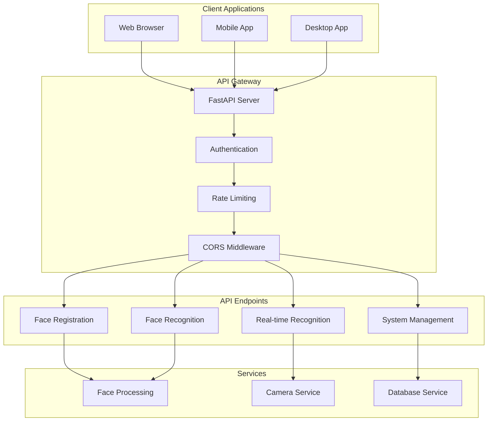

# Face Detection System - API Design

## Overview
Tài liệu này mô tả thiết kế API cho hệ thống nhận diện khuôn mặt, bao gồm RESTful APIs và WebSocket endpoints.

## API Architecture



## Base URL and Versioning

```yaml
Base URL: http://localhost:8000
API Version: v1
Full Base URL: http://localhost:8000/api/v1
```

## Authentication

### JWT Token Authentication
```yaml
Authentication:
  type: Bearer Token
  header: Authorization: Bearer <token>
  token_expiry: 24 hours
  refresh_token: true
```

### API Key Authentication (for system integration)
```yaml
API Key:
  header: X-API-Key: <api_key>
  scope: system_integration
```

## API Endpoints

### 1. Face Registration Endpoints

#### POST /api/v1/register-face
Đăng ký khuôn mặt mới với metadata.

**Request:**
```yaml
Content-Type: multipart/form-data

Parameters:
  image: file (required)
    - Format: JPEG, PNG
    - Max size: 10MB
    - Description: Image containing face to register
  
  name: string (required)
    - Min length: 2 characters
    - Max length: 100 characters
    - Description: Full name of the person
  
  email: string (optional)
    - Format: email
    - Description: Email address
  
  phone: string (optional)
    - Format: international phone number
    - Description: Phone number
  
  department: string (optional)
    - Max length: 50 characters
    - Description: Department or team
  
  position: string (optional)
    - Max length: 50 characters
    - Description: Job position or title
```

**Response:**
```json
{
  "success": true,
  "data": {
    "person_id": "p_001",
    "embedding_id": "emb_001",
    "name": "John Doe",
    "email": "john.doe@company.com",
    "department": "Engineering",
    "position": "Software Engineer",
    "confidence_score": 0.95,
    "quality_score": 0.92,
    "registration_date": "2024-01-01T00:00:00Z"
  },
  "message": "Face registered successfully"
}
```

**Error Responses:**
```json
{
  "success": false,
  "error": {
    "code": "FACE_NOT_DETECTED",
    "message": "No face detected in the image",
    "details": "Please ensure the image contains a clear face"
  }
}
```

#### POST /api/v1/register-face/batch
Đăng ký nhiều khuôn mặt cùng lúc.

**Request:**
```yaml
Content-Type: application/json

Body:
{
  "registrations": [
    {
      "image": "base64_encoded_image",
      "name": "John Doe",
      "email": "john@example.com",
      "department": "Engineering"
    },
    {
      "image": "base64_encoded_image_2",
      "name": "Jane Smith",
      "email": "jane@example.com",
      "department": "Marketing"
    }
  ]
}
```

### 2. Face Recognition Endpoints

#### POST /api/v1/recognize-face
Nhận diện khuôn mặt từ ảnh.

**Request:**
```yaml
Content-Type: multipart/form-data

Parameters:
  image: file (required)
    - Format: JPEG, PNG
    - Max size: 10MB
    - Description: Image containing face to recognize
  
  confidence_threshold: float (optional)
    - Default: 0.6
    - Min: 0.0
    - Max: 1.0
    - Description: Minimum confidence score for recognition
```

**Response:**
```json
{
  "success": true,
  "data": {
    "person_id": "p_001",
    "name": "John Doe",
    "email": "john.doe@company.com",
    "department": "Engineering",
    "position": "Software Engineer",
    "confidence_score": 0.92,
    "face_location": {
      "x": 100,
      "y": 150,
      "width": 200,
      "height": 250
    },
    "recognition_time": "2024-01-01T00:00:00Z"
  }
}
```

**No Match Response:**
```json
{
  "success": true,
  "data": {
    "person_id": null,
    "name": null,
    "confidence_score": 0.45,
    "face_location": {
      "x": 100,
      "y": 150,
      "width": 200,
      "height": 250
    },
    "message": "Face not recognized"
  }
}
```

#### POST /api/v1/recognize-face/batch
Nhận diện nhiều khuôn mặt cùng lúc.

**Request:**
```yaml
Content-Type: application/json

Body:
{
  "images": [
    "base64_encoded_image_1",
    "base64_encoded_image_2"
  ],
  "confidence_threshold": 0.6
}
```

### 3. Real-time Recognition Endpoints

#### WebSocket /api/v1/ws/recognize
Real-time face recognition qua WebSocket.

**Connection:**
```javascript
const ws = new WebSocket('ws://localhost:8000/api/v1/ws/recognize');
```

**Message Format (Client → Server):**
```json
{
  "type": "frame",
  "data": {
    "frame": "base64_encoded_image",
    "timestamp": "2024-01-01T00:00:00.000Z"
  }
}
```

**Response Format (Server → Client):**
```json
{
  "type": "recognition",
  "data": {
    "person_id": "p_001",
    "name": "John Doe",
    "confidence_score": 0.92,
    "face_locations": [
      {
        "x": 100,
        "y": 150,
        "width": 200,
        "height": 250,
        "person_id": "p_001",
        "name": "John Doe",
        "confidence": 0.92
      }
    ],
    "timestamp": "2024-01-01T00:00:00.000Z"
  }
}
```

**Control Messages:**
```json
// Start recognition
{
  "type": "start",
  "data": {
    "confidence_threshold": 0.6
  }
}

// Stop recognition
{
  "type": "stop"
}
```

### 4. Camera Management Endpoints

#### GET /api/v1/cameras
Lấy danh sách camera có sẵn.

**Response:**
```json
{
  "success": true,
  "data": {
    "cameras": [
      {
        "id": 0,
        "name": "Built-in Webcam",
        "resolution": [640, 480],
        "fps": 30,
        "status": "available"
      },
      {
        "id": 1,
        "name": "USB Camera",
        "resolution": [1280, 720],
        "fps": 30,
        "status": "available"
      }
    ]
  }
}
```

#### POST /api/v1/cameras/{camera_id}/capture
Chụp ảnh từ camera cụ thể.

**Response:**
```json
{
  "success": true,
  "data": {
    "image": "base64_encoded_image",
    "timestamp": "2024-01-01T00:00:00Z",
    "camera_id": 0
  }
}
```

### 5. Person Management Endpoints

#### GET /api/v1/persons
Lấy danh sách người đã đăng ký.

**Query Parameters:**
```yaml
page: integer (optional, default: 1)
limit: integer (optional, default: 20, max: 100)
search: string (optional)
department: string (optional)
status: string (optional, values: active, inactive, deleted)
```

**Response:**
```json
{
  "success": true,
  "data": {
    "persons": [
      {
        "person_id": "p_001",
        "name": "John Doe",
        "email": "john.doe@company.com",
        "department": "Engineering",
        "position": "Software Engineer",
        "registration_date": "2024-01-01T00:00:00Z",
        "status": "active",
        "embedding_count": 2,
        "last_recognition": "2024-01-01T12:00:00Z"
      }
    ],
    "pagination": {
      "page": 1,
      "limit": 20,
      "total": 50,
      "pages": 3
    }
  }
}
```

#### GET /api/v1/persons/{person_id}
Lấy thông tin chi tiết của một người.

**Response:**
```json
{
  "success": true,
  "data": {
    "person_id": "p_001",
    "name": "John Doe",
    "email": "john.doe@company.com",
    "phone": "+1234567890",
    "department": "Engineering",
    "position": "Software Engineer",
    "registration_date": "2024-01-01T00:00:00Z",
    "status": "active",
    "embeddings": [
      {
        "embedding_id": "emb_001",
        "quality_score": 0.95,
        "created_at": "2024-01-01T00:00:00Z"
      }
    ],
    "recognition_stats": {
      "total_recognitions": 150,
      "successful_recognitions": 142,
      "avg_confidence": 0.89,
      "last_recognition": "2024-01-01T12:00:00Z"
    }
  }
}
```

#### PUT /api/v1/persons/{person_id}
Cập nhật thông tin người dùng.

**Request:**
```yaml
Content-Type: application/json

Body:
{
  "name": "John Doe Updated",
  "email": "john.updated@company.com",
  "department": "Engineering",
  "position": "Senior Software Engineer"
}
```

#### DELETE /api/v1/persons/{person_id}
Xóa người dùng (soft delete).

**Response:**
```json
{
  "success": true,
  "message": "Person deleted successfully"
}
```

### 6. Recognition History Endpoints

#### GET /api/v1/recognitions
Lấy lịch sử nhận diện.

**Query Parameters:**
```yaml
page: integer (optional, default: 1)
limit: integer (optional, default: 20, max: 100)
person_id: string (optional)
start_date: string (optional, ISO format)
end_date: string (optional, ISO format)
min_confidence: float (optional)
```

**Response:**
```json
{
  "success": true,
  "data": {
    "recognitions": [
      {
        "log_id": "log_001",
        "person_id": "p_001",
        "name": "John Doe",
        "confidence_score": 0.92,
        "face_location": {
          "x": 100,
          "y": 150,
          "width": 200,
          "height": 250
        },
        "timestamp": "2024-01-01T12:00:00Z"
      }
    ],
    "pagination": {
      "page": 1,
      "limit": 20,
      "total": 1000,
      "pages": 50
    }
  }
}
```

### 7. System Management Endpoints

#### GET /api/v1/system/status
Lấy trạng thái hệ thống.

**Response:**
```json
{
  "success": true,
  "data": {
    "system_status": "healthy",
    "uptime": "2 days, 5 hours, 30 minutes",
    "total_persons": 150,
    "total_embeddings": 450,
    "total_recognitions": 5000,
    "database_status": "connected",
    "vector_db_status": "connected",
    "camera_status": "available",
    "last_backup": "2024-01-01T00:00:00Z"
  }
}
```

#### GET /api/v1/system/settings
Lấy cấu hình hệ thống.

**Response:**
```json
{
  "success": true,
  "data": {
    "face_recognition_tolerance": 0.6,
    "min_face_size": 20,
    "max_face_size": 1000,
    "quality_threshold": 0.7,
    "log_retention_days": 30,
    "max_embeddings_per_person": 5
  }
}
```

#### PUT /api/v1/system/settings
Cập nhật cấu hình hệ thống.

**Request:**
```yaml
Content-Type: application/json

Body:
{
  "face_recognition_tolerance": 0.65,
  "quality_threshold": 0.75
}
```

#### POST /api/v1/system/backup
Tạo backup database.

**Response:**
```json
{
  "success": true,
  "data": {
    "backup_id": "backup_20240101_120000",
    "backup_path": "/backups/backup_20240101_120000.tar.gz",
    "size": "50MB",
    "created_at": "2024-01-01T12:00:00Z"
  }
}
```

### 8. Analytics Endpoints

#### GET /api/v1/analytics/overview
Lấy tổng quan thống kê.

**Response:**
```json
{
  "success": true,
  "data": {
    "total_persons": 150,
    "active_persons": 145,
    "total_embeddings": 450,
    "total_recognitions": 5000,
    "successful_recognitions": 4800,
    "avg_confidence": 0.89,
    "recognition_accuracy": 0.96,
    "daily_stats": [
      {
        "date": "2024-01-01",
        "recognitions": 150,
        "new_registrations": 5
      }
    ]
  }
}
```

#### GET /api/v1/analytics/department
Thống kê theo phòng ban.

**Response:**
```json
{
  "success": true,
  "data": {
    "departments": [
      {
        "department": "Engineering",
        "person_count": 50,
        "recognition_count": 2000,
        "avg_confidence": 0.91
      },
      {
        "department": "Marketing",
        "person_count": 30,
        "recognition_count": 1200,
        "avg_confidence": 0.87
      }
    ]
  }
}
```

## Error Handling

### Standard Error Response Format
```json
{
  "success": false,
  "error": {
    "code": "ERROR_CODE",
    "message": "Human readable error message",
    "details": "Additional error details",
    "timestamp": "2024-01-01T00:00:00Z"
  }
}
```

### Common Error Codes
```yaml
Error Codes:
  VALIDATION_ERROR: Input validation failed
  FACE_NOT_DETECTED: No face found in image
  FACE_NOT_RECOGNIZED: Face not recognized
  PERSON_NOT_FOUND: Person not found
  DUPLICATE_PERSON: Person already exists
  IMAGE_TOO_LARGE: Image file too large
  INVALID_IMAGE_FORMAT: Unsupported image format
  CAMERA_NOT_AVAILABLE: Camera not available
  DATABASE_ERROR: Database operation failed
  VECTOR_DB_ERROR: Vector database error
  AUTHENTICATION_FAILED: Authentication failed
  AUTHORIZATION_FAILED: Insufficient permissions
  RATE_LIMIT_EXCEEDED: Too many requests
  INTERNAL_SERVER_ERROR: Internal server error
```

### HTTP Status Codes
```yaml
Status Codes:
  200: OK - Request successful
  201: Created - Resource created successfully
  400: Bad Request - Invalid input data
  401: Unauthorized - Authentication required
  403: Forbidden - Insufficient permissions
  404: Not Found - Resource not found
  409: Conflict - Resource conflict
  422: Unprocessable Entity - Validation error
  429: Too Many Requests - Rate limit exceeded
  500: Internal Server Error - Server error
  503: Service Unavailable - Service temporarily unavailable
```

## Rate Limiting

### Rate Limit Configuration
```yaml
Rate Limits:
  registration: 10 requests per minute
  recognition: 50 requests per minute
  real_time: 1000 requests per minute
  management: 100 requests per minute
  analytics: 20 requests per minute
```

### Rate Limit Headers
```yaml
Response Headers:
  X-RateLimit-Limit: Maximum requests per window
  X-RateLimit-Remaining: Remaining requests in window
  X-RateLimit-Reset: Time when limit resets (Unix timestamp)
```

## API Documentation

### OpenAPI Specification
```yaml
OpenAPI Version: 3.0.3
Title: Face Detection System API
Version: 1.0.0
Description: API for face detection and recognition system
```

### Interactive Documentation
- **Swagger UI**: Available at `/docs`
- **ReDoc**: Available at `/redoc`
- **OpenAPI JSON**: Available at `/openapi.json`

## SDK and Client Libraries

### Python SDK
```python
from face_detection_sdk import FaceDetectionClient

client = FaceDetectionClient(
    base_url="http://localhost:8000",
    api_key="your_api_key"
)

# Register face
result = client.register_face(
    image_path="path/to/image.jpg",
    name="John Doe",
    email="john@example.com"
)

# Recognize face
result = client.recognize_face(
    image_path="path/to/image.jpg"
)
```

### JavaScript SDK
```javascript
import { FaceDetectionClient } from 'face-detection-sdk';

const client = new FaceDetectionClient({
    baseUrl: 'http://localhost:8000',
    apiKey: 'your_api_key'
});

// Register face
const result = await client.registerFace({
    image: imageFile,
    name: 'John Doe',
    email: 'john@example.com'
});

// Recognize face
const result = await client.recognizeFace({
    image: imageFile
});
```

## Testing

### API Testing with Postman
```yaml
Postman Collection:
  name: Face Detection API
  description: Complete API testing collection
  environment: Development, Staging, Production
  variables:
    base_url: http://localhost:8000
    api_key: your_api_key
    auth_token: your_jwt_token
```

### Automated Testing
```python
# pytest configuration
pytest.ini:
  [pytest]
  testpaths = tests
  python_files = test_*.py
  python_classes = Test*
  python_functions = test_*
  markers =
    unit: Unit tests
    integration: Integration tests
    api: API tests
    performance: Performance tests
``` 