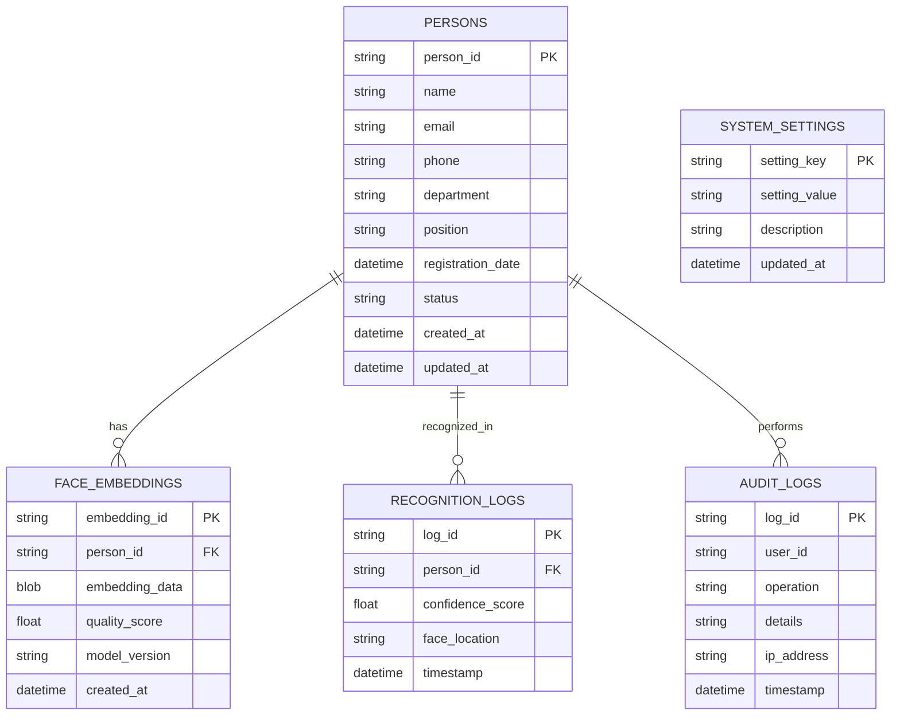

# Face Detection System - Database Schema

## Overview
Tài liệu này mô tả cấu trúc database cho hệ thống nhận diện khuôn mặt, bao gồm cả metadata database (SQLite) và vector database (ChromaDB).

## Database Architecture



## Metadata Database (SQLite)

### 1. Persons Table
Lưu trữ thông tin cơ bản của người dùng đã đăng ký.

```sql
CREATE TABLE persons (
    person_id TEXT PRIMARY KEY,
    name TEXT NOT NULL,
    email TEXT,
    phone TEXT,
    department TEXT,
    position TEXT,
    registration_date TIMESTAMP DEFAULT CURRENT_TIMESTAMP,
    status TEXT DEFAULT 'active' CHECK (status IN ('active', 'inactive', 'deleted')),
    created_at TIMESTAMP DEFAULT CURRENT_TIMESTAMP,
    updated_at TIMESTAMP DEFAULT CURRENT_TIMESTAMP
);

-- Indexes for performance
CREATE INDEX idx_persons_name ON persons(name);
CREATE INDEX idx_persons_email ON persons(email);
CREATE INDEX idx_persons_department ON persons(department);
CREATE INDEX idx_persons_status ON persons(status);
CREATE INDEX idx_persons_created_at ON persons(created_at);
```

**Sample Data:**
```sql
INSERT INTO persons (person_id, name, email, phone, department, position) VALUES
('p_001', 'John Doe', 'john.doe@company.com', '+1234567890', 'Engineering', 'Software Engineer'),
('p_002', 'Jane Smith', 'jane.smith@company.com', '+1234567891', 'Marketing', 'Marketing Manager'),
('p_003', 'Bob Johnson', 'bob.johnson@company.com', '+1234567892', 'Sales', 'Sales Representative');
```

### 2. Face Embeddings Table
Lưu trữ thông tin về face embeddings và liên kết với persons.

```sql
CREATE TABLE face_embeddings (
    embedding_id TEXT PRIMARY KEY,
    person_id TEXT NOT NULL,
    embedding_data BLOB NOT NULL,
    quality_score REAL CHECK (quality_score >= 0 AND quality_score <= 1),
    model_version TEXT DEFAULT '1.0',
    created_at TIMESTAMP DEFAULT CURRENT_TIMESTAMP,
    FOREIGN KEY (person_id) REFERENCES persons(person_id) ON DELETE CASCADE
);

-- Indexes for performance
CREATE INDEX idx_face_embeddings_person_id ON face_embeddings(person_id);
CREATE INDEX idx_face_embeddings_quality_score ON face_embeddings(quality_score);
CREATE INDEX idx_face_embeddings_created_at ON face_embeddings(created_at);
```

**Sample Data:**
```sql
INSERT INTO face_embeddings (embedding_id, person_id, embedding_data, quality_score, model_version) VALUES
('emb_001', 'p_001', X'0123456789ABCDEF...', 0.95, '1.0'),
('emb_002', 'p_001', X'FEDCBA9876543210...', 0.92, '1.0'),
('emb_003', 'p_002', X'1234567890ABCDEF...', 0.88, '1.0');
```

### 3. Recognition Logs Table
Lưu trữ lịch sử nhận diện khuôn mặt.

```sql
CREATE TABLE recognition_logs (
    log_id TEXT PRIMARY KEY,
    person_id TEXT,
    confidence_score REAL CHECK (confidence_score >= 0 AND confidence_score <= 1),
    face_location TEXT, -- JSON format: {"x": 100, "y": 150, "width": 200, "height": 250}
    timestamp TIMESTAMP DEFAULT CURRENT_TIMESTAMP,
    FOREIGN KEY (person_id) REFERENCES persons(person_id) ON DELETE SET NULL
);

-- Indexes for performance
CREATE INDEX idx_recognition_logs_person_id ON recognition_logs(person_id);
CREATE INDEX idx_recognition_logs_timestamp ON recognition_logs(timestamp);
CREATE INDEX idx_recognition_logs_confidence ON recognition_logs(confidence_score);
```

**Sample Data:**
```sql
INSERT INTO recognition_logs (log_id, person_id, confidence_score, face_location) VALUES
('log_001', 'p_001', 0.92, '{"x": 100, "y": 150, "width": 200, "height": 250}'),
('log_002', 'p_002', 0.88, '{"x": 300, "y": 200, "width": 180, "height": 220}'),
('log_003', NULL, 0.45, '{"x": 500, "y": 300, "width": 160, "height": 200}');
```

### 4. System Settings Table
Lưu trữ cấu hình hệ thống.

```sql
CREATE TABLE system_settings (
    setting_key TEXT PRIMARY KEY,
    setting_value TEXT,
    description TEXT,
    updated_at TIMESTAMP DEFAULT CURRENT_TIMESTAMP
);

-- Insert default settings
INSERT INTO system_settings (setting_key, setting_value, description) VALUES
('face_recognition_tolerance', '0.6', 'Threshold for face recognition'),
('min_face_size', '20', 'Minimum face size for detection'),
('max_face_size', '1000', 'Maximum face size for detection'),
('quality_threshold', '0.7', 'Minimum quality score for registration'),
('log_retention_days', '30', 'Number of days to keep recognition logs'),
('max_embeddings_per_person', '5', 'Maximum embeddings per person');
```

### 5. Audit Logs Table
Lưu trữ lịch sử hoạt động của hệ thống.

```sql
CREATE TABLE audit_logs (
    log_id TEXT PRIMARY KEY,
    user_id TEXT,
    operation TEXT NOT NULL,
    details TEXT,
    ip_address TEXT,
    timestamp TIMESTAMP DEFAULT CURRENT_TIMESTAMP
);

-- Indexes for performance
CREATE INDEX idx_audit_logs_user_id ON audit_logs(user_id);
CREATE INDEX idx_audit_logs_operation ON audit_logs(operation);
CREATE INDEX idx_audit_logs_timestamp ON audit_logs(timestamp);
```

**Sample Data:**
```sql
INSERT INTO audit_logs (log_id, user_id, operation, details, ip_address) VALUES
('audit_001', 'admin', 'person_registered', '{"person_id": "p_001", "name": "John Doe"}', '192.168.1.100'),
('audit_002', 'system', 'face_recognized', '{"person_id": "p_001", "confidence": 0.92}', '192.168.1.101'),
('audit_003', 'admin', 'settings_updated', '{"setting": "face_recognition_tolerance", "value": "0.6"}', '192.168.1.100');
```

## Vector Database (ChromaDB)

### Collection Structure
```python
import chromadb
from chromadb.config import Settings

# Initialize ChromaDB client
client = chromadb.Client(Settings(
    chroma_db_impl="duckdb+parquet",
    persist_directory="./data/vector_db"
))

# Create collection for face embeddings
collection = client.create_collection(
    name="face_embeddings",
    metadata={
        "description": "Face embeddings for recognition",
        "embedding_dimension": 128,
        "distance_metric": "cosine",
        "model_version": "1.0"
    }
)
```

### Document Structure
```python
# Example document structure
document = {
    "id": "emb_001",
    "embedding": [0.123, 0.456, 0.789, ...],  # 128-dimensional vector
    "metadata": {
        "person_id": "p_001",
        "name": "John Doe",
        "email": "john.doe@company.com",
        "department": "Engineering",
        "quality_score": 0.95,
        "model_version": "1.0",
        "created_at": "2024-01-01T00:00:00Z"
    }
}
```

### Query Operations
```python
# Add embeddings to collection
collection.add(
    embeddings=[[0.123, 0.456, ...]],  # List of embedding vectors
    metadatas=[{
        "person_id": "p_001",
        "name": "John Doe",
        "quality_score": 0.95
    }],
    ids=["emb_001"]
)

# Query similar faces
results = collection.query(
    query_embeddings=[[0.124, 0.457, ...]],  # Query embedding
    n_results=5,  # Number of similar faces to return
    where={"quality_score": {"$gte": 0.8}}  # Filter by quality
)
```

## Database Relationships

### 1. One-to-Many Relationships
- **Person → Face Embeddings**: Một người có thể có nhiều face embeddings
- **Person → Recognition Logs**: Một người có thể được nhận diện nhiều lần

### 2. Foreign Key Constraints
```sql
-- Face embeddings reference persons
ALTER TABLE face_embeddings 
ADD CONSTRAINT fk_face_embeddings_person 
FOREIGN KEY (person_id) REFERENCES persons(person_id) ON DELETE CASCADE;

-- Recognition logs reference persons
ALTER TABLE recognition_logs 
ADD CONSTRAINT fk_recognition_logs_person 
FOREIGN KEY (person_id) REFERENCES persons(person_id) ON DELETE SET NULL;
```

## Data Validation Rules

### 1. Person Data Validation
```sql
-- Check constraints for persons table
ALTER TABLE persons ADD CONSTRAINT chk_person_email 
CHECK (email LIKE '%@%');

ALTER TABLE persons ADD CONSTRAINT chk_person_phone 
CHECK (phone LIKE '+%' OR phone LIKE '[0-9]%');

ALTER TABLE persons ADD CONSTRAINT chk_person_status 
CHECK (status IN ('active', 'inactive', 'deleted'));
```

### 2. Embedding Data Validation
```sql
-- Check constraints for face_embeddings table
ALTER TABLE face_embeddings ADD CONSTRAINT chk_quality_score 
CHECK (quality_score >= 0 AND quality_score <= 1);

ALTER TABLE face_embeddings ADD CONSTRAINT chk_embedding_data 
CHECK (length(embedding_data) = 512); -- 128 floats * 4 bytes
```

## Database Views

### 1. Person Summary View
```sql
CREATE VIEW person_summary AS
SELECT 
    p.person_id,
    p.name,
    p.email,
    p.department,
    p.position,
    p.registration_date,
    p.status,
    COUNT(fe.embedding_id) as embedding_count,
    AVG(fe.quality_score) as avg_quality_score,
    COUNT(rl.log_id) as recognition_count,
    MAX(rl.timestamp) as last_recognition
FROM persons p
LEFT JOIN face_embeddings fe ON p.person_id = fe.person_id
LEFT JOIN recognition_logs rl ON p.person_id = rl.person_id
GROUP BY p.person_id;
```

### 2. Recognition Statistics View
```sql
CREATE VIEW recognition_stats AS
SELECT 
    DATE(timestamp) as recognition_date,
    COUNT(*) as total_recognitions,
    COUNT(person_id) as successful_recognitions,
    AVG(confidence_score) as avg_confidence,
    COUNT(DISTINCT person_id) as unique_persons
FROM recognition_logs
GROUP BY DATE(timestamp);
```

## Database Maintenance

### 1. Cleanup Procedures
```sql
-- Clean up old recognition logs (older than 30 days)
DELETE FROM recognition_logs 
WHERE timestamp < datetime('now', '-30 days');

-- Clean up old audit logs (older than 90 days)
DELETE FROM audit_logs 
WHERE timestamp < datetime('now', '-90 days');

-- Clean up inactive persons (older than 1 year)
UPDATE persons 
SET status = 'deleted' 
WHERE status = 'inactive' 
AND updated_at < datetime('now', '-1 year');
```

### 2. Optimization Procedures
```sql
-- Rebuild indexes
REINDEX;

-- Analyze table statistics
ANALYZE;

-- Vacuum database to reclaim space
VACUUM;
```

## Backup and Recovery

### 1. Backup Strategy
```bash
#!/bin/bash
# backup_database.sh

BACKUP_DIR="./backups"
DATE=$(date +%Y%m%d_%H%M%S)

# Backup SQLite database
sqlite3 data/metadata.db ".backup $BACKUP_DIR/metadata_$DATE.db"

# Backup ChromaDB
cp -r data/vector_db $BACKUP_DIR/vector_db_$DATE

# Compress backups
tar -czf $BACKUP_DIR/backup_$DATE.tar.gz $BACKUP_DIR/metadata_$DATE.db $BACKUP_DIR/vector_db_$DATE

# Clean up old backups (keep last 7 days)
find $BACKUP_DIR -name "backup_*.tar.gz" -mtime +7 -delete
```

### 2. Recovery Procedures
```bash
#!/bin/bash
# restore_database.sh

BACKUP_FILE=$1
RESTORE_DIR="./restore"

# Extract backup
tar -xzf $BACKUP_FILE -C $RESTORE_DIR

# Restore SQLite database
cp $RESTORE_DIR/metadata_*.db data/metadata.db

# Restore ChromaDB
rm -rf data/vector_db
cp -r $RESTORE_DIR/vector_db_* data/vector_db

# Clean up
rm -rf $RESTORE_DIR
```

## Performance Optimization

### 1. Indexing Strategy
```sql
-- Composite indexes for common queries
CREATE INDEX idx_recognition_logs_person_timestamp 
ON recognition_logs(person_id, timestamp);

CREATE INDEX idx_face_embeddings_person_quality 
ON face_embeddings(person_id, quality_score);

-- Partial indexes for active data
CREATE INDEX idx_persons_active 
ON persons(person_id, name, department) 
WHERE status = 'active';
```

### 2. Query Optimization
```sql
-- Use prepared statements for frequent queries
-- Example: Find person by name
SELECT person_id, name, email, department 
FROM persons 
WHERE name LIKE ? AND status = 'active';

-- Example: Get recent recognitions
SELECT rl.*, p.name, p.department 
FROM recognition_logs rl
JOIN persons p ON rl.person_id = p.person_id
WHERE rl.timestamp > datetime('now', '-1 day')
ORDER BY rl.timestamp DESC;
```

## Security Considerations

### 1. Data Encryption
```python
# Encrypt sensitive data before storing
from cryptography.fernet import Fernet

def encrypt_data(data: str, key: bytes) -> bytes:
    f = Fernet(key)
    return f.encrypt(data.encode())

def decrypt_data(encrypted_data: bytes, key: bytes) -> str:
    f = Fernet(key)
    return f.decrypt(encrypted_data).decode()
```

### 2. Access Control
```sql
-- Create read-only user for analytics
CREATE VIEW analytics_data AS
SELECT 
    p.department,
    COUNT(rl.log_id) as recognition_count,
    AVG(rl.confidence_score) as avg_confidence
FROM persons p
LEFT JOIN recognition_logs rl ON p.person_id = rl.person_id
WHERE p.status = 'active'
GROUP BY p.department;
``` 