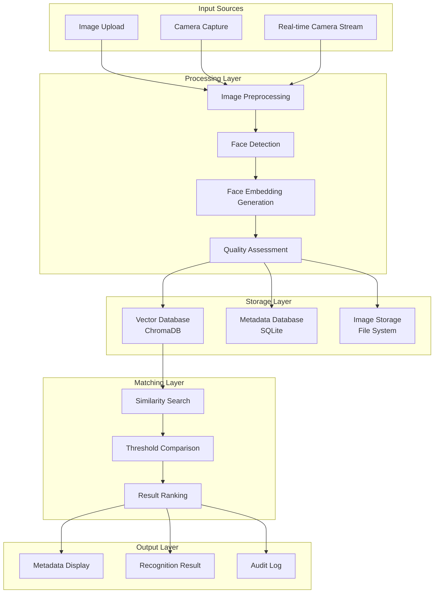
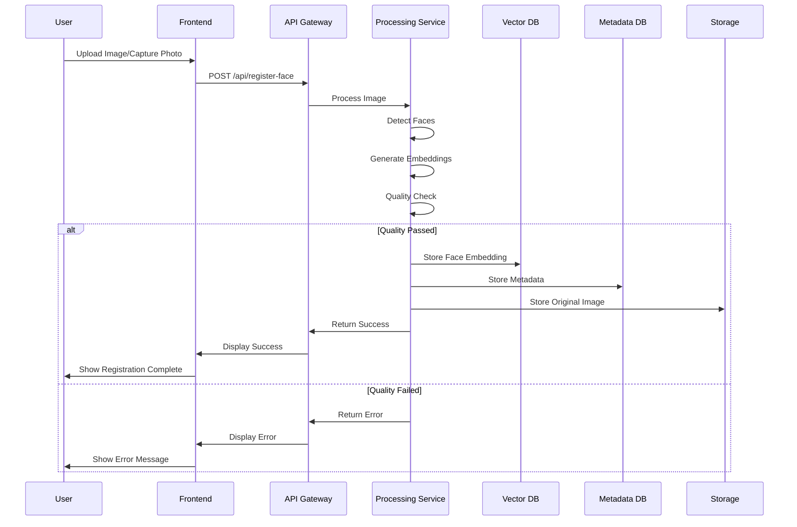
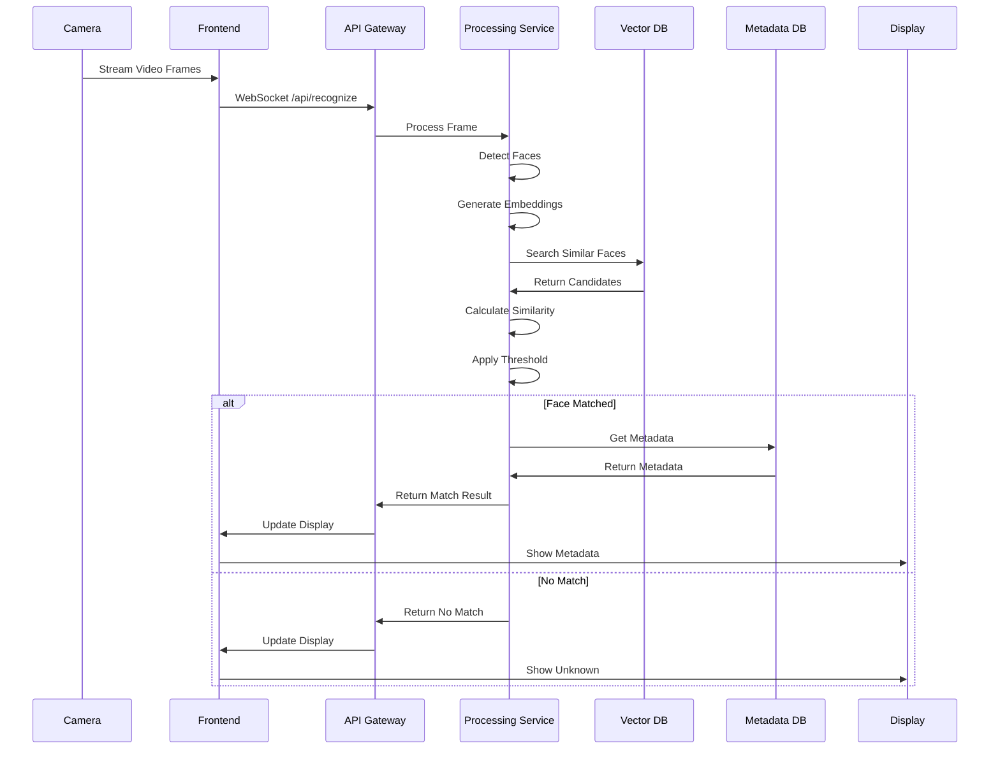

# Face Detection System - Data Flow Diagram

## Overview
Tài liệu này mô tả luồng dữ liệu trong hệ thống nhận diện khuôn mặt, bao gồm hai workflow chính:
1. **Face Registration Workflow**: Đăng ký khuôn mặt mới
2. **Face Recognition Workflow**: Nhận diện khuôn mặt real-time

## Data Flow Architecture



## Detailed Data Flow

### 1. Face Registration Workflow



### 2. Face Recognition Workflow



## Data Structures

### 1. Face Embedding Data
```json
{
  "embedding_id": "uuid",
  "face_embedding": [0.123, 0.456, ...],
  "embedding_dimension": 128,
  "model_version": "1.0",
  "created_at": "2024-01-01T00:00:00Z",
  "quality_score": 0.95
}
```

### 2. Metadata Structure
```json
{
  "person_id": "uuid",
  "name": "John Doe",
  "email": "john@example.com",
  "phone": "+1234567890",
  "department": "Engineering",
  "position": "Software Engineer",
  "registration_date": "2024-01-01T00:00:00Z",
  "face_embeddings": ["embedding_id_1", "embedding_id_2"],
  "status": "active"
}
```

### 3. Recognition Result
```json
{
  "recognition_id": "uuid",
  "timestamp": "2024-01-01T00:00:00Z",
  "person_id": "uuid",
  "confidence_score": 0.92,
  "face_location": {
    "x": 100,
    "y": 150,
    "width": 200,
    "height": 250
  },
  "metadata": {
    "name": "John Doe",
    "department": "Engineering"
  }
}
```

## Data Processing Pipeline

### 1. Image Preprocessing
```python
def preprocess_image(image):
    # Resize to standard size
    # Normalize pixel values
    # Convert to RGB format
    # Apply noise reduction
    return processed_image
```

### 2. Face Detection
```python
def detect_faces(image):
    # Use face_recognition library
    # Return face locations
    # Apply confidence threshold
    return face_locations
```

### 3. Embedding Generation
```python
def generate_embedding(face_image):
    # Use face_recognition.face_encodings()
    # Return 128-dimensional vector
    return embedding_vector
```

### 4. Similarity Search
```python
def find_similar_faces(query_embedding, threshold=0.6):
    # Search vector database
    # Calculate cosine similarity
    # Filter by threshold
    return similar_faces
```

## Performance Considerations

### 1. Batch Processing
- Process multiple faces in single request
- Parallel embedding generation
- Batch database operations

### 2. Caching Strategy
```python
# Cache frequently accessed embeddings
embedding_cache = {
    "person_id": embedding_vector,
    "last_accessed": timestamp
}

# Cache recognition results
recognition_cache = {
    "face_hash": {
        "person_id": "uuid",
        "confidence": 0.95,
        "timestamp": timestamp
    }
}
```

### 3. Database Optimization
- Index on embedding vectors
- Partition metadata by date
- Archive old recognition logs

## Error Handling

### 1. Image Quality Errors
```python
def validate_image_quality(image):
    if image.size < MIN_SIZE:
        raise ImageTooSmallError()
    if image.size > MAX_SIZE:
        raise ImageTooLargeError()
    if not has_face(image):
        raise NoFaceDetectedError()
    return True
```

### 2. Processing Errors
```python
def handle_processing_error(error):
    if isinstance(error, FaceDetectionError):
        return {"error": "No face detected", "code": 400}
    elif isinstance(error, EmbeddingError):
        return {"error": "Failed to generate embedding", "code": 500}
    else:
        return {"error": "Unknown processing error", "code": 500}
```

## Security & Privacy

### 1. Data Encryption
- Encrypt embeddings at rest
- Secure transmission of metadata
- Hash sensitive information

### 2. Access Control
```python
def check_permissions(user_id, operation):
    if operation == "register":
        return has_register_permission(user_id)
    elif operation == "recognize":
        return has_recognize_permission(user_id)
    return False
```

### 3. Audit Logging
```python
def log_operation(operation, user_id, result):
    audit_log = {
        "timestamp": datetime.now(),
        "operation": operation,
        "user_id": user_id,
        "result": result,
        "ip_address": request.client.host
    }
    db.audit_logs.insert(audit_log)
```

## Monitoring & Analytics

### 1. Performance Metrics
- Processing time per frame
- Recognition accuracy rate
- Database query performance
- Memory usage patterns

### 2. Business Metrics
- Number of registrations per day
- Recognition success rate
- User engagement patterns
- System uptime

### 3. Alert System
```python
def monitor_system_health():
    if cpu_usage > 80:
        send_alert("High CPU usage")
    if memory_usage > 90:
        send_alert("High memory usage")
    if error_rate > 5:
        send_alert("High error rate")
``` 