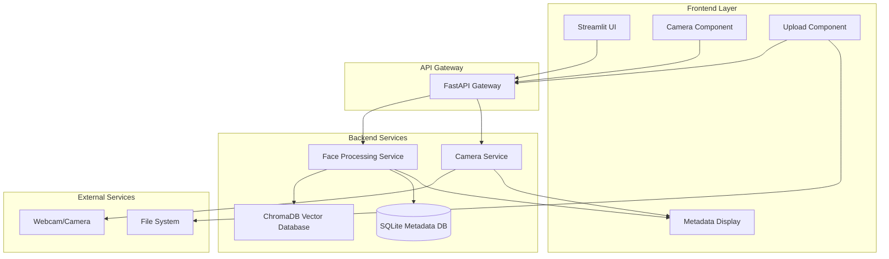
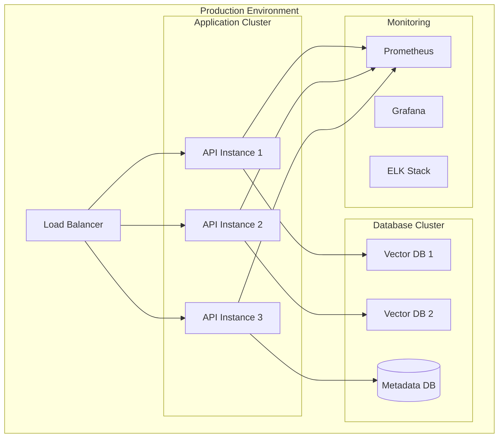

# Face Detection System - System Architecture

## Overview
Hệ thống nhận diện khuôn mặt được thiết kế theo kiến trúc microservices với các thành phần chính:
- **Frontend**: Streamlit UI cho user interaction
- **Backend API**: FastAPI cho business logic
- **Face Processing Service**: Xử lý face detection và embedding
- **Vector Database**: ChromaDB cho lưu trữ face embeddings
- **Metadata Database**: SQLite cho lưu trữ thông tin người dùng
- **Camera Service**: Xử lý camera/webcam input

## System Architecture Diagram

## Component Details

### 1. Frontend Layer (Streamlit)
- **Upload Component**: Cho phép upload ảnh từ file system
- **Camera Component**: Chụp ảnh trực tiếp từ webcam
- **Metadata Form**: Nhập thông tin người dùng
- **Display Component**: Hiển thị kết quả nhận diện và metadata

### 2. API Gateway (FastAPI)
- **RESTful APIs**: Xử lý HTTP requests
- **WebSocket**: Real-time communication cho camera stream
- **Authentication**: JWT token validation
- **Rate Limiting**: Bảo vệ API endpoints

### 3. Face Processing Service
- **Face Detection**: Sử dụng face_recognition library
- **Face Embedding**: Tạo vector representation của khuôn mặt
- **Face Matching**: So sánh embeddings với database
- **Quality Check**: Kiểm tra chất lượng ảnh đầu vào

### 4. Camera Service
- **Camera Management**: Quản lý camera/webcam devices
- **Frame Processing**: Xử lý video frames
- **Real-time Detection**: Nhận diện khuôn mặt real-time
- **Stream Management**: Quản lý video streams

### 5. Vector Database (ChromaDB)
- **Embedding Storage**: Lưu trữ face embeddings
- **Similarity Search**: Tìm kiếm khuôn mặt tương tự
- **Index Management**: Quản lý vector indexes
- **Performance Optimization**: Tối ưu hóa tìm kiếm

### 6. Metadata Database (SQLite)
- **User Information**: Lưu trữ thông tin người dùng
- **Face Metadata**: Metadata của từng khuôn mặt
- **Registration Data**: Dữ liệu đăng ký
- **Audit Trail**: Lịch sử hoạt động

## Technology Stack

### Frontend
- **Streamlit**: Web UI framework
- **OpenCV**: Camera handling
- **Pillow**: Image processing

### Backend
- **FastAPI**: API framework
- **SQLAlchemy**: ORM cho database
- **Pydantic**: Data validation
- **Uvicorn**: ASGI server

### AI/ML
- **face_recognition**: Face detection và embedding
- **dlib**: Face landmark detection
- **numpy**: Numerical computations

### Database
- **ChromaDB**: Vector database
- **SQLite**: Metadata database
- **Redis**: Caching (optional)

### Deployment
- **Docker**: Containerization
- **Docker Compose**: Multi-service orchestration
- **Nginx**: Reverse proxy (optional)

## Security Considerations

### Authentication & Authorization
- JWT token-based authentication
- Role-based access control
- API key management

### Data Protection
- Encryption at rest cho sensitive data
- Secure transmission (HTTPS/WSS)
- GDPR compliance cho personal data

### Privacy
- Face data anonymization
- Consent management
- Data retention policies

## Performance Optimization

### Caching Strategy
- Redis cache cho frequently accessed data
- In-memory caching cho face embeddings
- CDN cho static assets

### Scalability
- Horizontal scaling với load balancer
- Database sharding cho large datasets
- Microservices architecture

### Monitoring
- Application performance monitoring
- Database performance metrics
- Real-time system health checks

## Deployment Architecture

## Development Phases

### Phase 1: Core Infrastructure (Week 1-2)
- Setup development environment
- Implement basic face detection
- Create database schemas
- Build core services

### Phase 2: API Development (Week 3-4)
- Implement RESTful APIs
- Add authentication
- Create WebSocket endpoints
- Build error handling

### Phase 3: Frontend Development (Week 5-6)
- Create Streamlit UI
- Implement camera integration
- Build metadata forms
- Add real-time display

### Phase 4: Integration & Testing (Week 7-8)
- End-to-end testing
- Performance optimization
- Security testing
- User acceptance testing

### Phase 5: Deployment (Week 9-10)
- Docker containerization
- Production deployment
- Monitoring setup
- Documentation completion 