# Face Detection System - Workflow Diagram

## Overview
Tài liệu này mô tả các workflow chính trong hệ thống nhận diện khuôn mặt:
1. **Face Registration Workflow**: Đăng ký khuôn mặt mới vào hệ thống
2. **Face Recognition Workflow**: Nhận diện khuôn mặt real-time
3. **System Management Workflow**: Quản lý hệ thống và dữ liệu

## Workflow Overview

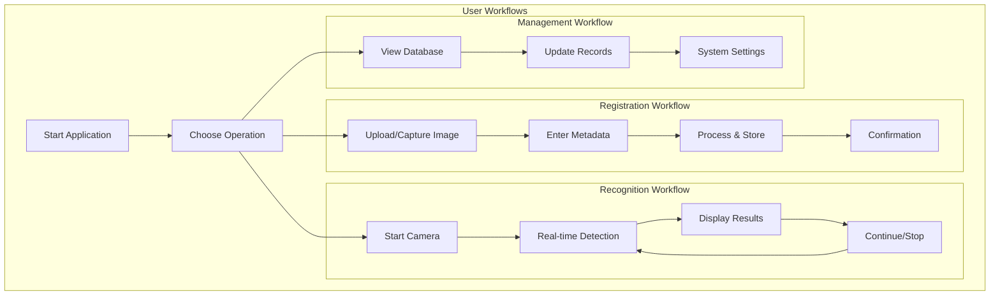

## Detailed Workflows

### 1. Face Registration Workflow

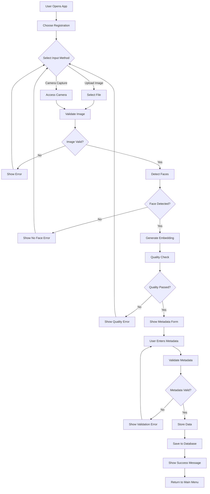

### 2. Face Recognition Workflow

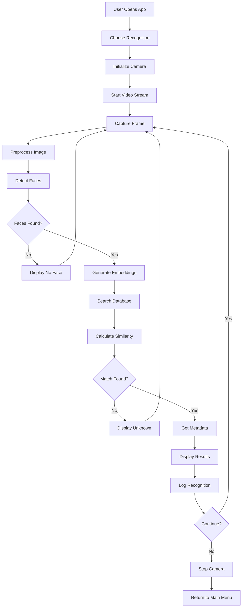

### 3. System Management Workflow

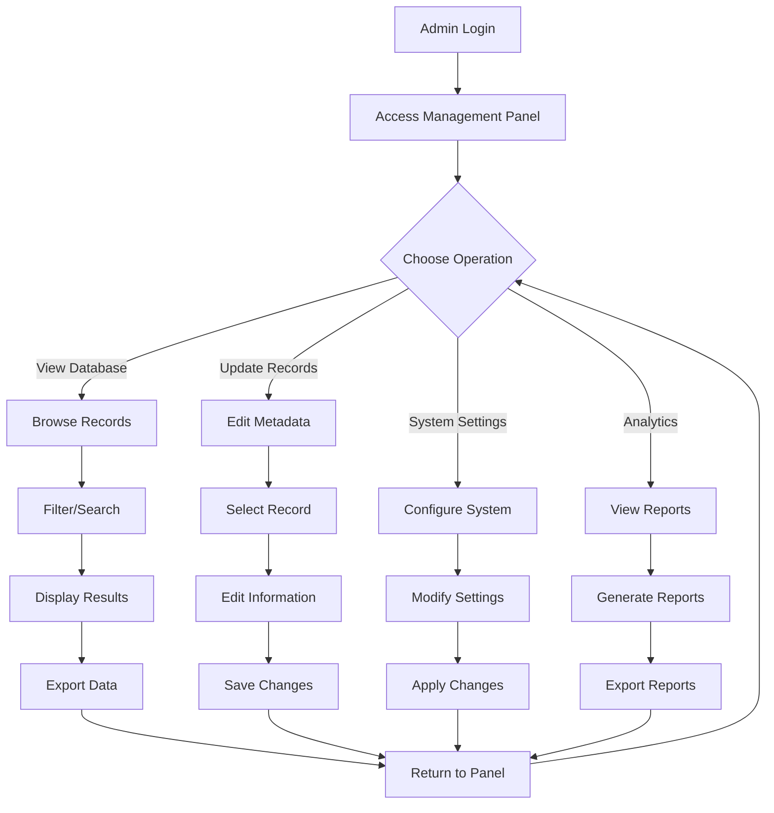

## User Interface Workflows

### 1. Main Application Flow

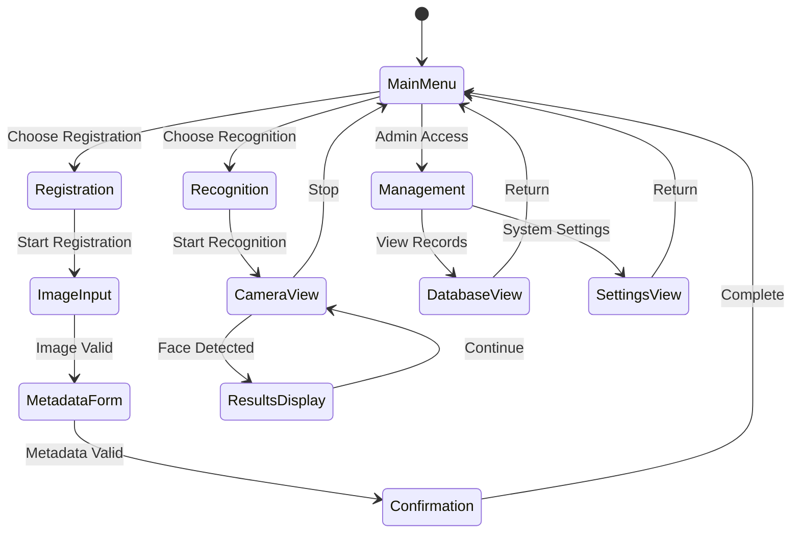

### 2. Error Handling Workflow

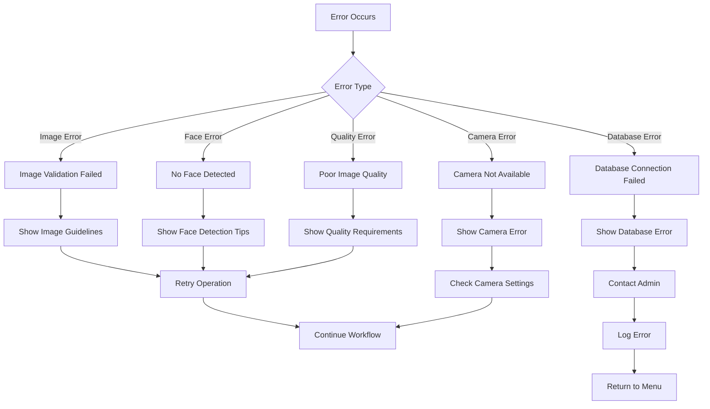

## Technical Implementation Workflows

### 1. Backend Processing Workflow

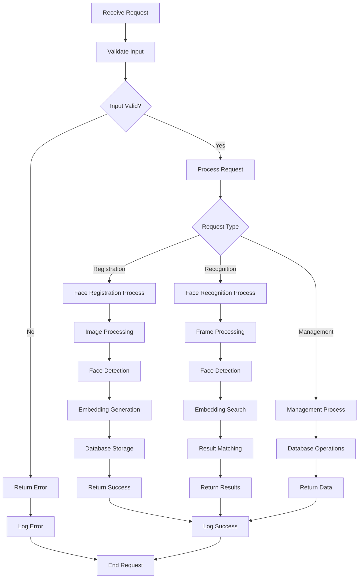

### 2. Database Operations Workflow

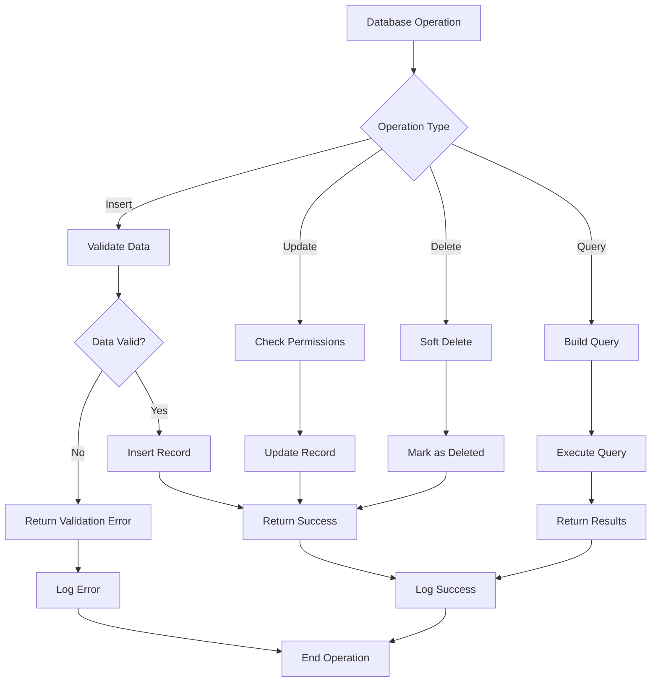

## Performance Optimization Workflows

### 1. Caching Strategy

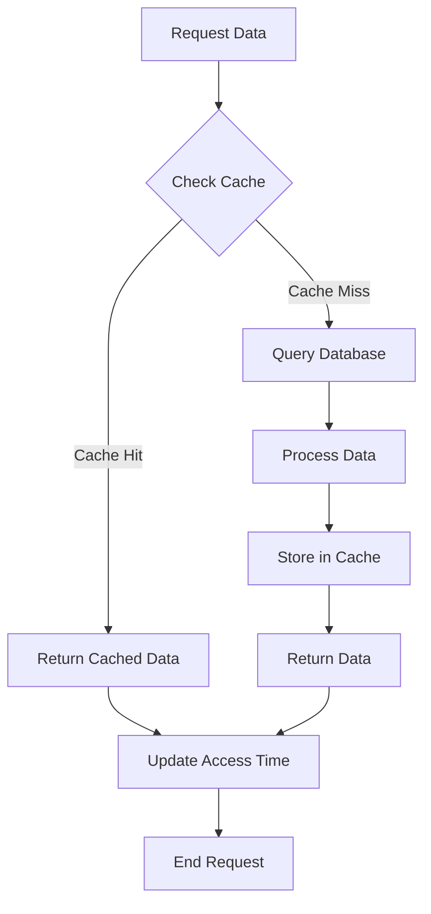

### 2. Batch Processing

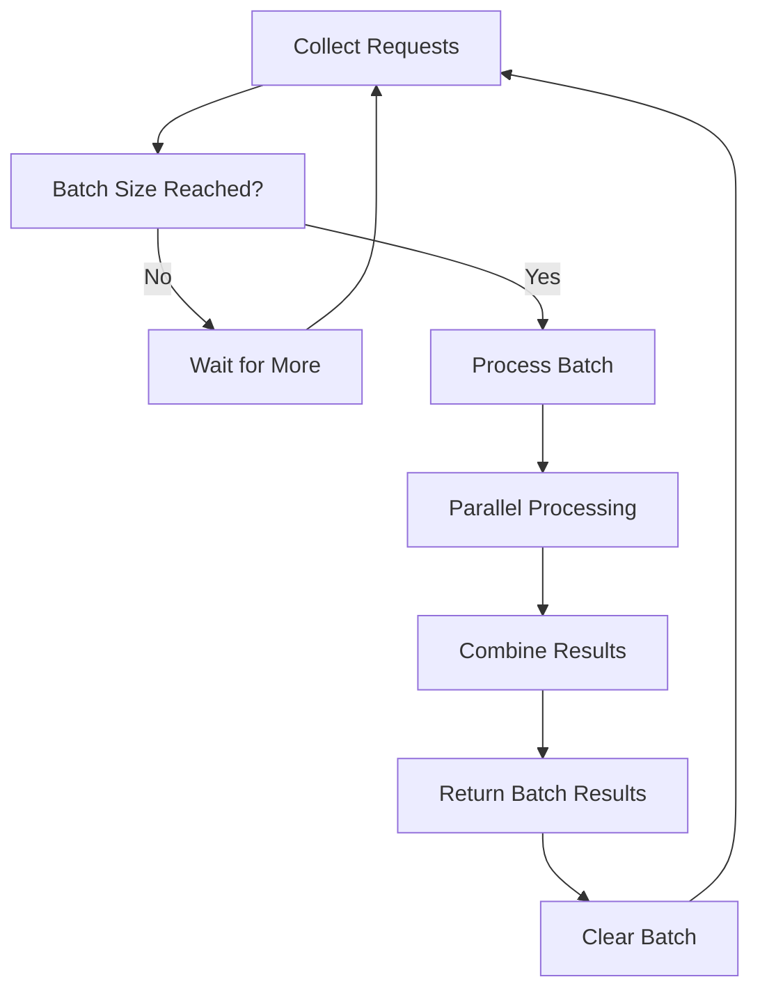

## Security Workflows

### 1. Authentication Flow

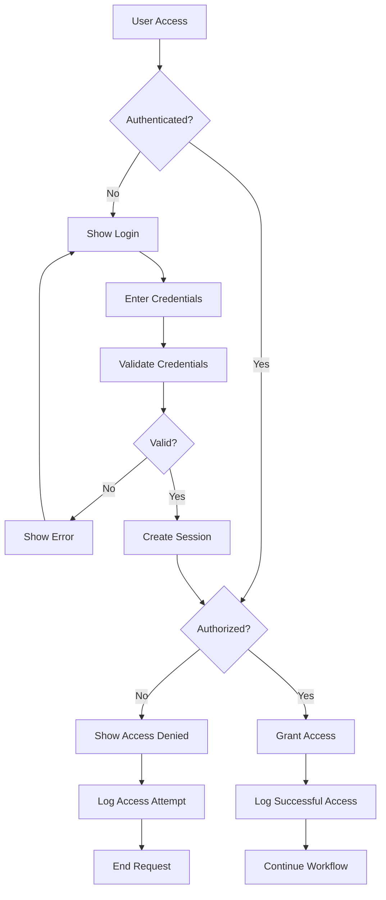

### 2. Data Protection Flow

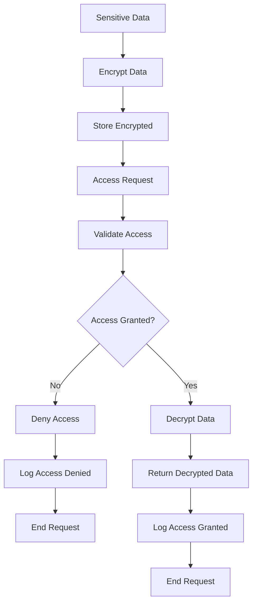

## Monitoring Workflows

### 1. System Health Monitoring

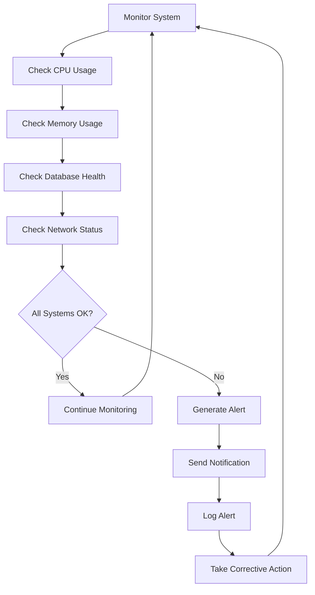

### 2. Performance Monitoring

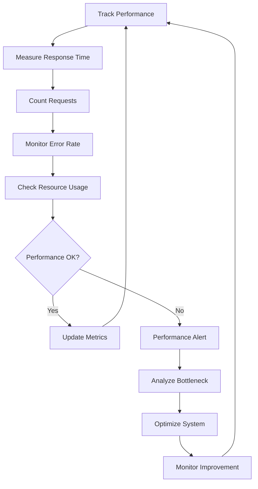

## Integration Workflows

### 1. Third-party Service Integration

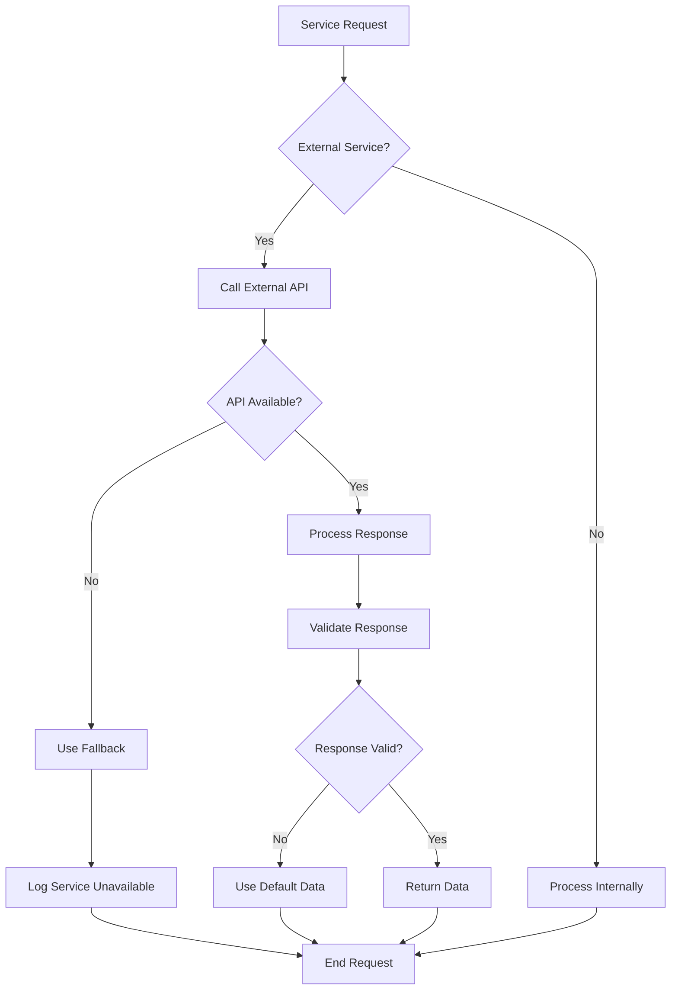

### 2. Data Synchronization

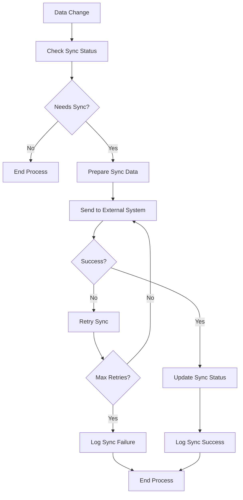