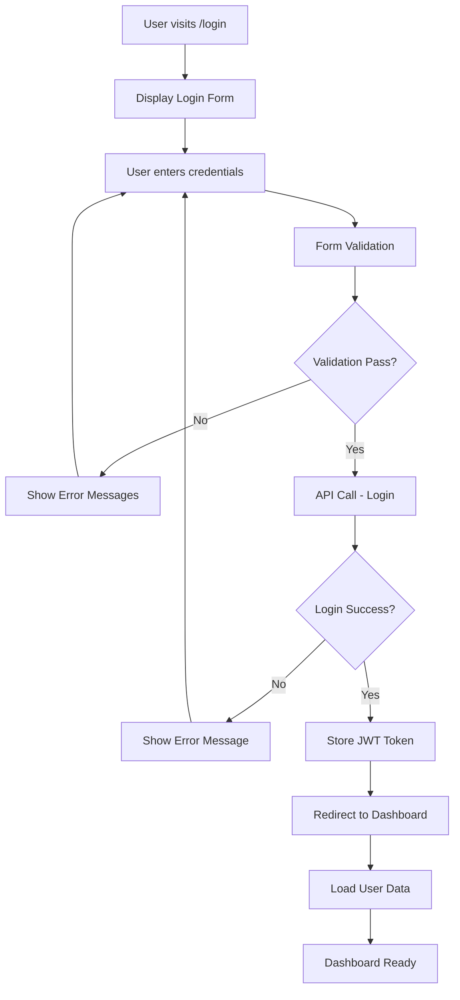
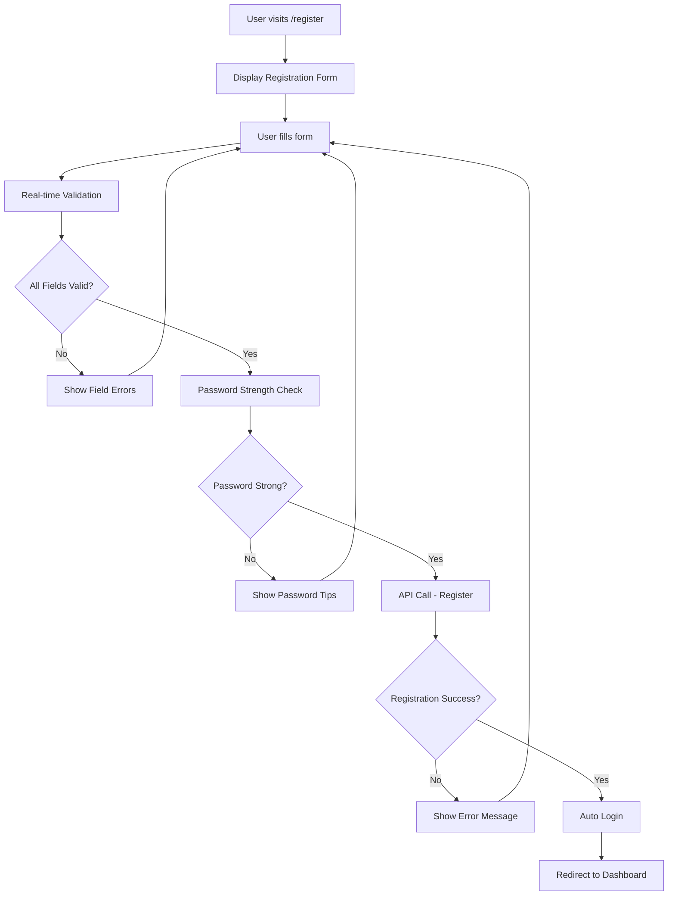
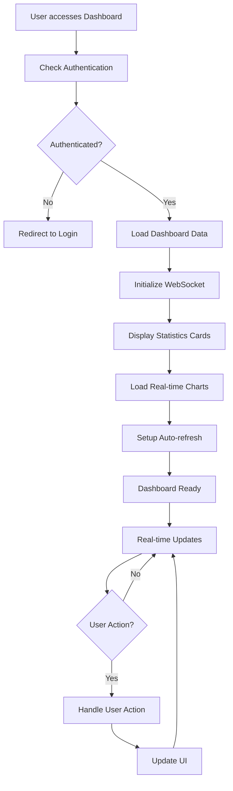
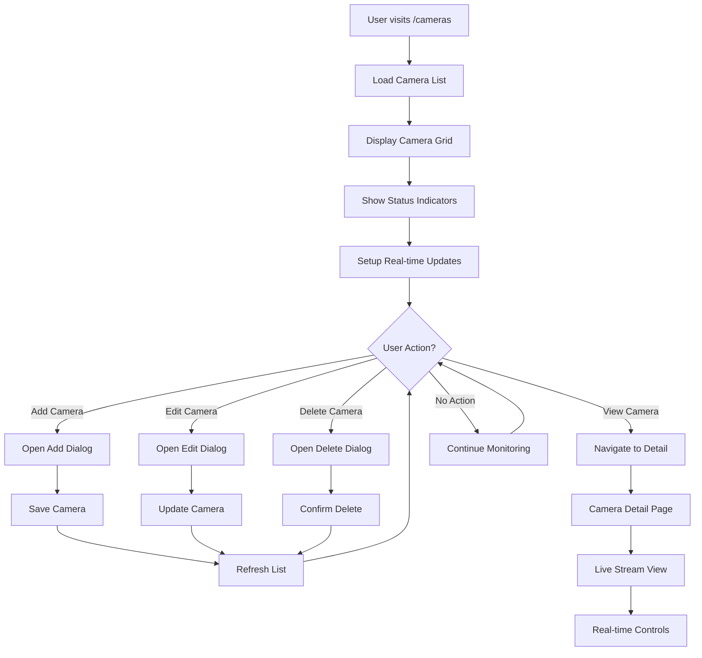
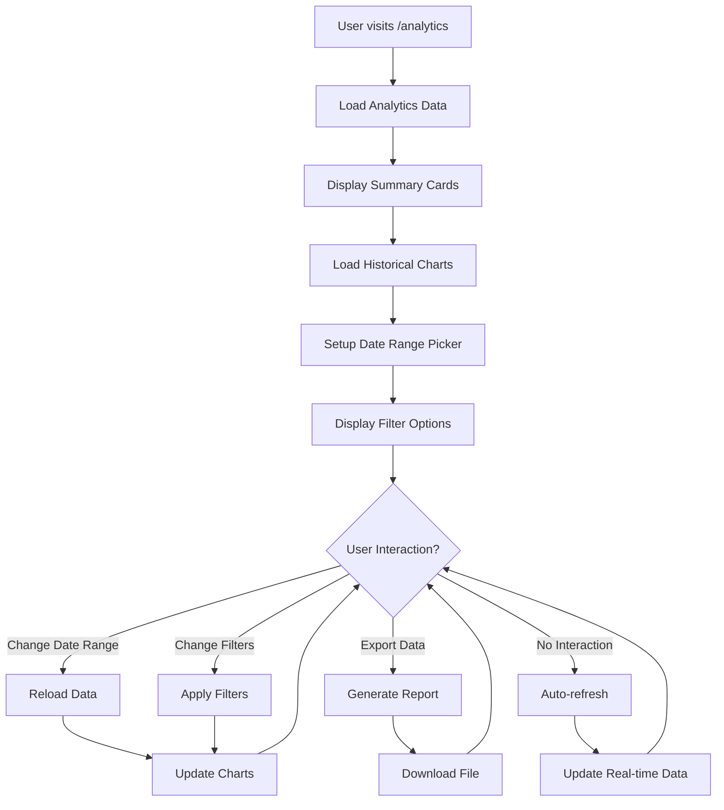

# 🎨 Frontend Development Plan - AI Camera Counting System

## 📊 **Tổng quan kế hoạch**

Tài liệu này trình bày kế hoạch phát triển frontend chi tiết cho hệ thống AI Camera Counting, bao gồm dataflow, workflow, UI/UX design và implementation roadmap.

**🟢 Status**: BACKEND READY - Frontend Development Phase  
**📅 Timeline**: 6 tuần (42 ngày)  
**👥 Team**: 2-3 Frontend Developers  
**🎯 Goal**: Production-ready React application với real-time features

---

## 🏗️ **System Architecture Overview**

### **Frontend Architecture Stack**
```
┌─────────────────────────────────────────────────────────────────────────────────┐
│                              FRONTEND ARCHITECTURE                              │
│                                                                                 │
│  ┌─────────────────┐  ┌─────────────────┐  ┌─────────────────┐                  │
│  │   Presentation  │  │   Business      │  │   Data          │                  │
│  │   Layer         │  │   Logic Layer   │  │   Layer         │                  │
│  │                 │  │                 │  │                 │                  │
│  │ • React         │  │ • Context API   │  │ • API Services  │                  │
│  │ • Material-UI   │  │ • Custom Hooks  │  │ • WebSocket     │                  │
│  │ • Vui Components│  │ • State Mgmt    │  │ • Local Storage │                  │
│  │ • ApexCharts    │  │ • Form Handling │  │ • Cache         │                  │
│  │ • React Router  │  │ • Validation    │  │ • Session Mgmt  │                  │
│  └─────────────────┘  └─────────────────┘  └─────────────────┘                  │
│           │                       │                       │                     │
│           │                       │                       │                     │
│           ▼                       ▼                       ▼                     │
│  ┌─────────────────┐  ┌─────────────────┐  ┌─────────────────┐                  │
│  │   Performance   │  │   Security      │  │   Testing       │                  │
│  │   Layer         │  │   Layer         │  │   Layer         │                  │
│  │                 │  │                 │  │                 │                  │
│  │ • Code Splitting│  │ • JWT Auth      │  │ • Unit Tests    │                  │
│  │ • Lazy Loading  │  │ • Route Guards  │  │ • Integration   │                  │
│  │ • Memoization   │  │ • Input Sanitize│  │ • E2E Tests     │                  │
│  │ • Bundle Opt    │  │ • XSS Prevention│  │ • Visual Tests  │                  │
│  │ • Image Opt     │  │ • HTTPS Only    │  │ • Performance   │                  │
│  └─────────────────┘  └─────────────────┘  └─────────────────┘                  │
└─────────────────────────────────────────────────────────────────────────────────┘
```

### **Data Flow Architecture**
```
┌─────────────────────────────────────────────────────────────────────────────────┐
│                              FRONTEND DATA FLOW                                 │
│                                                                                 │
│  ┌─────────────┐    ┌─────────────┐    ┌─────────────┐    ┌─────────────┐      │
│  │   User      │    │   React     │    │   API       │    │   Backend   │      │
│  │   Interface │    │   App       │    │   Services  │    │   Services  │      │
│  └─────────────┘    └─────────────┘    └─────────────┘    └─────────────┘      │
│         │                   │                   │                   │          │
│         │ 1. User Action    │                   │                   │          │
│         │ (Click, Form)     │                   │                   │          │
│         │──────────────────►│                   │                   │          │
│         │                   │                   │                   │          │
│         │                   │ 2. State Update   │                   │          │
│         │                   │ (Local State)     │                   │          │
│         │                   │                   │                   │          │
│         │                   │ 3. API Call       │                   │          │
│         │                   │ (Service Layer)   │                   │          │
│         │                   │──────────────────►│                   │          │
│         │                   │                   │                   │          │
│         │                   │                   │ 4. Backend        │          │
│         │                   │                   │ Processing        │          │
│         │                   │                   │                   │          │
│         │                   │                   │ 5. Response       │          │
│         │                   │                   │ (Data/Error)      │          │
│         │                   │                   │◄──────────────────┤          │
│         │                   │                   │                   │          │
│         │                   │ 6. State Update   │                   │          │
│         │                   │ (Global State)    │                   │          │
│         │                   │◄──────────────────┤                   │          │
│         │                   │                   │                   │          │
│         │ 7. UI Update      │                   │                   │          │
│         │ (Re-render)       │                   │                   │          │
│         │◄──────────────────┤                   │                   │          │
│         │                   │                   │                   │          │
└─────────────────────────────────────────────────────────────────────────────────┘
```

---

## 🎯 **Screen Design & User Workflows**

### **1. Authentication Workflow**

#### **Login Flow**


#### **Registration Flow**


### **2. Dashboard Workflow**

#### **Main Dashboard Flow**


### **3. Camera Management Workflow**

#### **Camera List Flow**


### **4. Analytics Workflow**

#### **Analytics Dashboard Flow**


---

## 🎨 **UI/UX Design Specifications**

### **Design System**

#### **Color Palette**
```css
/* Primary Colors */
--primary-main: #4318FF;
--primary-light: #6B46C1;
--primary-dark: #2D3748;

/* Secondary Colors */
--secondary-main: #00B929;
--secondary-light: #48BB78;
--secondary-dark: #2F855A;

/* Status Colors */
--success: #00B929;
--warning: #FFA500;
--error: #E53E3E;
--info: #3182CE;

/* Neutral Colors */
--background: #0F1535;
--surface: #1A1F37;
--text-primary: #FFFFFF;
--text-secondary: #A0AEC0;
--border: #2D3748;
```

#### **Typography Scale**
```css
/* Typography */
--font-family: 'Inter', sans-serif;
--font-size-xs: 0.75rem;    /* 12px */
--font-size-sm: 0.875rem;   /* 14px */
--font-size-base: 1rem;     /* 16px */
--font-size-lg: 1.125rem;   /* 18px */
--font-size-xl: 1.25rem;    /* 20px */
--font-size-2xl: 1.5rem;    /* 24px */
--font-size-3xl: 1.875rem;  /* 30px */
--font-size-4xl: 2.25rem;   /* 36px */
```

#### **Spacing System**
```css
/* Spacing */
--spacing-xs: 0.25rem;   /* 4px */
--spacing-sm: 0.5rem;    /* 8px */
--spacing-md: 1rem;      /* 16px */
--spacing-lg: 1.5rem;    /* 24px */
--spacing-xl: 2rem;      /* 32px */
--spacing-2xl: 3rem;     /* 48px */
--spacing-3xl: 4rem;     /* 64px */
```

### **Component Specifications**

#### **Button Components**
```typescript
interface ButtonProps {
  variant: 'contained' | 'outlined' | 'text';
  color: 'primary' | 'secondary' | 'success' | 'warning' | 'error';
  size: 'small' | 'medium' | 'large';
  disabled?: boolean;
  loading?: boolean;
  startIcon?: React.ReactNode;
  endIcon?: React.ReactNode;
  onClick?: () => void;
  children: React.ReactNode;
}

// Button Variants
const buttonVariants = {
  contained: {
    backgroundColor: 'var(--primary-main)',
    color: 'white',
    '&:hover': { backgroundColor: 'var(--primary-dark)' }
  },
  outlined: {
    border: '1px solid var(--primary-main)',
    color: 'var(--primary-main)',
    '&:hover': { backgroundColor: 'var(--primary-main)', color: 'white' }
  }
};
```

#### **Card Components**
```typescript
interface CardProps {
  variant: 'elevated' | 'outlined' | 'filled';
  padding: 'none' | 'small' | 'medium' | 'large';
  borderRadius: 'none' | 'small' | 'medium' | 'large';
  children: React.ReactNode;
}

// Card Styles
const cardStyles = {
  elevated: {
    backgroundColor: 'var(--surface)',
    boxShadow: '0 4px 6px rgba(0, 0, 0, 0.1)',
    borderRadius: '12px'
  },
  outlined: {
    backgroundColor: 'transparent',
    border: '1px solid var(--border)',
    borderRadius: '8px'
  }
};
```

#### **Form Components**
```typescript
interface InputProps {
  type: 'text' | 'email' | 'password' | 'number' | 'url';
  label: string;
  placeholder?: string;
  required?: boolean;
  error?: string;
  helperText?: string;
  disabled?: boolean;
  value: string;
  onChange: (value: string) => void;
}

// Input Styles
const inputStyles = {
  field: {
    backgroundColor: 'var(--surface)',
    border: '1px solid var(--border)',
    borderRadius: '8px',
    color: 'var(--text-primary)',
    '&:focus': {
      borderColor: 'var(--primary-main)',
      boxShadow: '0 0 0 2px rgba(67, 24, 255, 0.2)'
    }
  }
};
```

### **Responsive Design**

#### **Breakpoint System**
```css
/* Breakpoints */
--breakpoint-xs: 0px;
--breakpoint-sm: 600px;
--breakpoint-md: 960px;
--breakpoint-lg: 1280px;
--breakpoint-xl: 1920px;

/* Responsive Utilities */
.container {
  max-width: 1200px;
  margin: 0 auto;
  padding: 0 var(--spacing-md);
}

@media (max-width: 960px) {
  .container {
    padding: 0 var(--spacing-sm);
  }
}
```

#### **Grid System**
```typescript
interface GridProps {
  container?: boolean;
  item?: boolean;
  xs?: number;    // 0-12
  sm?: number;    // 0-12
  md?: number;    // 0-12
  lg?: number;    // 0-12
  xl?: number;    // 0-12
  spacing?: number;
  children: React.ReactNode;
}

// Grid Layout Examples
const gridLayouts = {
  dashboard: {
    xs: 12,    // Full width on mobile
    sm: 6,     // Half width on tablet
    md: 4,     // One-third on desktop
    lg: 3      // Quarter width on large screens
  }
};
```

---

## 🔧 **Technical Implementation Plan**

### **Phase 1: Foundation & Authentication (Tuần 1-2)**

#### **Week 1: Project Setup & Core Infrastructure**

##### **Day 1-2: Project Setup**
```bash
# Tasks
- [ ] Setup development environment
- [ ] Configure TypeScript
- [ ] Setup ESLint, Prettier, Husky
- [ ] Configure testing framework (Jest + RTL)
- [ ] Setup build pipeline
- [ ] Configure environment variables
```

##### **Day 3-4: Authentication Enhancement**
```typescript
// Enhanced AuthContext
interface AuthState {
  user: User | null;
  isAuthenticated: boolean;
  loading: boolean;
  error: string | null;
  permissions: string[];
}

// Features to implement:
- [ ] Enhanced form validation
- [ ] Real-time password strength indicator
- [ ] Remember me functionality
- [ ] Auto-logout on token expiry
- [ ] Session management
- [ ] Role-based access control
```

##### **Day 5-7: UI Component Library**
```typescript
// Core Components to build:
- [ ] VuiButton (enhanced)
- [ ] VuiInput (enhanced)
- [ ] VuiCard (enhanced)
- [ ] VuiModal
- [ ] VuiLoading
- [ ] VuiAlert
- [ ] VuiBadge
- [ ] VuiTooltip
```

#### **Week 2: Dashboard & Navigation**

##### **Day 1-3: Dashboard Real-time Integration**
```typescript
// WebSocket Integration
interface WebSocketService {
  connect(): Promise<void>;
  disconnect(): void;
  subscribe(event: string, callback: Function): void;
  unsubscribe(event: string): void;
  send(event: string, data: any): void;
}

// Features to implement:
- [ ] WebSocket connection management
- [ ] Real-time statistics updates
- [ ] Live charts integration
- [ ] Connection status indicators
- [ ] Auto-reconnection logic
```

##### **Day 4-5: Navigation & Layout**
```typescript
// Layout Components
- [ ] Responsive sidebar navigation
- [ ] Breadcrumb navigation
- [ ] Mobile navigation menu
- [ ] User profile dropdown
- [ ] Notification center
- [ ] Search functionality
```

##### **Day 6-7: Dashboard Components**
```typescript
// Dashboard Widgets
- [ ] Statistics cards with real-time data
- [ ] Live camera grid
- [ ] Quick action buttons
- [ ] Recent activity feed
- [ ] System status indicators
- [ ] Performance metrics
```

### **Phase 2: Core Features (Tuần 3-4)**

#### **Week 3: Camera Management**

##### **Day 1-3: Camera List Enhancement**
```typescript
// Camera Management Features
- [ ] Enhanced camera grid/list view
- [ ] Real-time status updates
- [ ] Bulk operations (start/stop/restart)
- [ ] Advanced filtering and search
- [ ] Camera grouping and organization
- [ ] Quick camera controls
```

##### **Day 4-5: Camera Detail & Live Stream**
```typescript
// Live Stream Integration
- [ ] Video stream player
- [ ] Stream quality controls
- [ ] Recording functionality
- [ ] Screenshot capture
- [ ] Stream analytics
- [ ] Error handling and recovery
```

##### **Day 6-7: Camera Configuration**
```typescript
// Camera Settings
- [ ] Camera configuration forms
- [ ] Detection settings
- [ ] Recording settings
- [ ] Alert configuration
- [ ] Performance optimization
- [ ] Settings validation
```

#### **Week 4: Analytics & Reporting**

##### **Day 1-3: Analytics Dashboard**
```typescript
// Analytics Components
- [ ] Interactive charts (ApexCharts)
- [ ] Date range picker
- [ ] Filtering options
- [ ] Real-time analytics
- [ ] Performance metrics
- [ ] Trend analysis
```

##### **Day 4-5: Reporting System**
```typescript
// Reporting Features
- [ ] Report generation
- [ ] Export functionality (PDF/Excel)
- [ ] Scheduled reports
- [ ] Custom report templates
- [ ] Report sharing
- [ ] Report history
```

##### **Day 6-7: Data Visualization**
```typescript
// Chart Components
- [ ] Line charts for trends
- [ ] Bar charts for comparisons
- [ ] Pie charts for distributions
- [ ] Heat maps for patterns
- [ ] Gauge charts for metrics
- [ ] Interactive tooltips
```

### **Phase 3: Advanced Features (Tuần 5-6)**

#### **Week 5: Real-time Monitoring & Alerts**

##### **Day 1-3: Real-time Monitoring**
```typescript
// Real-time Features
- [ ] Live count display
- [ ] Real-time alerts
- [ ] Event timeline
- [ ] System health monitoring
- [ ] Performance tracking
- [ ] Error monitoring
```

##### **Day 4-5: Alert System**
```typescript
// Alert Management
- [ ] Alert configuration
- [ ] Alert history
- [ ] Alert notifications
- [ ] Alert escalation
- [ ] Alert acknowledgment
- [ ] Alert reporting
```

##### **Day 6-7: Settings & Configuration**
```typescript
// Settings Management
- [ ] User profile settings
- [ ] System configuration
- [ ] Notification preferences
- [ ] Theme customization
- [ ] Language settings
- [ ] Security settings
```

#### **Week 6: Polish & Optimization**

##### **Day 1-3: Performance Optimization**
```typescript
// Performance Features
- [ ] Code splitting
- [ ] Lazy loading
- [ ] Image optimization
- [ ] Bundle optimization
- [ ] Memory management
- [ ] Caching strategies
```

##### **Day 4-5: Testing & Quality Assurance**
```typescript
// Testing Implementation
- [ ] Unit tests (80% coverage)
- [ ] Integration tests
- [ ] E2E tests
- [ ] Visual regression tests
- [ ] Performance tests
- [ ] Accessibility tests
```

##### **Day 6-7: Final Polish**
```typescript
// Final Touches
- [ ] Error boundaries
- [ ] Loading states
- [ ] Offline support
- [ ] Accessibility improvements
- [ ] Documentation
- [ ] Deployment preparation
```

---

## 📊 **Data Flow Implementation**

### **Authentication Data Flow**
```typescript
// Authentication Flow Implementation
class AuthenticationService {
  async login(credentials: LoginCredentials): Promise<AuthResponse> {
    try {
      // 1. Validate input
      this.validateCredentials(credentials);
      
      // 2. API call
      const response = await this.api.post('/auth/login', credentials);
      
      // 3. Store tokens
      this.storeTokens(response.data.tokens);
      
      // 4. Update context
      this.updateAuthContext(response.data.user);
      
      // 5. Setup auto-refresh
      this.setupTokenRefresh();
      
      return response.data;
    } catch (error) {
      this.handleAuthError(error);
      throw error;
    }
  }
}
```

### **Real-time Data Flow**
```typescript
// WebSocket Data Flow
class WebSocketService {
  private socket: WebSocket | null = null;
  private reconnectAttempts = 0;
  private maxReconnectAttempts = 5;

  connect(): Promise<void> {
    return new Promise((resolve, reject) => {
      this.socket = new WebSocket(process.env.REACT_APP_WS_URL);
      
      this.socket.onopen = () => {
        this.reconnectAttempts = 0;
        this.authenticate();
        resolve();
      };
      
      this.socket.onmessage = (event) => {
        this.handleMessage(JSON.parse(event.data));
      };
      
      this.socket.onerror = (error) => {
        reject(error);
      };
      
      this.socket.onclose = () => {
        this.handleDisconnect();
      };
    });
  }

  private handleMessage(data: any) {
    switch (data.type) {
      case 'camera_update':
        this.updateCameraData(data.payload);
        break;
      case 'count_update':
        this.updateCountData(data.payload);
        break;
      case 'alert':
        this.showAlert(data.payload);
        break;
      case 'system_status':
        this.updateSystemStatus(data.payload);
        break;
    }
  }
}
```

### **Camera Management Data Flow**
```typescript
// Camera Management Flow
class CameraService {
  async getCameras(): Promise<Camera[]> {
    try {
      const response = await this.api.get('/cameras');
      return response.data;
    } catch (error) {
      this.handleError(error);
      throw error;
    }
  }

  async updateCamera(id: string, data: Partial<Camera>): Promise<Camera> {
    try {
      const response = await this.api.put(`/cameras/${id}`, data);
      
      // Update local state
      this.updateCameraInStore(id, response.data);
      
      // Notify real-time subscribers
      this.notifyCameraUpdate(response.data);
      
      return response.data;
    } catch (error) {
      this.handleError(error);
      throw error;
    }
  }
}
```

---

## 🧪 **Testing Strategy**

### **Test Coverage Requirements**
```typescript
// Testing Configuration
const testConfig = {
  coverage: {
    statements: 80,
    branches: 80,
    functions: 80,
    lines: 80
  },
  testTypes: {
    unit: true,
    integration: true,
    e2e: true,
    visual: true,
    performance: true
  }
};
```

### **Unit Testing**
```typescript
// Example Unit Test
describe('AuthenticationService', () => {
  it('should login user successfully', async () => {
    const credentials = {
      email: 'test@example.com',
      password: 'TestPass123!'
    };
    
    const mockResponse = {
      success: true,
      data: {
        user: { id: 1, email: 'test@example.com' },
        tokens: { access: 'token', refresh: 'refresh' }
      }
    };
    
    api.post.mockResolvedValue(mockResponse);
    
    const result = await authService.login(credentials);
    
    expect(result.success).toBe(true);
    expect(result.data.user.email).toBe('test@example.com');
  });
});
```

### **Integration Testing**
```typescript
// Example Integration Test
describe('Camera Management Integration', () => {
  it('should create and update camera', async () => {
    // Create camera
    const newCamera = await cameraService.createCamera({
      name: 'Test Camera',
      location: 'Test Location',
      streamUrl: 'rtsp://test.com/stream'
    });
    
    expect(newCamera.name).toBe('Test Camera');
    
    // Update camera
    const updatedCamera = await cameraService.updateCamera(newCamera.id, {
      name: 'Updated Camera'
    });
    
    expect(updatedCamera.name).toBe('Updated Camera');
  });
});
```

### **E2E Testing**
```typescript
// Example E2E Test
describe('User Authentication Flow', () => {
  it('should complete login flow', async () => {
    await page.goto('/login');
    
    await page.fill('[data-testid="email-input"]', 'test@example.com');
    await page.fill('[data-testid="password-input"]', 'TestPass123!');
    await page.click('[data-testid="login-button"]');
    
    await page.waitForURL('/dashboard');
    
    const dashboardTitle = await page.textContent('[data-testid="dashboard-title"]');
    expect(dashboardTitle).toBe('Dashboard');
  });
});
```

---

## 🚀 **Performance Optimization**

### **Bundle Optimization**
```typescript
// Webpack Configuration
const webpackConfig = {
  optimization: {
    splitChunks: {
      chunks: 'all',
      cacheGroups: {
        vendor: {
          test: /[\\/]node_modules[\\/]/,
          name: 'vendors',
          chunks: 'all'
        },
        common: {
          name: 'common',
          minChunks: 2,
          chunks: 'all'
        }
      }
    }
  }
};
```

### **Code Splitting**
```typescript
// Lazy Loading Implementation
const Dashboard = lazy(() => import('./pages/Dashboard'));
const Cameras = lazy(() => import('./pages/Cameras'));
const Analytics = lazy(() => import('./pages/Analytics'));

// Route-based splitting
const routes = [
  {
    path: '/dashboard',
    component: Dashboard,
    preload: () => import('./pages/Dashboard')
  }
];
```

### **Caching Strategy**
```typescript
// Cache Implementation
class CacheService {
  private cache = new Map();
  private ttl = new Map();

  set(key: string, value: any, ttlMs: number = 300000) {
    this.cache.set(key, value);
    this.ttl.set(key, Date.now() + ttlMs);
  }

  get(key: string): any {
    if (this.isExpired(key)) {
      this.delete(key);
      return null;
    }
    return this.cache.get(key);
  }

  private isExpired(key: string): boolean {
    const expiry = this.ttl.get(key);
    return expiry && Date.now() > expiry;
  }
}
```

---

## 📈 **Success Metrics**

### **Performance Metrics**
```typescript
// Performance Targets
const performanceTargets = {
  pageLoad: {
    firstContentfulPaint: '< 1.5s',
    largestContentfulPaint: '< 2.5s',
    timeToInteractive: '< 3.5s'
  },
  bundle: {
    initialLoad: '< 500KB',
    totalSize: '< 2MB'
  },
  api: {
    responseTime: '< 200ms',
    errorRate: '< 1%'
  }
};
```

### **User Experience Metrics**
```typescript
// UX Metrics
const uxMetrics = {
  accessibility: {
    wcagCompliance: 'AA',
    keyboardNavigation: '100%',
    screenReaderSupport: '100%'
  },
  responsiveness: {
    mobilePerformance: '90+',
    tabletPerformance: '90+',
    desktopPerformance: '95+'
  },
  usability: {
    taskCompletionRate: '95%',
    errorRate: '< 2%',
    userSatisfaction: '4.5+'
  }
};
```

---

## 📋 **Implementation Checklist**

### **Phase 1 Checklist**
- [ ] Project setup and configuration
- [ ] Authentication system enhancement
- [ ] Core UI components
- [ ] Navigation and layout
- [ ] Dashboard real-time integration
- [ ] WebSocket connection management

### **Phase 2 Checklist**
- [ ] Camera management enhancement
- [ ] Live stream integration
- [ ] Analytics dashboard
- [ ] Reporting system
- [ ] Data visualization
- [ ] Export functionality

### **Phase 3 Checklist**
- [ ] Real-time monitoring
- [ ] Alert system
- [ ] Settings management
- [ ] Performance optimization
- [ ] Testing implementation
- [ ] Final polish and deployment

---

## 🎯 **Next Steps**

1. **Immediate Actions**:
   - Setup development environment
   - Configure TypeScript and testing
   - Begin authentication enhancement

2. **Week 1 Goals**:
   - Complete project setup
   - Implement enhanced authentication
   - Build core UI components

3. **Success Criteria**:
   - All authentication flows working
   - Real-time dashboard functional
   - Core components tested and documented

---

**📅 Last Updated**: 2025-01-14  
**👥 Author**: Frontend Development Team  
**📊 Status**: Planning Phase - Ready for Implementation 