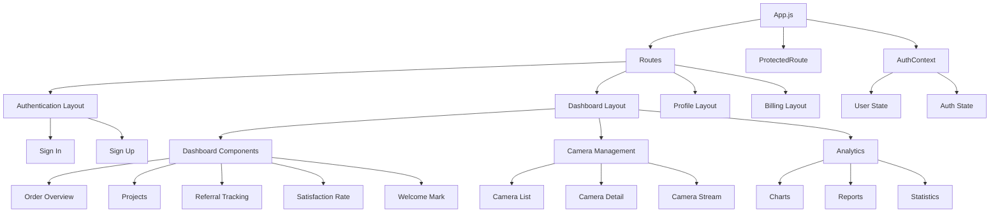

# Frontend Architecture - AI Camera Counting System

## 📊 Tổng quan
Tài liệu này định nghĩa kiến trúc frontend cho hệ thống AI Camera Counting, bao gồm component hierarchy, state management, routing và design patterns.

## 🏗️ Architecture Overview



## 📁 Component Structure

### Root Level Components
```
src/
├── App.js                    # Main application component
├── index.js                  # Application entry point
├── routes.js                 # Route definitions
├── context/
│   ├── AuthContext.js        # Authentication context
│   └── index.js              # Context exports
├── components/               # Reusable components
│   ├── LoadingSpinner.js     # Loading indicator
│   ├── ProtectedRoute.js     # Route protection
│   └── VuiComponents/        # Custom UI components
├── layouts/                  # Layout components
│   ├── authentication/       # Auth layouts
│   ├── dashboard/           # Dashboard layouts
│   ├── profile/             # Profile layouts
│   └── billing/             # Billing layouts
├── services/                # API services
│   ├── authAPI.js           # Authentication API
│   └── cameraAPI.js         # Camera API
└── variables/               # Global variables
    └── charts.js            # Chart configurations
```

## 🧩 Component Hierarchy

### 1. Application Root
```jsx
// App.js
import React from 'react';
import { BrowserRouter as Router } from 'react-router-dom';
import { AuthProvider } from './context/AuthContext';
import Routes from './routes';

function App() {
  return (
    <Router>
      <AuthProvider>
        <Routes />
      </AuthProvider>
    </Router>
  );
}
```

### 2. Authentication Context
```jsx
// context/AuthContext.js
import React, { createContext, useContext, useReducer } from 'react';

const AuthContext = createContext();

const initialState = {
  user: null,
  isAuthenticated: false,
  loading: true,
  error: null
};

function authReducer(state, action) {
  switch (action.type) {
    case 'LOGIN_SUCCESS':
      return {
        ...state,
        user: action.payload.user,
        isAuthenticated: true,
        loading: false,
        error: null
      };
    case 'LOGOUT':
      return {
        ...state,
        user: null,
        isAuthenticated: false,
        loading: false
      };
    default:
      return state;
  }
}

export function AuthProvider({ children }) {
  const [state, dispatch] = useReducer(authReducer, initialState);
  
  return (
    <AuthContext.Provider value={{ state, dispatch }}>
      {children}
    </AuthContext.Provider>
  );
}

export function useAuth() {
  return useContext(AuthContext);
}
```

### 3. Protected Route Component
```jsx
// components/ProtectedRoute.js
import React from 'react';
import { Navigate, useLocation } from 'react-router-dom';
import { useAuth } from '../context/AuthContext';
import LoadingSpinner from './LoadingSpinner';

function ProtectedRoute({ children, requiredRole = null }) {
  const { state } = useAuth();
  const location = useLocation();

  if (state.loading) {
    return <LoadingSpinner />;
  }

  if (!state.isAuthenticated) {
    return <Navigate to="/sign-in" state={{ from: location }} replace />;
  }

  if (requiredRole && state.user?.role !== requiredRole) {
    return <Navigate to="/unauthorized" replace />;
  }

  return children;
}
```

## 🎨 Layout Components

### 1. Dashboard Layout
```jsx
// layouts/dashboard/index.js
import React from 'react';
import { Box } from '@mui/material';
import DashboardNavbar from './components/DashboardNavbar';
import Sidenav from './components/Sidenav';
import Footer from './components/Footer';

function DashboardLayout({ children }) {
  return (
    <Box sx={{ display: 'flex' }}>
      <Sidenav />
      <Box sx={{ flexGrow: 1 }}>
        <DashboardNavbar />
        <Box component="main" sx={{ p: 3 }}>
          {children}
        </Box>
        <Footer />
      </Box>
    </Box>
  );
}
```

### 2. Authentication Layout
```jsx
// layouts/authentication/index.js
import React from 'react';
import { Box, Container } from '@mui/material';
import BasicLayout from './components/BasicLayout';
import CoverLayout from './components/CoverLayout';

function AuthenticationLayout({ children, variant = 'basic' }) {
  const LayoutComponent = variant === 'cover' ? CoverLayout : BasicLayout;
  
  return (
    <LayoutComponent>
      <Container maxWidth="sm">
        {children}
      </Container>
    </LayoutComponent>
  );
}
```

## 🔄 State Management

### 1. Global State Structure
```typescript
interface AppState {
  auth: {
    user: User | null;
    isAuthenticated: boolean;
    loading: boolean;
    error: string | null;
  };
  cameras: {
    list: Camera[];
    selectedCamera: Camera | null;
    loading: boolean;
    error: string | null;
  };
  countData: {
    data: CountData[];
    realtime: CountData | null;
    loading: boolean;
    error: string | null;
  };
  analytics: {
    summary: AnalyticsSummary | null;
    hourly: HourlyData[];
    loading: boolean;
    error: string | null;
  };
}
```

### 2. Context Providers
```jsx
// Context composition
function AppProviders({ children }) {
  return (
    <AuthProvider>
      <CameraProvider>
        <CountDataProvider>
          <AnalyticsProvider>
            {children}
          </AnalyticsProvider>
        </CountDataProvider>
      </CameraProvider>
    </AuthProvider>
  );
}
```

### 3. Custom Hooks
```jsx
// hooks/useCameras.js
import { useState, useEffect } from 'react';
import { cameraAPI } from '../services/cameraAPI';

export function useCameras() {
  const [cameras, setCameras] = useState([]);
  const [loading, setLoading] = useState(true);
  const [error, setError] = useState(null);

  useEffect(() => {
    fetchCameras();
  }, []);

  const fetchCameras = async () => {
    try {
      setLoading(true);
      const data = await cameraAPI.getCameras();
      setCameras(data);
    } catch (err) {
      setError(err.message);
    } finally {
      setLoading(false);
    }
  };

  return { cameras, loading, error, refetch: fetchCameras };
}
```

## 🛣️ Routing Structure

### Route Configuration
```jsx
// routes.js
import React from 'react';
import { Routes, Route, Navigate } from 'react-router-dom';
import ProtectedRoute from './components/ProtectedRoute';

// Layouts
import DashboardLayout from './layouts/dashboard';
import AuthenticationLayout from './layouts/authentication';
import ProfileLayout from './layouts/profile';

// Pages
import SignIn from './layouts/authentication/sign-in';
import SignUp from './layouts/authentication/sign-up';
import Dashboard from './layouts/dashboard';
import Profile from './layouts/profile';
import CameraManagement from './layouts/dashboard/components/CameraManagement';
import Analytics from './layouts/dashboard/components/Analytics';

function AppRoutes() {
  return (
    <Routes>
      {/* Public Routes */}
      <Route path="/sign-in" element={
        <AuthenticationLayout>
          <SignIn />
        </AuthenticationLayout>
      } />
      <Route path="/sign-up" element={
        <AuthenticationLayout>
          <SignUp />
        </AuthenticationLayout>
      } />

      {/* Protected Routes */}
      <Route path="/dashboard" element={
        <ProtectedRoute>
          <DashboardLayout>
            <Dashboard />
          </DashboardLayout>
        </ProtectedRoute>
      } />
      
      <Route path="/cameras" element={
        <ProtectedRoute>
          <DashboardLayout>
            <CameraManagement />
          </DashboardLayout>
        </ProtectedRoute>
      } />
      
      <Route path="/analytics" element={
        <ProtectedRoute>
          <DashboardLayout>
            <Analytics />
          </DashboardLayout>
        </ProtectedRoute>
      } />
      
      <Route path="/profile" element={
        <ProtectedRoute>
          <ProfileLayout>
            <Profile />
          </ProfileLayout>
        </ProtectedRoute>
      } />

      {/* Default redirect */}
      <Route path="/" element={<Navigate to="/dashboard" replace />} />
    </Routes>
  );
}
```

## 🎯 Component Patterns

### 1. Container/Presentational Pattern
```jsx
// Container Component
function CameraListContainer() {
  const { cameras, loading, error } = useCameras();
  
  if (loading) return <LoadingSpinner />;
  if (error) return <ErrorMessage message={error} />;
  
  return <CameraList cameras={cameras} />;
}

// Presentational Component
function CameraList({ cameras }) {
  return (
    <Grid container spacing={2}>
      {cameras.map(camera => (
        <Grid item xs={12} md={6} lg={4} key={camera.id}>
          <CameraCard camera={camera} />
        </Grid>
      ))}
    </Grid>
  );
}
```

### 2. Compound Component Pattern
```jsx
// Compound Component
function CameraCard({ camera, children }) {
  return (
    <Card>
      <CardHeader title={camera.name} />
      <CardContent>
        {children}
      </CardContent>
    </Card>
  );
}

CameraCard.Status = function CameraStatus({ status }) {
  return <Chip label={status} color={getStatusColor(status)} />;
};

CameraCard.Stream = function CameraStream({ streamUrl }) {
  return <VideoPlayer url={streamUrl} />;
};

// Usage
<CameraCard camera={camera}>
  <CameraCard.Status status={camera.status} />
  <CameraCard.Stream streamUrl={camera.stream_url} />
</CameraCard>
```

### 3. Render Props Pattern
```jsx
// Render Props Component
function WithRealTimeData({ cameraId, children }) {
  const [data, setData] = useState(null);
  
  useEffect(() => {
    const ws = new WebSocket(`ws://localhost:3003/camera/${cameraId}`);
    
    ws.onmessage = (event) => {
      const countData = JSON.parse(event.data);
      setData(countData);
    };
    
    return () => ws.close();
  }, [cameraId]);
  
  return children(data);
}

// Usage
<WithRealTimeData cameraId={1}>
  {(data) => (
    <CountDisplay 
      peopleIn={data?.people_in || 0}
      peopleOut={data?.people_out || 0}
      currentCount={data?.current_count || 0}
    />
  )}
</WithRealTimeData>
```

## 🔧 Service Layer

### 1. API Service Base
```jsx
// services/api.js
class ApiService {
  constructor(baseURL) {
    this.baseURL = baseURL;
  }

  async request(endpoint, options = {}) {
    const url = `${this.baseURL}${endpoint}`;
    const config = {
      headers: {
        'Content-Type': 'application/json',
        ...options.headers,
      },
      ...options,
    };

    // Add auth token
    const token = localStorage.getItem('accessToken');
    if (token) {
      config.headers.Authorization = `Bearer ${token}`;
    }

    try {
      const response = await fetch(url, config);
      
      if (!response.ok) {
        throw new Error(`HTTP error! status: ${response.status}`);
      }
      
      return await response.json();
    } catch (error) {
      console.error('API request failed:', error);
      throw error;
    }
  }

  get(endpoint) {
    return this.request(endpoint);
  }

  post(endpoint, data) {
    return this.request(endpoint, {
      method: 'POST',
      body: JSON.stringify(data),
    });
  }

  put(endpoint, data) {
    return this.request(endpoint, {
      method: 'PUT',
      body: JSON.stringify(data),
    });
  }

  delete(endpoint) {
    return this.request(endpoint, {
      method: 'DELETE',
    });
  }
}
```

### 2. Authentication Service
```jsx
// services/authAPI.js
import { apiService } from './api';

class AuthService {
  async login(credentials) {
    const response = await apiService.post('/auth/login', credentials);
    
    if (response.success) {
      localStorage.setItem('accessToken', response.data.accessToken);
      localStorage.setItem('refreshToken', response.data.refreshToken);
    }
    
    return response;
  }

  async register(userData) {
    const response = await apiService.post('/auth/register', userData);
    
    if (response.success) {
      localStorage.setItem('accessToken', response.data.accessToken);
      localStorage.setItem('refreshToken', response.data.refreshToken);
    }
    
    return response;
  }

  async logout() {
    try {
      await apiService.post('/auth/logout');
    } finally {
      localStorage.removeItem('accessToken');
      localStorage.removeItem('refreshToken');
    }
  }

  async refreshToken() {
    const refreshToken = localStorage.getItem('refreshToken');
    if (!refreshToken) throw new Error('No refresh token');

    const response = await apiService.post('/auth/refresh', { refreshToken });
    
    if (response.success) {
      localStorage.setItem('accessToken', response.data.accessToken);
      localStorage.setItem('refreshToken', response.data.refreshToken);
    }
    
    return response;
  }

  async getCurrentUser() {
    return await apiService.get('/auth/me');
  }
}

export const authService = new AuthService();
```

### 3. Camera Service
```jsx
// services/cameraAPI.js
import { apiService } from './api';

class CameraService {
  async getCameras(params = {}) {
    const queryString = new URLSearchParams(params).toString();
    const endpoint = `/cameras${queryString ? `?${queryString}` : ''}`;
    return await apiService.get(endpoint);
  }

  async getCamera(id) {
    return await apiService.get(`/cameras/${id}`);
  }

  async createCamera(cameraData) {
    return await apiService.post('/cameras', cameraData);
  }

  async updateCamera(id, cameraData) {
    return await apiService.put(`/cameras/${id}`, cameraData);
  }

  async deleteCamera(id) {
    return await apiService.delete(`/cameras/${id}`);
  }

  async getCountData(params = {}) {
    const queryString = new URLSearchParams(params).toString();
    const endpoint = `/counts${queryString ? `?${queryString}` : ''}`;
    return await apiService.get(endpoint);
  }

  async getRealTimeCount(cameraId) {
    return await apiService.get(`/counts/realtime?camera_id=${cameraId}`);
  }
}

export const cameraService = new CameraService();
```

## 🎨 UI Component Library

### 1. Custom VUI Components
```jsx
// components/VuiButton/index.js
import VuiButtonRoot from './VuiButtonRoot';

const VuiButton = ({ color, variant, size, circular, iconOnly, children, ...rest }) => {
  return (
    <VuiButtonRoot
      {...rest}
      ownerState={{ color, variant, size, circular, iconOnly }}
    >
      {children}
    </VuiButtonRoot>
  );
};

export default VuiButton;
```

### 2. Theme Configuration
```jsx
// assets/theme/index.js
import { createTheme } from '@mui/material/styles';

const theme = createTheme({
  palette: {
    primary: {
      main: '#4318FF',
      light: '#6B46C1',
      dark: '#2D3748',
    },
    secondary: {
      main: '#A0AEC0',
    },
    success: {
      main: '#48BB78',
    },
    warning: {
      main: '#ED8936',
    },
    error: {
      main: '#F56565',
    },
  },
  typography: {
    fontFamily: '"Inter", "Helvetica", "Arial", sans-serif',
  },
  components: {
    MuiButton: {
      styleOverrides: {
        root: {
          textTransform: 'none',
          borderRadius: '8px',
        },
      },
    },
  },
});

export default theme;
```

## 📊 Performance Optimization

### 1. Code Splitting
```jsx
// Lazy loading components
import React, { lazy, Suspense } from 'react';
import LoadingSpinner from './components/LoadingSpinner';

const Dashboard = lazy(() => import('./layouts/dashboard'));
const Analytics = lazy(() => import('./layouts/dashboard/components/Analytics'));
const CameraManagement = lazy(() => import('./layouts/dashboard/components/CameraManagement'));

function AppRoutes() {
  return (
    <Suspense fallback={<LoadingSpinner />}>
      <Routes>
        <Route path="/dashboard" element={<Dashboard />} />
        <Route path="/analytics" element={<Analytics />} />
        <Route path="/cameras" element={<CameraManagement />} />
      </Routes>
    </Suspense>
  );
}
```

### 2. Memoization
```jsx
// Memoized components
import React, { memo, useMemo } from 'react';

const CameraCard = memo(function CameraCard({ camera, onSelect }) {
  const statusColor = useMemo(() => {
    switch (camera.status) {
      case 'active': return 'success';
      case 'inactive': return 'error';
      case 'maintenance': return 'warning';
      default: return 'default';
    }
  }, [camera.status]);

  return (
    <Card>
      <CardHeader title={camera.name} />
      <CardContent>
        <Chip label={camera.status} color={statusColor} />
      </CardContent>
    </Card>
  );
});
```

### 3. Virtual Scrolling
```jsx
// Virtual scrolling for large lists
import { FixedSizeList as List } from 'react-window';

function CameraList({ cameras }) {
  const Row = ({ index, style }) => (
    <div style={style}>
      <CameraCard camera={cameras[index]} />
    </div>
  );

  return (
    <List
      height={600}
      itemCount={cameras.length}
      itemSize={200}
      width="100%"
    >
      {Row}
    </List>
  );
}
```

## 🔒 Security Considerations

### 1. Input Validation
```jsx
// Form validation
import { useFormik } from 'formik';
import * as Yup from 'yup';

const validationSchema = Yup.object({
  name: Yup.string()
    .required('Name is required')
    .min(2, 'Name must be at least 2 characters')
    .max(255, 'Name must not exceed 255 characters'),
  stream_url: Yup.string()
    .url('Invalid URL format')
    .matches(/^rtsp:\/\//, 'Must be RTSP URL'),
});

function CameraForm({ onSubmit }) {
  const formik = useFormik({
    initialValues: { name: '', stream_url: '' },
    validationSchema,
    onSubmit,
  });

  return (
    <form onSubmit={formik.handleSubmit}>
      {/* Form fields */}
    </form>
  );
}
```

### 2. XSS Prevention
```jsx
// Safe rendering
import DOMPurify from 'dompurify';

function SafeContent({ content }) {
  const sanitizedContent = DOMPurify.sanitize(content);
  
  return (
    <div 
      dangerouslySetInnerHTML={{ __html: sanitizedContent }}
    />
  );
}
```

---

**Last Updated**: 2025-07-03  
**Version**: 1.0.0  
**Status**: Ready for Implementation 