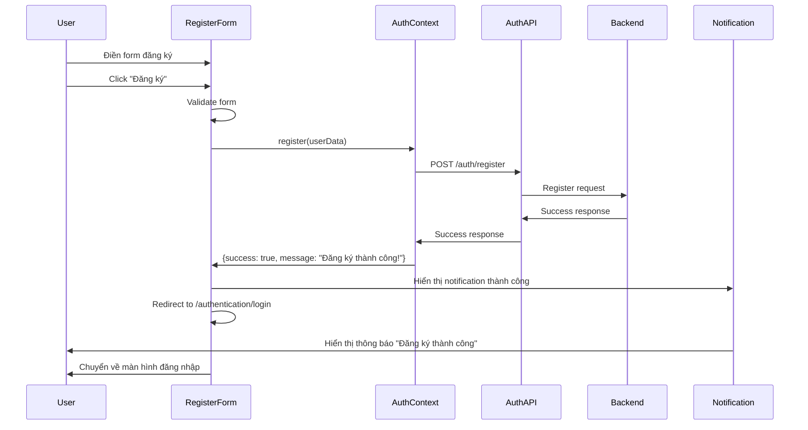
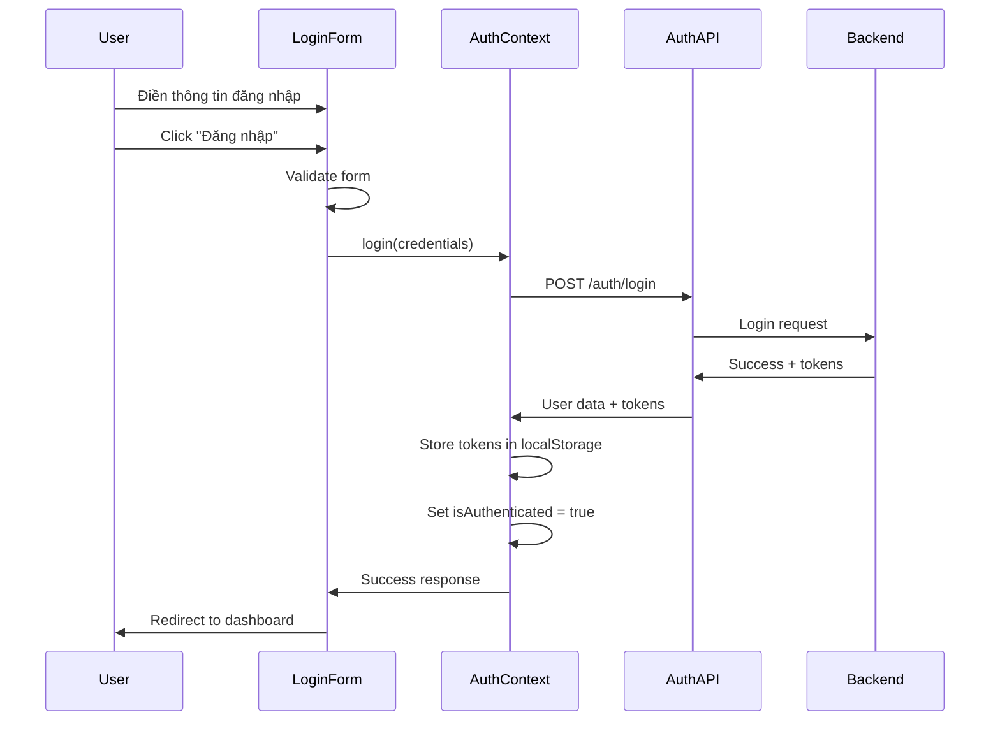

# Authentication Flow - Frontend

## Tổng quan

Tài liệu này mô tả luồng xác thực (authentication) trong frontend, bao gồm đăng nhập, đăng ký và quên mật khẩu.

## Luồng đăng ký (Registration Flow)

### 1. Luồng đăng ký thành công

### 2. Các bước chi tiết

1. **User điền form đăng ký** với các thông tin:
   - Họ và tên
   - Tên đăng nhập
   - Email
   - Mật khẩu
   - Xác nhận mật khẩu
   - Mã đăng ký
   - Đồng ý điều khoản

2. **Validation real-time** cho từng field:
   - Email format
   - Password strength
   - Username format
   - Password confirmation match

3. **Submit form**:
   - Validate toàn bộ form
   - Gọi API đăng ký
   - Xử lý response

4. **Thành công**:
   - Hiển thị notification thành công
   - Redirect về màn hình đăng nhập
   - KHÔNG tự động đăng nhập

5. **Thất bại**:
   - Hiển thị error message
   - Giữ nguyên form data
   - Cho phép user sửa lỗi

### 3. Luồng đăng nhập (Login Flow)

## Components

### 1. RegisterForm
- **Props**: `onSuccess`, `onError`, `className`
- **State**: form data, validation errors, notification
- **Features**:
  - Real-time validation
  - Password strength indicator
  - Success notification
  - Auto redirect to login

### 2. LoginForm
- **Props**: `onSuccess`, `onError`, `className`
- **State**: form data, validation errors
- **Features**:
  - Remember me checkbox
  - Forgot password link
  - Auto redirect to dashboard

### 3. Notification Component
- **Props**: `open`, `message`, `type`, `title`, `onClose`
- **Types**: success, error, warning, info
- **Features**:
  - Auto-hide after 6 seconds
  - Custom action button
  - Responsive design

## Error Handling

### 1. Validation Errors
- Real-time validation cho từng field
- Hiển thị error message dưới field
- Disable submit button khi có lỗi

### 2. API Errors
- Network errors: "Lỗi kết nối. Vui lòng thử lại."
- Server errors: "Lỗi server. Vui lòng thử lại sau."
- Validation errors: Hiển thị message từ backend

### 3. Registration Code Errors
- Invalid code: "Mã đăng ký không hợp lệ"
- Expired code: "Mã đăng ký đã hết hạn"
- Limit reached: "Mã đăng ký đã đạt giới hạn sử dụng"

## Security Features

1. **Password Requirements**:
   - Tối thiểu 8 ký tự
   - Có chữ hoa, chữ thường, số, ký tự đặc biệt
   - Strength indicator

2. **Rate Limiting**:
   - Giới hạn số lần submit form
   - Disable button khi đang submit

3. **Token Management**:
   - Store tokens in localStorage
   - Auto refresh tokens
   - Clear tokens on logout

## Test Cases

### 1. RegisterForm Tests
- ✅ Form validation
- ✅ Password strength
- ✅ Success flow với notification
- ✅ Error handling
- ✅ Redirect to login

### 2. LoginForm Tests
- ✅ Form validation
- ✅ Success flow
- ✅ Error handling
- ✅ Remember me functionality

### 3. Integration Tests
- ✅ Complete registration flow
- ✅ Complete login flow
- ✅ Error scenarios
- ✅ Navigation between forms

## Accessibility

1. **ARIA Labels**: Tất cả form fields có aria-label
2. **Keyboard Navigation**: Tab order hợp lý
3. **Screen Reader**: Error messages được announce
4. **Color Contrast**: Đạt WCAG 2.1 AA standards

## Performance

1. **Lazy Loading**: Components load khi cần
2. **Debounced Validation**: Validation không quá frequent
3. **Optimized Re-renders**: Sử dụng React.memo khi cần
4. **Bundle Size**: Tree shaking cho unused components 