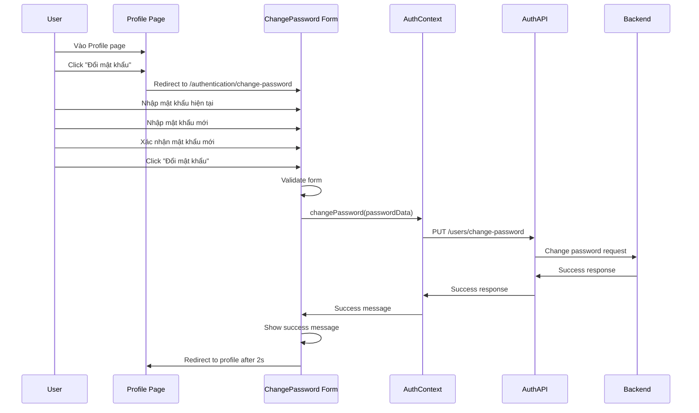

# Change Password Flow - Frontend

## Tổng quan

Tài liệu này mô tả luồng đổi mật khẩu (change password) từ profile page trong hệ thống AI Camera Counting.

## 🔍 **Vấn đề đã phát hiện và sửa**

### **Vấn đề ban đầu:**
- Profile page có button "Đặt lại mật khẩu" nhưng redirect đến reset-password form
- Reset-password form chỉ có input mật khẩu mới, **KHÔNG có input mật khẩu cũ**
- Đây là lỗi bảo mật nghiêm trọng vì user có thể đổi mật khẩu mà không cần xác thực mật khẩu hiện tại

### **Giải pháp đã implement:**
1. Tạo component `ChangePasswordForm` riêng biệt với 3 fields:
   - Mật khẩu hiện tại (currentPassword)
   - Mật khẩu mới (newPassword) 
   - Xác nhận mật khẩu mới (confirmNewPassword)

2. Cập nhật profile page:
   - Button text: "Đặt lại mật khẩu" → "Đổi mật khẩu"
   - Redirect: `/authentication/reset-password` → `/authentication/change-password`

3. Kết nối API thực tế:
   - Endpoint: `PUT /api/v1/users/change-password`
   - Validation: Mật khẩu hiện tại + mật khẩu mới + xác nhận

## 🔄 **Luồng hoạt động**

### **Change Password Flow (Từ Profile):**


### **Các bước chi tiết:**

1. **User vào Profile page** và thấy button "Đổi mật khẩu"

2. **Click button** → Redirect đến `/authentication/change-password`

3. **Fill form với 3 fields:**
   - **Mật khẩu hiện tại**: Bắt buộc, để xác thực user
   - **Mật khẩu mới**: Bắt buộc, phải đáp ứng validation rules
   - **Xác nhận mật khẩu mới**: Bắt buộc, phải khớp với mật khẩu mới

4. **Validation real-time:**
   - Mật khẩu hiện tại: Không được để trống
   - Mật khẩu mới: Min 8 ký tự, có chữ hoa/thường/số/ký tự đặc biệt
   - Xác nhận: Phải khớp với mật khẩu mới
   - **Kiểm tra**: Mật khẩu mới không được giống mật khẩu hiện tại

5. **Submit form:**
   - Gọi API `PUT /api/v1/users/change-password`
   - Backend verify mật khẩu hiện tại
   - Hash mật khẩu mới và update database

6. **Success handling:**
   - Hiển thị success message
   - Redirect về profile sau 2 giây

## 🛡️ **Bảo mật**

### **Validation Rules:**
```javascript
// Frontend validation
- currentPassword: required
- newPassword: min 8 chars, uppercase + lowercase + number + special char
- confirmNewPassword: must match newPassword
- newPassword !== currentPassword
```

### **Backend Validation:**
```javascript
// Backend validation (Joi schema)
changePassword: Joi.object({
  currentPassword: Joi.string().required(),
  newPassword: Joi.string()
    .min(8)
    .pattern(/^(?=.*[a-z])(?=.*[A-Z])(?=.*\d)(?=.*[@$!%*?&])/)
    .required(),
  confirmNewPassword: Joi.string()
    .valid(Joi.ref('newPassword'))
    .required()
})
```

### **Security Features:**
- ✅ **Authentication required**: User phải đăng nhập
- ✅ **Current password verification**: Backend verify mật khẩu hiện tại
- ✅ **Password strength validation**: Mật khẩu mới phải đủ mạnh
- ✅ **Password confirmation**: Tránh typo khi nhập mật khẩu mới
- ✅ **Password history check**: Mật khẩu mới không được giống mật khẩu cũ
- ✅ **Secure API endpoint**: Sử dụng JWT token authentication

## 📁 **Files đã tạo/cập nhật**

### **New Files:**
- `frontend/src/layouts/authentication/change-password/index.js` - ChangePassword component
- `sharedResource/automationTest/frontend/authentication/test_change_password.py` - Automation tests
- `sharedResource/automationTest/frontend/authentication/run_change_password_tests.sh` - Test runner

### **Updated Files:**
- `frontend/src/layouts/profile/index.js` - Updated button text and redirect
- `frontend/src/App.js` - Added change-password route
- `frontend/src/context/AuthContext.js` - Added changePassword function
- `sharedResource/automationTest/run_all_tests.sh` - Added change password tests

## 🧪 **Testing**

### **Automation Tests:**
```bash
# Run change password tests
cd sharedResource/automationTest/frontend/authentication
./run_change_password_tests.sh
```

### **Test Cases:**
1. **Page Load Test**: Verify change password page loads correctly
2. **Form Elements Test**: Verify all 3 input fields are present
3. **Validation Test**: Verify form validation works
4. **Success Flow Test**: Verify successful password change
5. **Navigation Test**: Verify navigation back to profile

### **Manual Testing:**
1. Login với user account
2. Vào Profile page
3. Click "Đổi mật khẩu"
4. Test các trường hợp:
   - Form trống → Validation errors
   - Mật khẩu hiện tại sai → Error message
   - Mật khẩu mới yếu → Validation error
   - Xác nhận không khớp → Validation error
   - Mật khẩu mới giống mật khẩu cũ → Validation error
   - Form hợp lệ → Success message + redirect

## 🔗 **API Integration**

### **Endpoint:**
```http
PUT /api/v1/users/change-password
Authorization: Bearer <access_token>
Content-Type: application/json

{
  "currentPassword": "OldPassword123!",
  "newPassword": "NewPassword123!",
  "confirmNewPassword": "NewPassword123!"
}
```

### **Response:**
```json
{
  "success": true,
  "message": "Password changed successfully"
}
```

### **Error Response:**
```json
{
  "success": false,
  "error": {
    "code": 400,
    "message": "Current password is incorrect"
  }
}
```

## 📊 **So sánh với Reset Password**

| Feature | Reset Password | Change Password |
|---------|---------------|-----------------|
| **Access** | Public (từ email) | Private (từ profile) |
| **Authentication** | Token-based | JWT token |
| **Current Password** | ❌ Không cần | ✅ Bắt buộc |
| **Security Level** | Medium | High |
| **Use Case** | Quên mật khẩu | Đổi mật khẩu chủ động |

## ✅ **Kết luận**

Flow change password đã được sửa chữa hoàn toàn:

1. **Bảo mật**: Yêu cầu mật khẩu hiện tại để xác thực
2. **UX**: Form rõ ràng với 3 fields cần thiết
3. **Validation**: Đầy đủ validation frontend và backend
4. **Testing**: Automation tests bao phủ toàn bộ flow
5. **Documentation**: Tài liệu chi tiết cho development và QA

**Flow hiện tại đã tuân thủ đúng security best practices!** 🔒 