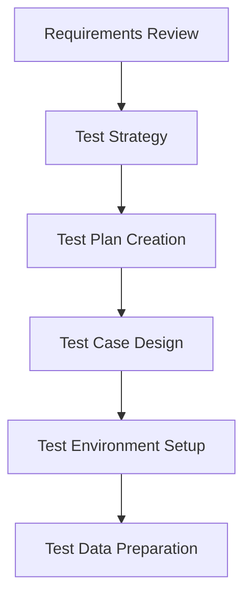
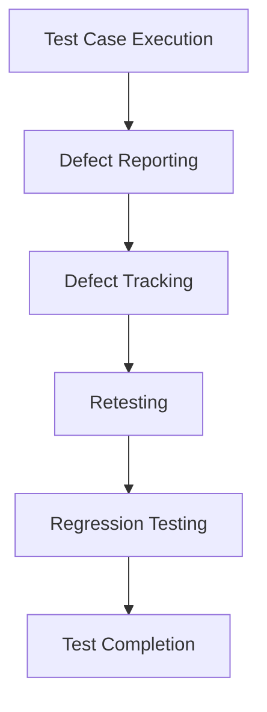
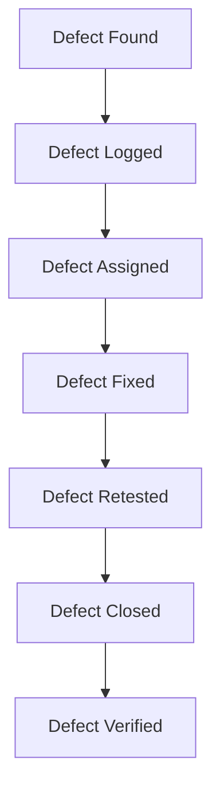

# QA Process - AI Camera Counting System

## 📊 Tổng quan
Tài liệu này định nghĩa quy trình QA (Quality Assurance) cho hệ thống AI Camera Counting, bao gồm testing workflow, defect management, và quality gates.

## 🎯 QA Objectives

### 1. Quality Goals
- **Zero Critical Bugs**: Không có lỗi nghiêm trọng trong production
- **High User Satisfaction**: >90% user satisfaction score
- **Performance Standards**: Response time <200ms, uptime >99.5%
- **Security Compliance**: Zero security vulnerabilities

### 2. Quality Metrics
- **Bug Detection Rate**: >80% issues caught before production
- **Test Coverage**: >80% code coverage, >95% critical paths
- **Release Quality**: <5 medium bugs per release
- **User Acceptance**: >95% user acceptance rate

## 🔄 QA Workflow

### 1. Test Planning Phase


#### Test Plan Template
```markdown
# Test Plan - [Feature Name]

## 1. Test Scope
- **In Scope**: Features to be tested
- **Out of Scope**: Features not to be tested
- **Dependencies**: External systems and dependencies

## 2. Test Strategy
- **Test Types**: Unit, Integration, E2E, Performance, Security
- **Test Levels**: Component, System, Acceptance
- **Test Techniques**: Black box, White box, Gray box

## 3. Test Schedule
- **Start Date**: [Date]
- **End Date**: [Date]
- **Milestones**: Key testing milestones

## 4. Test Environment
- **Hardware**: Required hardware specifications
- **Software**: Required software and tools
- **Data**: Test data requirements

## 5. Test Deliverables
- Test cases and test scripts
- Test data and test environment
- Test results and defect reports
- Test summary report
```

### 2. Test Execution Phase


#### Test Execution Checklist
- [ ] All test cases executed
- [ ] Test results documented
- [ ] Defects logged and tracked
- [ ] Regression testing completed
- [ ] Performance testing completed
- [ ] Security testing completed
- [ ] User acceptance testing completed

### 3. Defect Management

#### Defect Lifecycle


#### Defect Severity Levels
```markdown
## Critical (P1)
- System crash or data loss
- Security vulnerability
- Complete feature failure
- **Resolution Time**: 24 hours

## High (P2)
- Major feature not working
- Performance degradation
- Data corruption
- **Resolution Time**: 3 days

## Medium (P3)
- Minor feature issues
- UI/UX problems
- Non-critical bugs
- **Resolution Time**: 1 week

## Low (P4)
- Cosmetic issues
- Documentation errors
- Enhancement requests
- **Resolution Time**: 2 weeks
```

#### Defect Report Template
```markdown
# Defect Report

## Defect ID
[Auto-generated]

## Summary
Brief description of the defect

## Severity
[Critical/High/Medium/Low]

## Priority
[P1/P2/P3/P4]

## Environment
- Browser: [Chrome/Firefox/Safari/Edge]
- OS: [Windows/Mac/Linux]
- Version: [Version number]

## Steps to Reproduce
1. Step 1
2. Step 2
3. Step 3

## Expected Result
What should happen

## Actual Result
What actually happened

## Screenshots/Logs
[Attach relevant files]

## Additional Information
Any other relevant details
```

## 🧪 Testing Types

### 1. Functional Testing
```markdown
## Test Categories
- **Unit Testing**: Individual component testing
- **Integration Testing**: Component interaction testing
- **System Testing**: End-to-end system testing
- **User Acceptance Testing**: Business requirement validation

## Test Scenarios
### Authentication Flow
- User registration with valid data
- User registration with invalid data
- User login with valid credentials
- User login with invalid credentials
- Password reset functionality
- Token refresh mechanism

### Camera Management
- Camera creation with valid data
- Camera creation with invalid data
- Camera update functionality
- Camera deletion with confirmation
- Camera status changes
- Camera list pagination

### Real-time Counting
- Live camera stream display
- Real-time count updates
- Count accuracy validation
- Confidence score display
- Historical data retrieval
```

### 2. Non-Functional Testing

#### Performance Testing
```markdown
## Load Testing
- **Concurrent Users**: 100, 500, 1000 users
- **Response Time**: <200ms for 95% of requests
- **Throughput**: >1000 requests/second
- **Resource Usage**: <80% CPU, <2GB memory

## Stress Testing
- **Peak Load**: 150% of expected load
- **Recovery Time**: <5 minutes after load reduction
- **Error Rate**: <1% under stress conditions

## Scalability Testing
- **Horizontal Scaling**: Multiple instances
- **Vertical Scaling**: Increased resources
- **Database Scaling**: Connection pooling, indexing
```

#### Security Testing
```markdown
## Authentication Security
- Password strength validation
- Brute force protection
- Session management
- Token security

## Authorization Security
- Role-based access control
- API endpoint protection
- Data access permissions
- Admin privilege validation

## Data Security
- Input validation
- SQL injection prevention
- XSS protection
- CSRF protection
- Data encryption
```

#### Usability Testing
```markdown
## User Interface
- Responsive design
- Cross-browser compatibility
- Mobile device compatibility
- Accessibility compliance (WCAG 2.1 AA)

## User Experience
- Navigation flow
- Error handling
- Loading states
- Success feedback
- Help and documentation
```

## 📊 Quality Gates

### 1. Definition of Done (DoD)
```markdown
## Development DoD
- [ ] Code written and reviewed
- [ ] Unit tests written and passing
- [ ] Integration tests passing
- [ ] Code coverage >80%
- [ ] Documentation updated
- [ ] Security review completed

## Testing DoD
- [ ] All test cases executed
- [ ] All critical bugs fixed
- [ ] Performance requirements met
- [ ] Security requirements met
- [ ] User acceptance testing passed
- [ ] Test documentation completed

## Release DoD
- [ ] All DoD criteria met
- [ ] Production deployment successful
- [ ] Smoke tests passing
- [ ] Monitoring alerts configured
- [ ] Rollback plan ready
- [ ] Release notes published
```

### 2. Quality Metrics Dashboard
```markdown
## Weekly Quality Report

### Test Execution
- **Test Cases Executed**: 245/250 (98%)
- **Test Cases Passed**: 240/245 (98%)
- **Test Cases Failed**: 5/245 (2%)

### Defect Summary
- **Critical Defects**: 0
- **High Defects**: 2
- **Medium Defects**: 8
- **Low Defects**: 15
- **Total Defects**: 25

### Performance Metrics
- **Average Response Time**: 150ms
- **95th Percentile**: 180ms
- **Error Rate**: 0.5%
- **Uptime**: 99.8%

### Code Quality
- **Code Coverage**: 85%
- **Critical Path Coverage**: 97%
- **Code Smells**: 12
- **Technical Debt**: Low
```

## 🔄 Continuous Testing

### 1. Automated Testing Pipeline
```yaml
# .github/workflows/qa-pipeline.yml
name: QA Pipeline

on:
  push:
    branches: [main, develop]
  pull_request:
    branches: [main]

jobs:
  unit-tests:
    runs-on: ubuntu-latest
    steps:
      - uses: actions/checkout@v3
      - name: Run Unit Tests
        run: npm test -- --coverage

  integration-tests:
    runs-on: ubuntu-latest
    needs: unit-tests
    steps:
      - uses: actions/checkout@v3
      - name: Run Integration Tests
        run: npm run test:integration

  e2e-tests:
    runs-on: ubuntu-latest
    needs: integration-tests
    steps:
      - uses: actions/checkout@v3
      - name: Run E2E Tests
        run: npm run test:e2e

  performance-tests:
    runs-on: ubuntu-latest
    needs: e2e-tests
    steps:
      - uses: actions/checkout@v3
      - name: Run Performance Tests
        run: k6 run tests/performance/load-test.js

  security-tests:
    runs-on: ubuntu-latest
    needs: performance-tests
    steps:
      - uses: actions/checkout@v3
      - name: Run Security Tests
        run: npm run test:security
```

### 2. Test Automation Strategy
```markdown
## Automation Pyramid
```
E2E Tests (10%)
    ↓
Integration Tests (20%)
    ↓
Unit Tests (70%)
```

## Automation Tools
- **Unit Testing**: Jest, pytest
- **Integration Testing**: Supertest, TestClient
- **E2E Testing**: Playwright, Cypress
- **Performance Testing**: K6, JMeter
- **Security Testing**: OWASP ZAP, SonarQube
```

## 📈 Quality Monitoring

### 1. Real-time Monitoring
```markdown
## Application Monitoring
- **Response Time**: Real-time API response times
- **Error Rate**: Percentage of failed requests
- **Throughput**: Requests per second
- **Resource Usage**: CPU, memory, disk usage

## User Experience Monitoring
- **Page Load Time**: Frontend performance metrics
- **User Interactions**: Click tracking, navigation flow
- **Error Tracking**: Client-side error reporting
- **User Feedback**: In-app feedback collection
```

### 2. Quality Alerts
```markdown
## Alert Thresholds
- **Critical**: Response time >500ms, Error rate >5%
- **Warning**: Response time >200ms, Error rate >1%
- **Info**: Response time >100ms, Error rate >0.5%

## Alert Channels
- **Slack**: Real-time notifications
- **Email**: Daily summary reports
- **SMS**: Critical alerts only
```

## 🎯 QA Team Responsibilities

### 1. QA Lead
```markdown
## Responsibilities
- Define QA strategy and processes
- Manage QA team and resources
- Coordinate with development team
- Report quality metrics to stakeholders
- Ensure quality gates are enforced

## Skills Required
- Test strategy and planning
- Team management
- Stakeholder communication
- Quality metrics analysis
- Process improvement
```

### 2. QA Engineers
```markdown
## Responsibilities
- Execute test cases
- Report and track defects
- Create and maintain test data
- Perform regression testing
- Contribute to test automation

## Skills Required
- Manual testing techniques
- Test automation tools
- Defect management
- Test data management
- Technical documentation
```

### 3. Test Automation Engineers
```markdown
## Responsibilities
- Develop automated test scripts
- Maintain test automation framework
- Integrate tests with CI/CD pipeline
- Monitor test execution results
- Optimize test performance

## Skills Required
- Programming languages (JavaScript, Python)
- Test automation frameworks
- CI/CD tools
- Performance testing
- Database testing
```

## 📋 QA Documentation

### 1. Test Documentation Standards
```markdown
## Required Documents
- Test Plan
- Test Cases
- Test Data
- Test Results
- Defect Reports
- Test Summary Report

## Documentation Templates
- Standardized templates for all documents
- Version control for all documents
- Review and approval process
- Regular updates and maintenance
```

### 2. Knowledge Management
```markdown
## Knowledge Base
- Common issues and solutions
- Best practices and guidelines
- Tool configurations
- Troubleshooting guides
- FAQ and user guides
```

---

**Last Updated**: 2025-07-03  
**Version**: 1.0.0  
**Status**: Ready for Implementation 