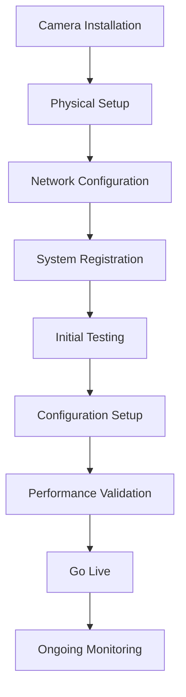
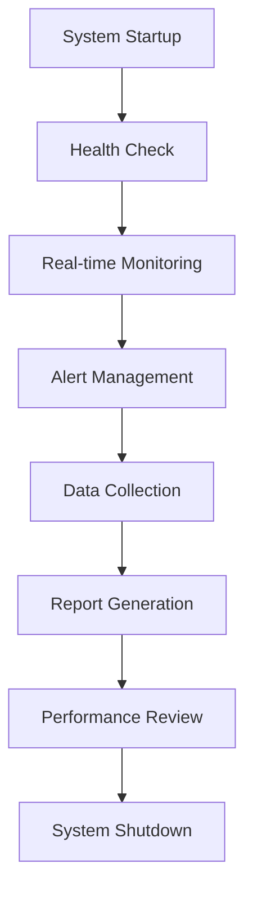
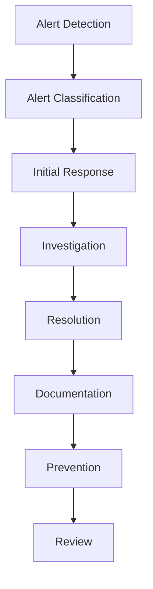

# Business Requirements Documentation
## AI Camera Counting System

### 📊 Tổng quan Business Requirements

**Document Type**: Business Requirements Specification  
**Version**: 1.0  
**Last Updated**: [Date]  
**Responsible**: Product Owner + Business Analyst  

### 🎯 Mục tiêu Business Requirements

#### Mục tiêu chính
- Định nghĩa rõ ràng business needs và user requirements
- Đảm bảo technical solutions đáp ứng business objectives
- Cung cấp foundation cho development và testing
- Đảm bảo ROI và business value delivery

#### Business Objectives
- Tự động hóa quá trình đếm người với độ chính xác >95%
- Giảm 30% chi phí manual counting
- Tăng hiệu quả quản lý với real-time monitoring
- Mở rộng khả năng xử lý 100+ camera streams
- Đảm bảo compliance với data privacy regulations

### 👥 User Personas

#### **1. System Administrator**
**Profile**: IT Manager, Technical Lead
**Responsibilities**:
- Quản lý hệ thống camera và infrastructure
- Cấu hình và monitoring system performance
- Quản lý user access và security
- Backup và disaster recovery

**Goals**:
- Đảm bảo system uptime >99.9%
- Tối ưu hóa performance và security
- Giảm manual intervention
- Scalable system management

**Pain Points**:
- Manual camera configuration
- Lack of real-time monitoring
- Difficult troubleshooting
- Limited scalability

#### **2. Operations Manager**
**Profile**: Facility Manager, Security Manager
**Responsibilities**:
- Quản lý daily operations
- Monitor people flow và occupancy
- Generate reports và analytics
- Coordinate với security team

**Goals**:
- Real-time visibility vào people flow
- Accurate counting data
- Easy report generation
- Proactive alerting

**Pain Points**:
- Manual counting errors
- Delayed reporting
- Limited historical data
- Difficult trend analysis

#### **3. Security Officer**
**Profile**: Security Guard, Safety Officer
**Responsibilities**:
- Monitor security cameras
- Respond to alerts và incidents
- Maintain security protocols
- Report security events

**Goals**:
- Real-time security monitoring
- Accurate people counting
- Quick incident response
- Reliable alerting system

**Pain Points**:
- Manual monitoring fatigue
- Missed security events
- Inaccurate counting
- Delayed response times

#### **4. Business Analyst**
**Profile**: Data Analyst, Business Intelligence
**Responsibilities**:
- Analyze people flow data
- Generate business insights
- Create reports và dashboards
- Support decision making

**Goals**:
- Comprehensive data analysis
- Trend identification
- Predictive analytics
- Business intelligence

**Pain Points**:
- Limited data granularity
- Manual data collection
- Poor data quality
- Time-consuming analysis

### 📋 User Stories

#### **Epic 1: Camera Management**

**Story 1.1: Camera Registration**
**As a** System Administrator  
**I want to** register new cameras vào system  
**So that** I can monitor additional locations  

**Acceptance Criteria**:
- [ ] Admin can add camera với IP address và credentials
- [ ] System validates camera connectivity
- [ ] Camera appears trong management dashboard
- [ ] Admin can configure camera settings
- [ ] System stores camera metadata securely

**Story 1.2: Camera Configuration**
**As a** System Administrator  
**I want to** configure camera parameters  
**So that** I can optimize counting accuracy  

**Acceptance Criteria**:
- [ ] Admin can set counting zones
- [ ] Admin can adjust sensitivity settings
- [ ] Admin can configure alert thresholds
- [ ] Changes apply immediately
- [ ] Configuration is versioned

**Story 1.3: Camera Monitoring**
**As a** System Administrator  
**I want to** monitor camera health và performance  
**So that** I can ensure reliable operation  

**Acceptance Criteria**:
- [ ] System shows camera status (online/offline)
- [ ] System displays performance metrics
- [ ] System alerts on camera failures
- [ ] Admin can view camera logs
- [ ] System tracks uptime statistics

#### **Epic 2: People Counting**

**Story 2.1: Real-time Counting**
**As an** Operations Manager  
**I want to** see real-time people count  
**So that** I can monitor current occupancy  

**Acceptance Criteria**:
- [ ] Real-time count updates every second
- [ ] Count shows people entering và exiting
- [ ] Count displays current occupancy
- [ ] Count is accurate >95%
- [ ] Count updates without delay

**Story 2.2: Historical Data**
**As a** Business Analyst  
**I want to** access historical counting data  
**So that** I can analyze trends và patterns  

**Acceptance Criteria**:
- [ ] Data stored for minimum 2 years
- [ ] Data available by hour, day, month
- [ ] Data exportable in multiple formats
- [ ] Data includes metadata (weather, events)
- [ ] Data is searchable và filterable

**Story 2.3: Counting Accuracy**
**As a** Security Officer  
**I want to** ensure counting accuracy  
**So that** I can rely on data for security decisions  

**Acceptance Criteria**:
- [ ] System accuracy >95% in normal conditions
- [ ] System handles crowded scenes
- [ ] System works in various lighting conditions
- [ ] System provides confidence scores
- [ ] System flags potential errors

#### **Epic 3: Alerting & Notifications**

**Story 3.1: Threshold Alerts**
**As an** Operations Manager  
**I want to** set occupancy thresholds  
**So that** I can receive alerts when limits are exceeded  

**Acceptance Criteria**:
- [ ] Admin can set occupancy limits
- [ ] System sends immediate alerts
- [ ] Alerts include location và count
- [ ] Alerts sent via email, SMS, dashboard
- [ ] Alerts are acknowledged và tracked

**Story 3.2: Anomaly Detection**
**As a** Security Officer  
**I want to** detect unusual patterns  
**So that** I can respond to potential security issues  

**Acceptance Criteria**:
- [ ] System detects unusual counting patterns
- [ ] System flags suspicious activities
- [ ] System provides context for anomalies
- [ ] System learns from historical patterns
- [ ] System reduces false positives

**Story 3.3: Emergency Alerts**
**As a** Security Officer  
**I want to** receive emergency notifications  
**So that** I can respond quickly to incidents  

**Acceptance Criteria**:
- [ ] System detects emergency situations
- [ ] System sends immediate emergency alerts
- [ ] Alerts include location và severity
- [ ] Alerts escalate automatically
- [ ] System tracks response times

#### **Epic 4: Reporting & Analytics**

**Story 4.1: Daily Reports**
**As an** Operations Manager  
**I want to** generate daily reports  
**So that** I can track daily operations  

**Acceptance Criteria**:
- [ ] Reports generated automatically
- [ ] Reports include peak hours analysis
- [ ] Reports show occupancy trends
- [ ] Reports are delivered via email
- [ ] Reports are archived

**Story 4.2: Custom Analytics**
**As a** Business Analyst  
**I want to** create custom analytics  
**So that** I can gain business insights  

**Acceptance Criteria**:
- [ ] User can create custom dashboards
- [ ] User can define custom metrics
- [ ] User can set up automated reports
- [ ] User can share dashboards
- [ ] User can export data

**Story 4.3: Predictive Analytics**
**As a** Business Analyst  
**I want to** predict future patterns  
**So that** I can plan resources effectively  

**Acceptance Criteria**:
- [ ] System predicts peak hours
- [ ] System forecasts occupancy trends
- [ ] System considers external factors
- [ ] Predictions are accurate >80%
- [ ] System explains prediction factors

#### **Epic 5: User Management**

**Story 5.1: User Authentication**
**As a** System Administrator  
**I want to** manage user access  
**So that** I can control system security  

**Acceptance Criteria**:
- [ ] Multi-factor authentication
- [ ] Role-based access control
- [ ] Password policies enforced
- [ ] Session management
- [ ] Audit logging

**Story 5.2: User Roles**
**As a** System Administrator  
**I want to** assign user roles  
**So that** I can control permissions appropriately  

**Acceptance Criteria**:
- [ ] Predefined roles (Admin, Manager, Analyst, Viewer)
- [ ] Custom role creation
- [ ] Granular permissions
- [ ] Role inheritance
- [ ] Permission audit trail

### 🔄 Business Process Flows

#### **Process 1: Camera Setup & Configuration**

**Process Steps**:
1. **Camera Installation**: Physical camera setup tại location
2. **Network Configuration**: Configure network settings và connectivity
3. **System Registration**: Register camera trong management system
4. **Initial Testing**: Test camera connectivity và basic functionality
5. **Configuration Setup**: Configure counting zones, sensitivity, alerts
6. **Performance Validation**: Validate counting accuracy và performance
7. **Go Live**: Activate camera cho production use
8. **Ongoing Monitoring**: Monitor performance và health

#### **Process 2: Daily Operations Management**

**Process Steps**:
1. **System Startup**: Start all services và validate connectivity
2. **Health Check**: Verify all cameras và systems operational
3. **Real-time Monitoring**: Monitor people flow và system performance
4. **Alert Management**: Respond to alerts và notifications
5. **Data Collection**: Collect và store counting data
6. **Report Generation**: Generate daily reports và analytics
7. **Performance Review**: Review system performance và accuracy
8. **System Shutdown**: Graceful shutdown và backup

#### **Process 3: Incident Response**

**Process Steps**:
1. **Alert Detection**: System detects anomaly hoặc incident
2. **Alert Classification**: Classify alert severity và type
3. **Initial Response**: Immediate response actions
4. **Investigation**: Investigate root cause và impact
5. **Resolution**: Implement fix hoặc workaround
6. **Documentation**: Document incident và resolution
7. **Prevention**: Implement preventive measures
8. **Review**: Review process và improve

### 📊 Use Cases

#### **Use Case 1: Real-time People Counting**

**Primary Actor**: Operations Manager
**Goal**: Monitor real-time people flow và occupancy

**Preconditions**:
- Cameras are operational
- System is running
- User has appropriate permissions

**Main Flow**:
1. User logs into dashboard
2. System displays real-time camera feeds
3. System shows current count for each location
4. System updates count every second
5. User can view historical data
6. User can set alerts và thresholds

**Alternative Flows**:
- Camera offline: System shows error và alerts
- High occupancy: System sends alert notifications
- System error: System shows error message và logs

**Postconditions**:
- Real-time data is displayed
- Alerts are sent if thresholds exceeded
- Data is stored for historical analysis

#### **Use Case 2: Report Generation**

**Primary Actor**: Business Analyst
**Goal**: Generate comprehensive reports và analytics

**Preconditions**:
- Historical data is available
- User has report permissions
- System is operational

**Main Flow**:
1. User selects report type và parameters
2. System validates parameters
3. System retrieves data from database
4. System processes và analyzes data
5. System generates report
6. System delivers report via email
7. System archives report

**Alternative Flows**:
- No data available: System shows message
- Large dataset: System shows progress indicator
- Export error: System shows error message

**Postconditions**:
- Report is generated và delivered
- Report is archived
- Data is available for future analysis

#### **Use Case 3: Alert Management**

**Primary Actor**: Security Officer
**Goal**: Respond to security alerts và incidents

**Preconditions**:
- Alert system is operational
- User has alert permissions
- Cameras are monitoring

**Main Flow**:
1. System detects anomaly hoặc threshold breach
2. System classifies alert severity
3. System sends notification to appropriate users
4. User receives alert notification
5. User acknowledges alert
6. User investigates situation
7. User takes appropriate action
8. User documents response

**Alternative Flows**:
- No response: System escalates alert
- False positive: User marks as false positive
- Emergency: System sends emergency notifications

**Postconditions**:
- Alert is acknowledged và handled
- Response is documented
- System learns from incident

### 📋 Business Rules

#### **Data Management Rules**

**Rule 1: Data Retention**
- **Description**: Historical data must be retained for minimum 2 years
- **Rationale**: Compliance requirements và business analysis needs
- **Implementation**: Automated data archiving và cleanup

**Rule 2: Data Accuracy**
- **Description**: Counting accuracy must be >95% in normal conditions
- **Rationale**: Business decisions depend on accurate data
- **Implementation**: Regular accuracy validation và calibration

**Rule 3: Data Privacy**
- **Description**: Personal data must be anonymized và protected
- **Rationale**: GDPR compliance và privacy protection
- **Implementation**: Data anonymization và encryption

#### **System Performance Rules**

**Rule 4: System Uptime**
- **Description**: System must maintain >99.9% uptime
- **Rationale**: Critical business operations depend on system availability
- **Implementation**: Redundant systems và monitoring

**Rule 5: Response Time**
- **Description**: Real-time updates must be <200ms
- **Rationale**: User experience requires immediate feedback
- **Implementation**: Optimized processing và caching

**Rule 6: Scalability**
- **Description**: System must support 100+ cameras simultaneously
- **Rationale**: Business growth requires scalable solution
- **Implementation**: Microservices architecture và load balancing

#### **Security Rules**

**Rule 7: Authentication**
- **Description**: All users must authenticate với multi-factor authentication
- **Rationale**: Protect sensitive data và system access
- **Implementation**: MFA integration và session management

**Rule 8: Access Control**
- **Description**: Users can only access data appropriate to their role
- **Rationale**: Data security và privacy protection
- **Implementation**: Role-based access control

**Rule 9: Audit Logging**
- **Description**: All system activities must be logged
- **Rationale**: Compliance và security monitoring
- **Implementation**: Comprehensive audit trail

#### **Business Process Rules**

**Rule 10: Alert Escalation**
- **Description**: Unacknowledged alerts must escalate after 5 minutes
- **Rationale**: Ensure timely response to critical issues
- **Implementation**: Automated escalation procedures

**Rule 11: Report Delivery**
- **Description**: Reports must be delivered within 1 hour of generation
- **Rationale**: Timely information for business decisions
- **Implementation**: Automated report delivery

**Rule 12: Data Validation**
- **Description**: All data must be validated before storage
- **Rationale**: Ensure data quality và integrity
- **Implementation**: Input validation và data cleansing

### 📊 Success Metrics

#### **Business Value Metrics**
- **Cost Reduction**: 30% reduction in manual counting costs
- **Efficiency Gain**: 50% reduction in report generation time
- **Accuracy Improvement**: 95% counting accuracy vs. 70% manual
- **Response Time**: 90% faster incident response

#### **User Satisfaction Metrics**
- **User Adoption**: 100+ active users within 3 months
- **User Satisfaction**: >90% satisfaction score
- **Feature Usage**: 80% of users use advanced features
- **Support Tickets**: <5% of users require support

#### **System Performance Metrics**
- **Uptime**: >99.9% system availability
- **Response Time**: <200ms for real-time updates
- **Data Accuracy**: >95% counting accuracy
- **Scalability**: Support 100+ cameras

### 🚨 Business Risks & Mitigation

#### **Data Quality Risks**
- **Risk**: Inaccurate counting data
- **Impact**: Poor business decisions
- **Mitigation**: Regular calibration và validation

#### **System Performance Risks**
- **Risk**: System downtime
- **Impact**: Loss of monitoring capability
- **Mitigation**: Redundant systems và monitoring

#### **Compliance Risks**
- **Risk**: GDPR violations
- **Impact**: Legal penalties và reputation damage
- **Mitigation**: Privacy-by-design và regular audits

#### **User Adoption Risks**
- **Risk**: Low user adoption
- **Impact**: Reduced ROI
- **Mitigation**: Comprehensive training và support

---

**Business Analyst**: [Name]  
**Product Owner**: [Name]  
**Approval Date**: [Date]  
**Next Review**: [Date]
