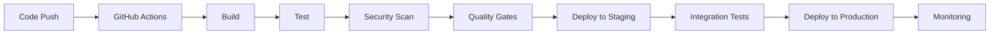

# CI/CD Pipeline Guide
## AI Camera Counting System

### 📊 Tổng quan

Tài liệu này định nghĩa CI/CD pipeline cho hệ thống AI Camera Counting, bao gồm GitHub Actions workflows, deployment procedures, environment management, và release management.

### 🎯 CI/CD Objectives
- Automate build, test, và deployment processes
- Ensure code quality và security
- Enable rapid và reliable deployments
- Maintain environment consistency

### 🔄 CI/CD Architecture

#### Pipeline Overview


#### Environment Strategy
```yaml
# Environment Configuration
environments:
  development:
    url: "http://localhost:3000"
    database: "postgresql://localhost:5432/aicamera_dev"
    redis: "redis://localhost:6379"
    auto_deploy: true
    testing: "Unit tests only"
  
  staging:
    url: "https://staging.aicamera.com"
    database: "postgresql://staging-db:5432/aicamera_staging"
    redis: "redis://staging-redis:6379"
    auto_deploy: true
    testing: "Full test suite"
  
  production:
    url: "https://aicamera.com"
    database: "postgresql://prod-db:5432/aicamera_prod"
    redis: "redis://prod-redis:6379"
    auto_deploy: false
    testing: "Full test suite + security"
```

### 🛠️ GitHub Actions Workflows

#### Main Workflow
```yaml
# .github/workflows/main.yml
name: CI/CD Pipeline

on:
  push:
    branches: [main, develop]
  pull_request:
    branches: [main, develop]

jobs:
  # Build and Test
  build-and-test:
    runs-on: ubuntu-latest
    strategy:
      matrix:
        node-version: [18.x]
        python-version: [3.9]
    
    steps:
      - name: Checkout code
        uses: actions/checkout@v3
      
      - name: Setup Node.js
        uses: actions/setup-node@v3
        with:
          node-version: ${{ matrix.node-version }}
          cache: 'npm'
      
      - name: Setup Python
        uses: actions/setup-python@v4
        with:
          python-version: ${{ matrix.python-version }}
      
      - name: Install dependencies
        run: |
          npm ci
          pip install -r beCamera/requirements.txt
      
      - name: Run linting
        run: |
          npm run lint
          npm run type-check
      
      - name: Run tests
        run: |
          npm run test:unit
          npm run test:integration
          cd beCamera && python -m pytest
      
      - name: Build application
        run: npm run build
      
      - name: Upload build artifacts
        uses: actions/upload-artifact@v3
        with:
          name: build-files
          path: build/
  
  # Security Scan
  security-scan:
    runs-on: ubuntu-latest
    needs: build-and-test
    
    steps:
      - name: Checkout code
        uses: actions/checkout@v3
      
      - name: Run Snyk security scan
        uses: snyk/actions/node@master
        env:
          SNYK_TOKEN: ${{ secrets.SNYK_TOKEN }}
        with:
          args: --severity-threshold=high
      
      - name: Run OWASP ZAP scan
        uses: zaproxy/action-full-scan@v0.8.0
        with:
          target: 'http://localhost:3000'
          rules_file_name: '.zap/rules.tsv'
          cmd_options: '-a'
      
      - name: Upload security report
        uses: actions/upload-artifact@v3
        with:
          name: security-report
          path: zap-report.html
  
  # Quality Gates
  quality-gates:
    runs-on: ubuntu-latest
    needs: [build-and-test, security-scan]
    
    steps:
      - name: Check test coverage
        run: |
          npm run test:coverage
          if [ $(echo "$COVERAGE < 80" | bc) -eq 1 ]; then
            echo "Test coverage below 80%"
            exit 1
          fi
      
      - name: Check code quality
        run: |
          npm run lint
          if [ $? -ne 0 ]; then
            echo "Code quality check failed"
            exit 1
          fi
      
      - name: Check security vulnerabilities
        run: |
          if [ -f "snyk-report.json" ]; then
            VULNERABILITIES=$(jq '.vulnerabilities | length' snyk-report.json)
            if [ "$VULNERABILITIES" -gt 0 ]; then
              echo "Security vulnerabilities found"
              exit 1
            fi
          fi
  
  # Deploy to Staging
  deploy-staging:
    runs-on: ubuntu-latest
    needs: quality-gates
    if: github.ref == 'refs/heads/develop'
    environment: staging
    
    steps:
      - name: Deploy to staging
        run: |
          docker-compose -f docker-compose.staging.yml up -d
          ./scripts/wait-for-health.sh staging
      
      - name: Run integration tests
        run: |
          npm run test:e2e -- --config=playwright.staging.config.ts
      
      - name: Notify deployment
        run: |
          curl -X POST $SLACK_WEBHOOK \
            -H 'Content-type: application/json' \
            -d '{"text":"Deployment to staging completed successfully"}'
  
  # Deploy to Production
  deploy-production:
    runs-on: ubuntu-latest
    needs: quality-gates
    if: github.ref == 'refs/heads/main'
    environment: production
    
    steps:
      - name: Deploy to production
        run: |
          docker-compose -f docker-compose.prod.yml up -d
          ./scripts/wait-for-health.sh production
      
      - name: Run smoke tests
        run: |
          npm run test:smoke -- --config=playwright.prod.config.ts
      
      - name: Notify deployment
        run: |
          curl -X POST $SLACK_WEBHOOK \
            -H 'Content-type: application/json' \
            -d '{"text":"Deployment to production completed successfully"}'
```

#### Pull Request Workflow
```yaml
# .github/workflows/pr.yml
name: Pull Request Checks

on:
  pull_request:
    branches: [main, develop]

jobs:
  pr-checks:
    runs-on: ubuntu-latest
    
    steps:
      - name: Checkout code
        uses: actions/checkout@v3
      
      - name: Setup Node.js
        uses: actions/setup-node@v3
        with:
          node-version: '18.x'
          cache: 'npm'
      
      - name: Install dependencies
        run: npm ci
      
      - name: Run linting
        run: |
          npm run lint
          npm run type-check
      
      - name: Run tests
        run: |
          npm run test:unit
          npm run test:integration
      
      - name: Check test coverage
        run: |
          npm run test:coverage
          if [ $(echo "$COVERAGE < 80" | bc) -eq 1 ]; then
            echo "Test coverage below 80%"
            exit 1
          fi
      
      - name: Security scan
        uses: snyk/actions/node@master
        env:
          SNYK_TOKEN: ${{ secrets.SNYK_TOKEN }}
        with:
          args: --severity-threshold=high
      
      - name: Comment PR
        uses: actions/github-script@v6
        with:
          script: |
            github.rest.issues.createComment({
              issue_number: context.issue.number,
              owner: context.repo.owner,
              repo: context.repo.repo,
              body: '✅ All checks passed! Ready for review.'
            })
```

### 🚀 Deployment Procedures

#### Environment-Specific Configurations
```yaml
# docker-compose.staging.yml
version: '3.8'

services:
  frontend:
    build:
      context: .
      dockerfile: Dockerfile
    environment:
      - NODE_ENV=staging
      - REACT_APP_API_URL=https://staging-api.aicamera.com
    ports:
      - "3000:3000"
    depends_on:
      - beAuth
      - beCamera

  beAuth:
    build:
      context: ./beAuth
      dockerfile: Dockerfile
    environment:
      - NODE_ENV=staging
      - DATABASE_URL=postgresql://staging-db:5432/aicamera_staging
      - REDIS_URL=redis://staging-redis:6379
    ports:
      - "3001:3001"
    depends_on:
      - postgres
      - redis

  beCamera:
    build:
      context: ./beCamera
      dockerfile: Dockerfile
    environment:
      - ENVIRONMENT=staging
      - DATABASE_URL=postgresql://staging-db:5432/aicamera_staging
      - REDIS_URL=redis://staging-redis:6379
    ports:
      - "8000:8000"
    depends_on:
      - postgres
      - redis

  postgres:
    image: postgres:13
    environment:
      POSTGRES_DB: aicamera_staging
      POSTGRES_USER: postgres
      POSTGRES_PASSWORD: password
    volumes:
      - postgres_staging_data:/var/lib/postgresql/data

  redis:
    image: redis:6-alpine
    volumes:
      - redis_staging_data:/data

volumes:
  postgres_staging_data:
  redis_staging_data:
```

#### Production Deployment
```yaml
# docker-compose.prod.yml
version: '3.8'

services:
  frontend:
    build:
      context: .
      dockerfile: Dockerfile.prod
    environment:
      - NODE_ENV=production
      - REACT_APP_API_URL=https://api.aicamera.com
    ports:
      - "80:80"
      - "443:443"
    depends_on:
      - beAuth
      - beCamera
    restart: unless-stopped

  beAuth:
    build:
      context: ./beAuth
      dockerfile: Dockerfile.prod
    environment:
      - NODE_ENV=production
      - DATABASE_URL=postgresql://prod-db:5432/aicamera_prod
      - REDIS_URL=redis://prod-redis:6379
      - JWT_SECRET=${JWT_SECRET}
    ports:
      - "3001:3001"
    depends_on:
      - postgres
      - redis
    restart: unless-stopped

  beCamera:
    build:
      context: ./beCamera
      dockerfile: Dockerfile.prod
    environment:
      - ENVIRONMENT=production
      - DATABASE_URL=postgresql://prod-db:5432/aicamera_prod
      - REDIS_URL=redis://prod-redis:6379
      - AI_MODEL_PATH=/app/models/
    ports:
      - "8000:8000"
    depends_on:
      - postgres
      - redis
    restart: unless-stopped

  postgres:
    image: postgres:13
    environment:
      POSTGRES_DB: aicamera_prod
      POSTGRES_USER: postgres
      POSTGRES_PASSWORD: ${DB_PASSWORD}
    volumes:
      - postgres_prod_data:/var/lib/postgresql/data
    restart: unless-stopped

  redis:
    image: redis:6-alpine
    volumes:
      - redis_prod_data:/data
    restart: unless-stopped

  nginx:
    image: nginx:alpine
    ports:
      - "80:80"
      - "443:443"
    volumes:
      - ./nginx.conf:/etc/nginx/nginx.conf
      - ./ssl:/etc/nginx/ssl
    depends_on:
      - frontend
      - beAuth
      - beCamera
    restart: unless-stopped

volumes:
  postgres_prod_data:
  redis_prod_data:
```

### 🔄 Release Management

#### Release Process
```yaml
# Release Management Process
release_process:
  pre_release:
    - name: "Feature freeze"
      duration: "1 week"
      activities:
        - "Complete feature development"
        - "Final testing"
        - "Documentation updates"
    
    - name: "Release candidate"
      duration: "3 days"
      activities:
        - "Create release branch"
        - "Deploy to staging"
        - "User acceptance testing"
        - "Bug fixes"
    
    - name: "Release preparation"
      duration: "1 day"
      activities:
        - "Final testing"
        - "Release notes"
        - "Deployment plan"
        - "Rollback plan"
  
  release:
    - name: "Production deployment"
      duration: "2 hours"
      activities:
        - "Database migrations"
        - "Application deployment"
        - "Health checks"
        - "Smoke tests"
    
    - name: "Post-release monitoring"
      duration: "24 hours"
      activities:
        - "Performance monitoring"
        - "Error tracking"
        - "User feedback"
        - "Hot fixes if needed"
```

#### Release Automation
```yaml
# .github/workflows/release.yml
name: Release Management

on:
  push:
    tags:
      - 'v*'

jobs:
  create-release:
    runs-on: ubuntu-latest
    
    steps:
      - name: Checkout code
        uses: actions/checkout@v3
      
      - name: Create Release
        uses: actions/create-release@v1
        env:
          GITHUB_TOKEN: ${{ secrets.GITHUB_TOKEN }}
        with:
          tag_name: ${{ github.ref }}
          release_name: Release ${{ github.ref }}
          body: |
            ## What's Changed
            - Feature 1
            - Feature 2
            - Bug fixes
            
            ## Installation
            ```bash
            docker-compose -f docker-compose.prod.yml up -d
            ```
          draft: false
          prerelease: false
      
      - name: Deploy to production
        run: |
          docker-compose -f docker-compose.prod.yml up -d
          ./scripts/wait-for-health.sh production
      
      - name: Run post-deployment tests
        run: |
          npm run test:smoke
          npm run test:performance
      
      - name: Notify stakeholders
        run: |
          curl -X POST $SLACK_WEBHOOK \
            -H 'Content-type: application/json' \
            -d '{"text":"Release ${{ github.ref }} deployed successfully"}'
```

### 🔄 Rollback Procedures

#### Automated Rollback
```bash
#!/bin/bash
# scripts/rollback.sh

RELEASE_TAG=$1
CURRENT_TAG=$(git describe --tags --abbrev=0)

echo "Rolling back from $CURRENT_TAG to $RELEASE_TAG"

# 1. Stop current deployment
docker-compose -f docker-compose.prod.yml down

# 2. Checkout previous version
git checkout $RELEASE_TAG

# 3. Deploy previous version
docker-compose -f docker-compose.prod.yml up -d

# 4. Wait for health checks
./scripts/wait-for-health.sh production

# 5. Run smoke tests
npm run test:smoke

# 6. Notify team
curl -X POST $SLACK_WEBHOOK \
  -H 'Content-type: application/json' \
  -d "{\"text\":\"Rollback to $RELEASE_TAG completed\"}"
```

#### Manual Rollback Process
```yaml
# Manual Rollback Checklist
manual_rollback:
  immediate_actions:
    - [ ] Stop current deployment
    - [ ] Assess impact and severity
    - [ ] Notify stakeholders
    - [ ] Identify rollback target
  
  rollback_execution:
    - [ ] Deploy previous stable version
    - [ ] Verify database compatibility
    - [ ] Run health checks
    - [ ] Execute smoke tests
  
  post_rollback:
    - [ ] Monitor system stability
    - [ ] Document incident
    - [ ] Plan fix for next release
    - [ ] Update rollback procedures
```

### 📊 Monitoring & Alerting

#### Deployment Monitoring
```yaml
# Deployment Monitoring
deployment_monitoring:
  health_checks:
    - name: "Application health"
      endpoint: "/health"
      expected_status: 200
      timeout: 30
    
    - name: "Database connectivity"
      endpoint: "/api/health"
      expected_status: 200
      timeout: 60
    
    - name: "Redis connectivity"
      endpoint: "/api/health"
      expected_status: 200
      timeout: 30
  
  performance_metrics:
    - name: "Response time"
      threshold: "< 200ms"
      alert: "Response time > 500ms"
    
    - name: "Error rate"
      threshold: "< 1%"
      alert: "Error rate > 5%"
    
    - name: "CPU usage"
      threshold: "< 80%"
      alert: "CPU usage > 90%"
    
    - name: "Memory usage"
      threshold: "< 85%"
      alert: "Memory usage > 95%"
```

#### Alerting Configuration
```yaml
# Alerting Rules
alerting_rules:
  deployment_alerts:
    - name: "Deployment failed"
      condition: "Deployment status != success"
      notification: "Slack #deployments"
      priority: "High"
    
    - name: "Health check failed"
      condition: "Health check status != healthy"
      notification: "Slack #alerts"
      priority: "Critical"
    
    - name: "Performance degradation"
      condition: "Response time > 500ms"
      notification: "Slack #performance"
      priority: "Medium"
  
  business_alerts:
    - name: "High error rate"
      condition: "Error rate > 5%"
      notification: "Slack #alerts"
      priority: "High"
    
    - name: "Service unavailable"
      condition: "Service status != available"
      notification: "PagerDuty"
      priority: "Critical"
```

### 📋 CI/CD Checklist

#### Pre-Deployment
- [ ] All tests passing
- [ ] Security scan completed
- [ ] Code review approved
- [ ] Documentation updated
- [ ] Environment variables configured
- [ ] Database migrations ready
- [ ] Rollback plan prepared

#### Deployment
- [ ] Staging deployment successful
- [ ] Integration tests passing
- [ ] Performance tests passing
- [ ] Security tests passing
- [ ] User acceptance testing completed
- [ ] Production deployment executed
- [ ] Health checks passing
- [ ] Smoke tests passing

#### Post-Deployment
- [ ] Monitoring configured
- [ ] Alerting active
- [ ] Performance monitoring
- [ ] Error tracking
- [ ] User feedback collection
- [ ] Documentation updated
- [ ] Team notified

### 🎯 CI/CD Success Metrics

#### Deployment Metrics
- **Deployment Frequency**: Daily deployments
- **Lead Time**: < 2 hours from commit to production
- **MTTR**: < 30 minutes for critical issues
- **Deployment Success Rate**: > 95%

#### Quality Metrics
- **Test Coverage**: > 80%
- **Security Vulnerabilities**: 0 critical
- **Performance**: < 200ms response time
- **Availability**: > 99.9% uptime

#### Process Metrics
- **Automation Level**: > 90%
- **Manual Interventions**: < 5%
- **Rollback Frequency**: < 1 per month
- **Release Confidence**: > 95%

---

**Document Version**: 1.0  
**Last Updated**: 2025-07-03  
**Next Review**: 2025-07-10  
**Status**: Ready for Implementation 