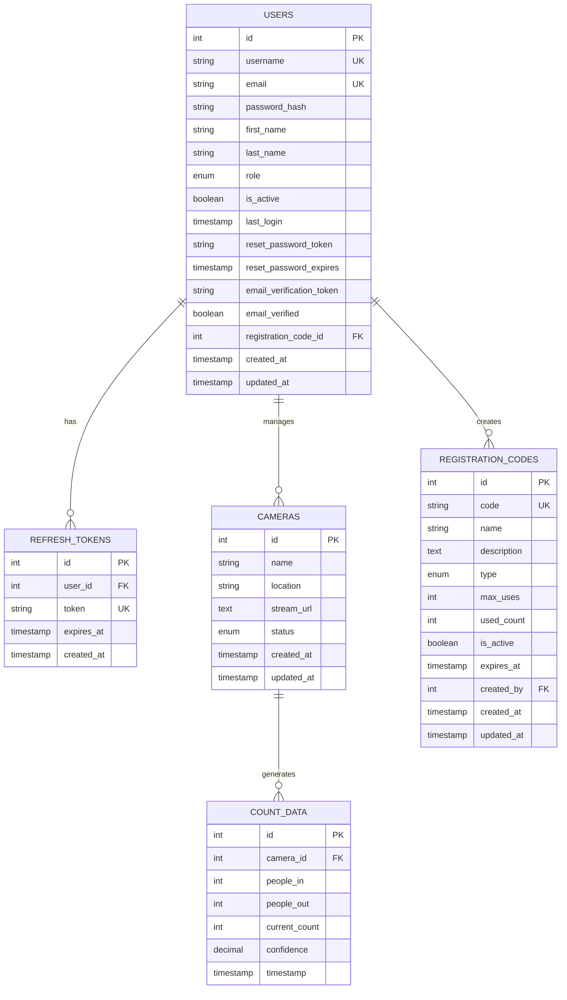
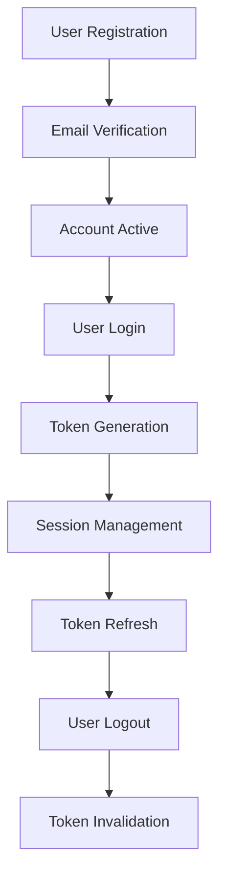
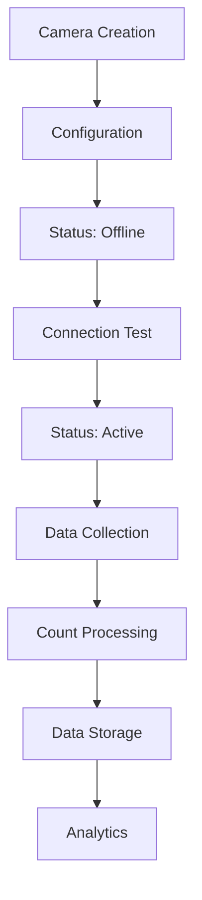
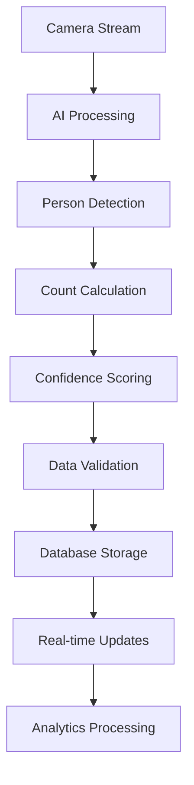

# Data Models - AI Camera Counting System

## 📊 Tổng quan
Tài liệu này định nghĩa các data models cho hệ thống AI Camera Counting, bao gồm entities, relationships, validation rules và constraints.

## 🏗️ Database Schema Overview



## 📋 Entity Definitions

### 1. User Entity

#### Database Table
```sql
CREATE TABLE users (
    id SERIAL PRIMARY KEY,
    username VARCHAR(50) UNIQUE NOT NULL,
    email VARCHAR(100) UNIQUE NOT NULL,
    password_hash VARCHAR(255) NOT NULL,
    first_name VARCHAR(50),
    last_name VARCHAR(50),
    role user_role DEFAULT 'user',
    is_active BOOLEAN DEFAULT TRUE,
    last_login TIMESTAMP,
    reset_password_token VARCHAR(255),
    reset_password_expires TIMESTAMP,
    email_verification_token VARCHAR(255),
    email_verified BOOLEAN DEFAULT FALSE,
    registration_code_id INTEGER REFERENCES registration_codes(id),
    created_at TIMESTAMP DEFAULT CURRENT_TIMESTAMP,
    updated_at TIMESTAMP DEFAULT CURRENT_TIMESTAMP
);
```

#### TypeScript Interface
```typescript
interface User {
  id: number;
  username: string;
  email: string;
  password_hash?: string; // Never returned in API responses
  first_name?: string;
  last_name?: string;
  role: 'admin' | 'user' | 'viewer';
  is_active: boolean;
  last_login?: string; // ISO 8601 timestamp
  reset_password_token?: string;
  reset_password_expires?: string;
  email_verification_token?: string;
  email_verified: boolean;
  registration_code_id?: number;
  created_at: string;
  updated_at: string;
}

interface CreateUserRequest {
  username: string;
  email: string;
  password: string;
  first_name?: string;
  last_name?: string;
  registration_code?: string;
}

interface UpdateUserRequest {
  first_name?: string;
  last_name?: string;
  email?: string;
  is_active?: boolean;
}
```

#### Validation Rules
```javascript
// Frontend Validation (React Hook Form)
const userValidationSchema = yup.object({
  username: yup
    .string()
    .required('Username is required')
    .min(3, 'Username must be at least 3 characters')
    .max(50, 'Username must not exceed 50 characters')
    .matches(/^[a-zA-Z0-9_]+$/, 'Username can only contain letters, numbers, and underscores'),
  
  email: yup
    .string()
    .required('Email is required')
    .email('Invalid email format')
    .max(100, 'Email must not exceed 100 characters'),
  
  password: yup
    .string()
    .required('Password is required')
    .min(8, 'Password must be at least 8 characters')
    .matches(/^(?=.*[a-z])(?=.*[A-Z])(?=.*\d)/, 'Password must contain at least one uppercase letter, one lowercase letter, and one number'),
  
  first_name: yup
    .string()
    .max(50, 'First name must not exceed 50 characters'),
  
  last_name: yup
    .string()
    .max(50, 'Last name must not exceed 50 characters'),
  
  registration_code: yup
    .string()
    .required('Registration code is required')
    .length(8, 'Registration code must be 8 characters')
});
```

### 2. Camera Entity

#### Database Table
```sql
CREATE TABLE cameras (
    id SERIAL PRIMARY KEY,
    name VARCHAR(255) NOT NULL,
    location VARCHAR(500),
    stream_url TEXT,
    status VARCHAR(50) DEFAULT 'offline',
    created_at TIMESTAMP DEFAULT CURRENT_TIMESTAMP,
    updated_at TIMESTAMP DEFAULT CURRENT_TIMESTAMP
);
```

#### TypeScript Interface
```typescript
interface Camera {
  id: number;
  name: string;
  location?: string;
  stream_url?: string;
  status: 'active' | 'inactive' | 'maintenance' | 'offline';
  created_at: string;
  updated_at: string;
}

interface CreateCameraRequest {
  name: string;
  location?: string;
  stream_url?: string;
  status?: 'active' | 'inactive' | 'maintenance' | 'offline';
}

interface UpdateCameraRequest {
  name?: string;
  location?: string;
  stream_url?: string;
  status?: 'active' | 'inactive' | 'maintenance' | 'offline';
}
```

#### Validation Rules
```javascript
const cameraValidationSchema = yup.object({
  name: yup
    .string()
    .required('Camera name is required')
    .min(2, 'Camera name must be at least 2 characters')
    .max(255, 'Camera name must not exceed 255 characters'),
  
  location: yup
    .string()
    .max(500, 'Location must not exceed 500 characters'),
  
  stream_url: yup
    .string()
    .url('Invalid stream URL format')
    .matches(/^rtsp:\/\//, 'Stream URL must be RTSP protocol'),
  
  status: yup
    .string()
    .oneOf(['active', 'inactive', 'maintenance', 'offline'], 'Invalid status')
});
```

### 3. Count Data Entity

#### Database Table
```sql
CREATE TABLE count_data (
    id SERIAL PRIMARY KEY,
    camera_id INTEGER REFERENCES cameras(id) ON DELETE CASCADE,
    people_in INTEGER DEFAULT 0,
    people_out INTEGER DEFAULT 0,
    current_count INTEGER DEFAULT 0,
    confidence DECIMAL(3,2) DEFAULT 0.0,
    timestamp TIMESTAMP DEFAULT CURRENT_TIMESTAMP
);
```

#### TypeScript Interface
```typescript
interface CountData {
  id: number;
  camera_id: number;
  people_in: number;
  people_out: number;
  current_count: number;
  confidence: number; // 0.00 to 1.00
  timestamp: string;
}

interface CreateCountDataRequest {
  camera_id: number;
  people_in: number;
  people_out: number;
  current_count: number;
  confidence: number;
}

interface CountDataFilter {
  camera_id?: number;
  start_date?: string;
  end_date?: string;
  limit?: number;
  offset?: number;
}
```

#### Validation Rules
```javascript
const countDataValidationSchema = yup.object({
  camera_id: yup
    .number()
    .required('Camera ID is required')
    .positive('Camera ID must be positive'),
  
  people_in: yup
    .number()
    .required('People in count is required')
    .min(0, 'People in count cannot be negative')
    .integer('People in count must be an integer'),
  
  people_out: yup
    .number()
    .required('People out count is required')
    .min(0, 'People out count cannot be negative')
    .integer('People out count must be an integer'),
  
  current_count: yup
    .number()
    .required('Current count is required')
    .min(0, 'Current count cannot be negative')
    .integer('Current count must be an integer'),
  
  confidence: yup
    .number()
    .required('Confidence is required')
    .min(0, 'Confidence cannot be negative')
    .max(1, 'Confidence cannot exceed 1.0')
});
```

### 4. Refresh Token Entity

#### Database Table
```sql
CREATE TABLE refresh_tokens (
    id SERIAL PRIMARY KEY,
    user_id INTEGER REFERENCES users(id) ON DELETE CASCADE,
    token VARCHAR(500) UNIQUE NOT NULL,
    expires_at TIMESTAMP NOT NULL,
    created_at TIMESTAMP DEFAULT CURRENT_TIMESTAMP
);
```

#### TypeScript Interface
```typescript
interface RefreshToken {
  id: number;
  user_id: number;
  token: string;
  expires_at: string;
  created_at: string;
}

interface RefreshTokenRequest {
  refreshToken: string;
}
```

### 5. Registration Code Entity

#### Database Table
```sql
CREATE TABLE registration_codes (
    id SERIAL PRIMARY KEY,
    code VARCHAR(50) UNIQUE NOT NULL,
    name VARCHAR(100) NOT NULL,
    description TEXT,
    type VARCHAR(20) DEFAULT 'organization' CHECK (type IN ('organization', 'department', 'general')),
    max_uses INTEGER DEFAULT NULL,
    used_count INTEGER DEFAULT 0,
    is_active BOOLEAN DEFAULT TRUE,
    expires_at TIMESTAMP DEFAULT NULL,
    created_by INTEGER REFERENCES users(id),
    created_at TIMESTAMP DEFAULT CURRENT_TIMESTAMP,
    updated_at TIMESTAMP DEFAULT CURRENT_TIMESTAMP
);
```

#### TypeScript Interface
```typescript
interface RegistrationCode {
  id: number;
  code: string;
  name: string;
  description?: string;
  type: 'organization' | 'department' | 'general';
  max_uses?: number;
  used_count: number;
  is_active: boolean;
  expires_at?: string;
  created_by?: number;
  created_at: string;
  updated_at: string;
}

interface CreateRegistrationCodeRequest {
  code: string;
  name: string;
  description?: string;
  type?: 'organization' | 'department' | 'general';
  max_uses?: number;
  expires_at?: string;
}
```

## 🔗 Relationships & Constraints

### Foreign Key Relationships
```sql
-- Users -> Registration Codes
ALTER TABLE users 
ADD CONSTRAINT fk_users_registration_code 
FOREIGN KEY (registration_code_id) REFERENCES registration_codes(id);

-- Refresh Tokens -> Users
ALTER TABLE refresh_tokens 
ADD CONSTRAINT fk_refresh_tokens_user 
FOREIGN KEY (user_id) REFERENCES users(id) ON DELETE CASCADE;

-- Count Data -> Cameras
ALTER TABLE count_data 
ADD CONSTRAINT fk_count_data_camera 
FOREIGN KEY (camera_id) REFERENCES cameras(id) ON DELETE CASCADE;

-- Registration Codes -> Users (created_by)
ALTER TABLE registration_codes 
ADD CONSTRAINT fk_registration_codes_created_by 
FOREIGN KEY (created_by) REFERENCES users(id);
```

### Indexes for Performance
```sql
-- Users table indexes
CREATE INDEX idx_users_email ON users(email);
CREATE INDEX idx_users_username ON users(username);
CREATE INDEX idx_users_role ON users(role);
CREATE INDEX idx_users_is_active ON users(is_active);

-- Cameras table indexes
CREATE INDEX idx_cameras_status ON cameras(status);
CREATE INDEX idx_cameras_created_at ON cameras(created_at);

-- Count Data table indexes
CREATE INDEX idx_count_data_camera_id ON count_data(camera_id);
CREATE INDEX idx_count_data_timestamp ON count_data(timestamp);
CREATE INDEX idx_count_data_camera_timestamp ON count_data(camera_id, timestamp);

-- Refresh Tokens table indexes
CREATE INDEX idx_refresh_tokens_user_id ON refresh_tokens(user_id);
CREATE INDEX idx_refresh_tokens_token ON refresh_tokens(token);
CREATE INDEX idx_refresh_tokens_expires_at ON refresh_tokens(expires_at);

-- Registration Codes table indexes
CREATE INDEX idx_registration_codes_code ON registration_codes(code);
CREATE INDEX idx_registration_codes_type ON registration_codes(type);
CREATE INDEX idx_registration_codes_is_active ON registration_codes(is_active);
```

## 📊 Data Validation & Business Rules

### User Validation Rules
1. **Username**: Unique, 3-50 characters, alphanumeric + underscore only
2. **Email**: Unique, valid email format, max 100 characters
3. **Password**: Min 8 characters, must contain uppercase, lowercase, and number
4. **Role**: Must be one of: 'admin', 'user', 'viewer'
5. **Registration Code**: Required for new user registration

### Camera Validation Rules
1. **Name**: Required, 2-255 characters
2. **Stream URL**: Must be valid RTSP URL format
3. **Status**: Must be one of: 'active', 'inactive', 'maintenance', 'offline'
4. **Location**: Optional, max 500 characters

### Count Data Validation Rules
1. **Camera ID**: Must reference existing camera
2. **Counts**: Must be non-negative integers
3. **Confidence**: Must be between 0.0 and 1.0
4. **Timestamp**: Auto-generated, cannot be in future

### Registration Code Validation Rules
1. **Code**: Unique, 8 characters, alphanumeric
2. **Type**: Must be one of: 'organization', 'department', 'general'
3. **Max Uses**: Optional, must be positive if provided
4. **Expires At**: Optional, must be in future if provided

## 🔄 Data Lifecycle Management

### User Data Lifecycle


### Camera Data Lifecycle


### Count Data Lifecycle


## 🧪 Test Data Examples

### Sample Users
```sql
INSERT INTO users (username, email, password_hash, first_name, last_name, role) VALUES
('admin', 'admin@example.com', '$2b$10$...', 'Admin', 'User', 'admin'),
('john_doe', 'john@example.com', '$2b$10$...', 'John', 'Doe', 'user'),
('jane_smith', 'jane@example.com', '$2b$10$...', 'Jane', 'Smith', 'user');
```

### Sample Cameras
```sql
INSERT INTO cameras (name, location, stream_url, status) VALUES
('Main Entrance', 'Building A - Main Entrance', 'rtsp://camera1.example.com/stream1', 'active'),
('Parking Lot', 'Building A - Parking Lot', 'rtsp://camera2.example.com/stream2', 'active'),
('Lobby', 'Building A - Lobby', 'rtsp://camera3.example.com/stream3', 'offline');
```

### Sample Count Data
```sql
INSERT INTO count_data (camera_id, people_in, people_out, current_count, confidence) VALUES
(1, 25, 18, 7, 0.92),
(1, 30, 22, 15, 0.88),
(2, 15, 12, 3, 0.95),
(2, 20, 18, 5, 0.91);
```

### Sample Registration Codes
```sql
INSERT INTO registration_codes (code, name, description, type, max_uses) VALUES
('ORG001', 'Organization A', 'Registration code for Organization A', 'organization', 100),
('DEPT001', 'Department A', 'Registration code for Department A', 'department', 50),
('GEN001', 'General Access', 'General registration code', 'general', NULL);
```

---

**Last Updated**: 2025-07-03  
**Version**: 1.0.0  
**Status**: Ready for Implementation 