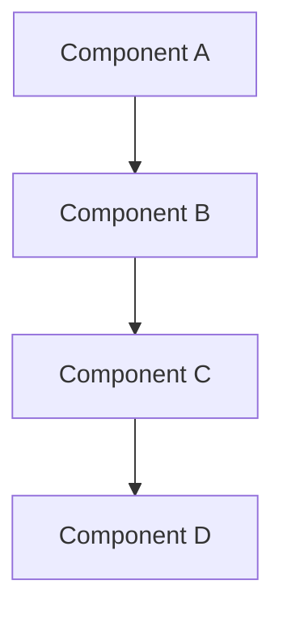

# Documentation Standards
## AI Camera Counting System

### 📊 Tổng quan

Tài liệu này định nghĩa các standards và guidelines cho việc tạo, maintain, và update documentation trong dự án AI Camera Counting System.

### 🎯 Documentation Objectives
- Đảm bảo consistency trong documentation
- Facilitate knowledge sharing và onboarding
- Maintain documentation quality và accuracy
- Enable efficient collaboration và handover

### 📋 Documentation Structure

#### Document Categories
```markdown
# Documentation Hierarchy
sharedResource/docs/
├── dev/                    # Development documentation
│   ├── api-specifications.md
│   ├── data-models.md
│   ├── frontend-architecture.md
│   ├── coding-standards.md
│   ├── development-tools.md
│   ├── git-workflow.md
│   ├── pr-templates.md
│   ├── mvp-feature-specifications.md
│   ├── technical-design.md
│   └── documentation-standards.md
├── test/                   # Testing documentation
│   ├── testing-strategy.md
│   ├── test-data-management.md
│   ├── frontend-unit-testing.md
│   ├── backend-unit-testing.md
│   ├── integration-testing.md
│   ├── e2e-testing.md
│   └── performance-testing.md
├── qa/                     # Quality assurance documentation
│   ├── qa-process.md
│   ├── quality-gates.md
│   ├── monitoring-setup.md
│   └── performance-testing.md
└── README.md              # Main documentation index
```

#### Document Types
```yaml
# Document Type Definitions
specifications:
  - name: "Technical Specifications"
    purpose: "Define technical requirements and architecture"
    audience: "Developers, Architects"
    update_frequency: "As needed"
    review_cycle: "Monthly"

guides:
  - name: "How-to Guides"
    purpose: "Step-by-step instructions for common tasks"
    audience: "Developers, DevOps"
    update_frequency: "Weekly"
    review_cycle: "Bi-weekly"

standards:
  - name: "Standards & Best Practices"
    purpose: "Define coding standards and conventions"
    audience: "All team members"
    update_frequency: "Monthly"
    review_cycle: "Quarterly"

processes:
  - name: "Process Documentation"
    purpose: "Define workflows and procedures"
    audience: "All team members"
    update_frequency: "As needed"
    review_cycle: "Monthly"
```

### 📝 Documentation Templates

#### Technical Specification Template
```markdown
# [Document Title]
## [System/Component Name]

### 📊 Tổng quan

Brief description of the document's purpose and scope.

### 🎯 Objectives
- Primary objective 1
- Primary objective 2
- Primary objective 3

### 🏗️ Technical Details

#### Architecture Overview


#### Implementation Details
```typescript
// Code examples with proper syntax highlighting
interface ExampleInterface {
  property1: string;
  property2: number;
  property3: boolean;
}
```

#### Configuration
```yaml
# Configuration examples
service:
  name: "example-service"
  port: 3000
  environment: "development"
```

### 📋 Requirements

#### Functional Requirements
- [ ] Requirement 1
- [ ] Requirement 2
- [ ] Requirement 3

#### Non-Functional Requirements
- **Performance**: Response time < 200ms
- **Security**: Authentication required
- **Scalability**: Support 1000+ concurrent users

### 🧪 Testing

#### Test Cases
```typescript
describe('Component Test', () => {
  it('should perform expected behavior', () => {
    // Test implementation
  });
});
```

### 📊 Metrics & Monitoring

#### Key Metrics
- Metric 1: Target value
- Metric 2: Target value
- Metric 3: Target value

### 🚨 Risk Assessment

#### High Risk
- Risk 1: Mitigation strategy
- Risk 2: Mitigation strategy

#### Medium Risk
- Risk 3: Mitigation strategy

### 📋 Checklist

#### Implementation Checklist
- [ ] Task 1
- [ ] Task 2
- [ ] Task 3

---

**Document Version**: 1.0  
**Last Updated**: [Date]  
**Next Review**: [Date + 2 weeks]  
**Status**: [Draft/In Review/Approved]
```

#### Process Documentation Template
```markdown
# [Process Name]
## [System/Component Name]

### 📊 Tổng quan

Description of the process and its purpose.

### 🎯 Process Objectives
- Objective 1
- Objective 2
- Objective 3

### 🔄 Process Flow

#### Step-by-Step Process
1. **Step 1**: Description
   - Action: What to do
   - Input: Required inputs
   - Output: Expected outputs
   - Validation: How to verify

2. **Step 2**: Description
   - Action: What to do
   - Input: Required inputs
   - Output: Expected outputs
   - Validation: How to verify

### 📋 Roles & Responsibilities

#### Process Owner
- **Role**: [Role name]
- **Responsibilities**:
  - Responsibility 1
  - Responsibility 2

#### Process Participants
- **Role 1**: [Role name]
  - Responsibilities: [List]
- **Role 2**: [Role name]
  - Responsibilities: [List]

### ⚠️ Exception Handling

#### Common Exceptions
- **Exception 1**: How to handle
- **Exception 2**: How to handle

#### Escalation Procedures
- **Level 1**: [Escalation path]
- **Level 2**: [Escalation path]

### 📊 Success Metrics

#### Key Performance Indicators
- KPI 1: Target and measurement method
- KPI 2: Target and measurement method

### 📋 Process Checklist

#### Pre-Process
- [ ] Checklist item 1
- [ ] Checklist item 2

#### During Process
- [ ] Checklist item 3
- [ ] Checklist item 4

#### Post-Process
- [ ] Checklist item 5
- [ ] Checklist item 6

---

**Process Version**: 1.0  
**Last Updated**: [Date]  
**Next Review**: [Date + 1 month]  
**Status**: [Draft/Active/Deprecated]
```

### 🔄 Documentation Lifecycle

#### Document Creation Process
```yaml
# Document Creation Workflow
creation_process:
  1. identify_need:
     - Determine document type and purpose
     - Identify target audience
     - Define scope and requirements
  
  2. create_draft:
     - Use appropriate template
     - Follow writing guidelines
     - Include all required sections
  
  3. review_process:
     - Self-review for completeness
     - Peer review for accuracy
     - Technical review for correctness
  
  4. approval:
     - Stakeholder approval
     - Final formatting check
     - Publication to repository
  
  5. maintenance:
     - Regular review schedule
     - Update as needed
     - Version control
```

#### Review and Update Process
```yaml
# Review Schedule
review_schedule:
  technical_specifications:
    frequency: "Monthly"
    reviewers: ["Tech Lead", "Architect"]
    criteria: ["Accuracy", "Completeness", "Clarity"]
  
  process_documents:
    frequency: "Bi-weekly"
    reviewers: ["Process Owner", "Team Lead"]
    criteria: ["Effectiveness", "Efficiency", "Compliance"]
  
  how_to_guides:
    frequency: "Weekly"
    reviewers: ["Subject Matter Expert"]
    criteria: ["Usability", "Accuracy", "Completeness"]
```

### 📝 Writing Guidelines

#### Content Standards
```markdown
# Content Guidelines

## Language & Tone
- Use clear, concise language
- Write in active voice
- Use present tense for current state
- Use future tense for planned changes
- Maintain professional but approachable tone

## Structure
- Use consistent heading hierarchy (H1, H2, H3)
- Include table of contents for documents > 500 words
- Use bullet points for lists
- Use numbered lists for sequential steps

## Code Examples
- Include syntax highlighting
- Provide complete, runnable examples
- Include error handling
- Add comments for complex logic

## Diagrams & Visuals
- Use Mermaid for flowcharts and diagrams
- Include alt text for accessibility
- Use consistent color schemes
- Keep diagrams simple and focused

## Links & References
- Use relative links for internal references
- Include full URLs for external references
- Verify all links are working
- Update broken links promptly
```

#### Naming Conventions
```yaml
# File Naming Conventions
file_naming:
  pattern: "kebab-case.md"
  examples:
    - "api-specifications.md"
    - "frontend-architecture.md"
    - "testing-strategy.md"
  
  directory_naming:
    pattern: "kebab-case"
    examples:
      - "sharedResource/docs/dev/"
      - "sharedResource/docs/test/"
      - "sharedResource/docs/qa/"
  
  document_titles:
    pattern: "Title Case"
    examples:
      - "API Specifications"
      - "Frontend Architecture"
      - "Testing Strategy"
```

### 🔍 Quality Assurance

#### Documentation Review Checklist
```yaml
# Review Checklist
content_review:
  - [ ] Document purpose is clear
  - [ ] Target audience is identified
  - [ ] All required sections are included
  - [ ] Information is accurate and current
  - [ ] Examples are relevant and working
  - [ ] Links are valid and accessible
  - [ ] Grammar and spelling are correct
  - [ ] Formatting is consistent

technical_review:
  - [ ] Technical information is correct
  - [ ] Code examples are functional
  - [ ] Diagrams are accurate
  - [ ] Configuration examples work
  - [ ] API specifications are complete
  - [ ] Error handling is documented
  - [ ] Security considerations are addressed

usability_review:
  - [ ] Document is easy to follow
  - [ ] Steps are in logical order
  - [ ] Prerequisites are clearly stated
  - [ ] Expected outcomes are defined
  - [ ] Troubleshooting section is included
  - [ ] Related documents are linked
```

#### Documentation Metrics
```yaml
# Quality Metrics
quality_metrics:
  completeness:
    - All required sections present
    - No broken links
    - All examples provided
    - All scenarios covered
  
  accuracy:
    - Technical information verified
    - Code examples tested
    - Configuration validated
    - Process steps confirmed
  
  clarity:
    - Clear language used
    - Logical structure
    - Appropriate detail level
    - Visual aids included
  
  maintainability:
    - Version control used
    - Update schedule defined
    - Review process established
    - Change tracking implemented
```

### 🛠️ Tools & Platforms

#### Documentation Tools
```yaml
# Recommended Tools
markdown_editor:
  - name: "VS Code"
    extensions: ["Markdown All in One", "Markdown Preview Enhanced"]
  
  - name: "Typora"
    features: ["Live preview", "Export options"]
  
  - name: "Obsidian"
    features: ["Knowledge management", "Graph view"]

diagram_tools:
  - name: "Mermaid"
    use_case: "Flowcharts, sequence diagrams"
  
  - name: "Draw.io"
    use_case: "Complex diagrams, wireframes"
  
  - name: "Lucidchart"
    use_case: "Professional diagrams"

version_control:
  - name: "Git"
    features: ["Version tracking", "Collaboration"]
  
  - name: "GitHub"
    features: ["Web interface", "Pull requests"]
```

#### Documentation Platform
```yaml
# Platform Configuration
documentation_platform:
  repository: "GitHub"
  structure: "Markdown files"
  hosting: "GitHub Pages"
  search: "GitHub search + local search"
  collaboration: "Pull requests + reviews"
  
  features:
    - "Version control"
    - "Collaborative editing"
    - "Review process"
    - "Search functionality"
    - "Mobile accessibility"
```

### 📊 Maintenance Procedures

#### Regular Maintenance Tasks
```yaml
# Maintenance Schedule
daily_tasks:
  - Check for broken links
  - Review recent changes
  - Update version numbers

weekly_tasks:
  - Review documentation accuracy
  - Update outdated information
  - Check for missing documentation

monthly_tasks:
  - Comprehensive review of all documents
  - Update templates and standards
  - Archive outdated documents
  - Plan documentation improvements

quarterly_tasks:
  - Major documentation audit
  - Update documentation strategy
  - Review and update standards
  - Team training on documentation
```

#### Update Procedures
```yaml
# Update Workflow
update_process:
  1. identify_change:
     - Determine what needs updating
     - Assess impact on other documents
     - Plan update approach
  
  2. create_update:
     - Make changes in development branch
     - Update version number
     - Update last modified date
  
  3. review_update:
     - Self-review changes
     - Peer review for accuracy
     - Technical review if needed
  
  4. publish_update:
     - Merge to main branch
     - Update index/README
     - Notify team of changes
  
  5. verify_update:
     - Confirm changes are live
     - Test any code examples
     - Verify links still work
```

### 📋 Implementation Checklist

#### Setup Phase
- [ ] Create documentation structure
- [ ] Set up templates
- [ ] Configure tools and platforms
- [ ] Establish review processes
- [ ] Train team on standards

#### Maintenance Phase
- [ ] Implement regular review schedule
- [ ] Set up quality metrics tracking
- [ ] Establish update procedures
- [ ] Create feedback collection process
- [ ] Monitor documentation usage

#### Continuous Improvement
- [ ] Collect user feedback
- [ ] Analyze usage patterns
- [ ] Identify improvement opportunities
- [ ] Update standards based on feedback
- [ ] Regular team training

### 🎯 Success Metrics

#### Documentation Quality
- **Completeness**: 100% of required documents created
- **Accuracy**: < 5% error rate in technical information
- **Currency**: < 30 days average age of documents
- **Usability**: > 90% positive feedback from users

#### Process Efficiency
- **Review Time**: < 48 hours average review time
- **Update Time**: < 24 hours for critical updates
- **Accessibility**: 100% documents accessible to team
- **Searchability**: < 30 seconds to find relevant information

#### Team Adoption
- **Usage**: > 80% of team regularly use documentation
- **Contribution**: > 50% of team contribute to documentation
- **Training**: 100% of new team members trained on standards
- **Feedback**: Regular feedback collection and implementation

---

**Document Version**: 1.0  
**Last Updated**: 2025-07-03  
**Next Review**: 2025-07-10  
**Status**: Ready for Implementation 