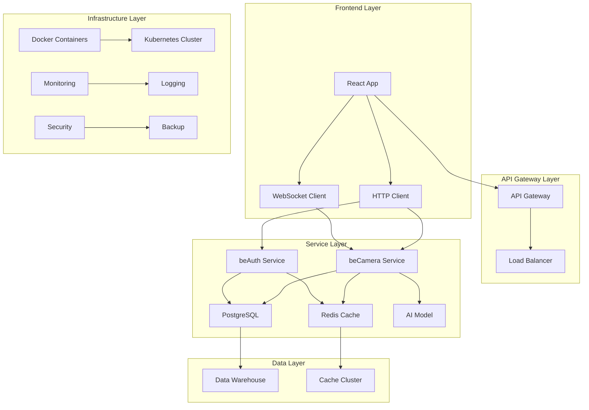
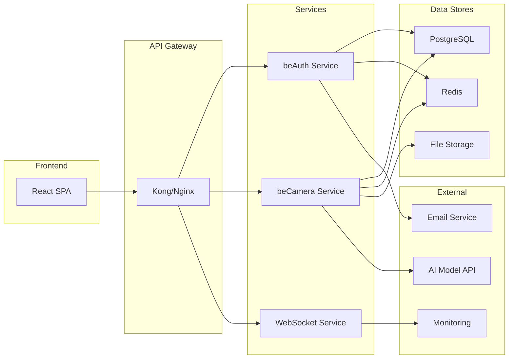
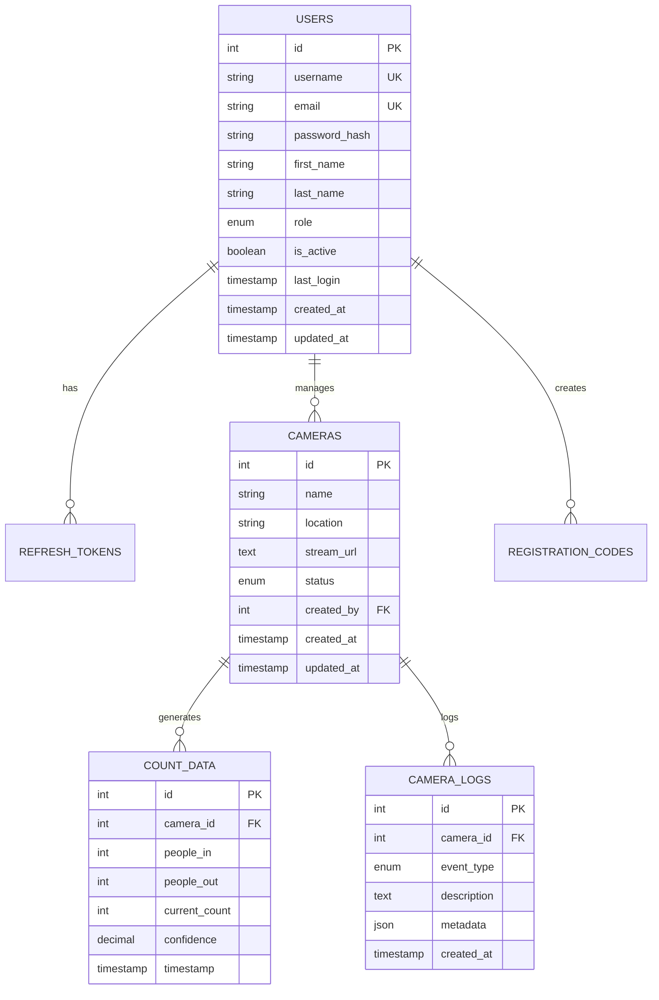
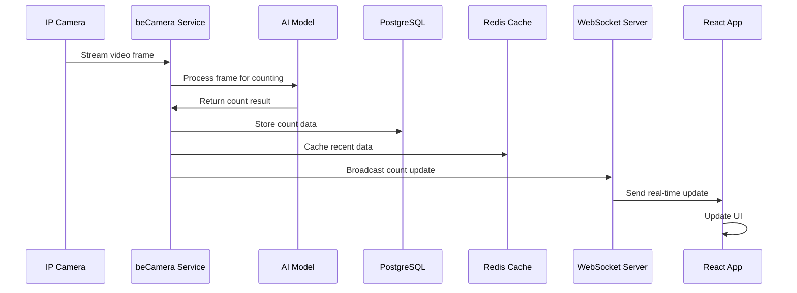
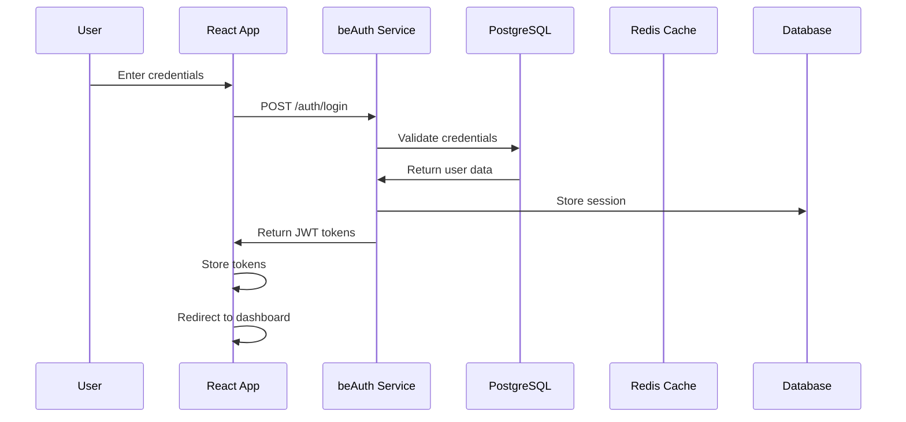
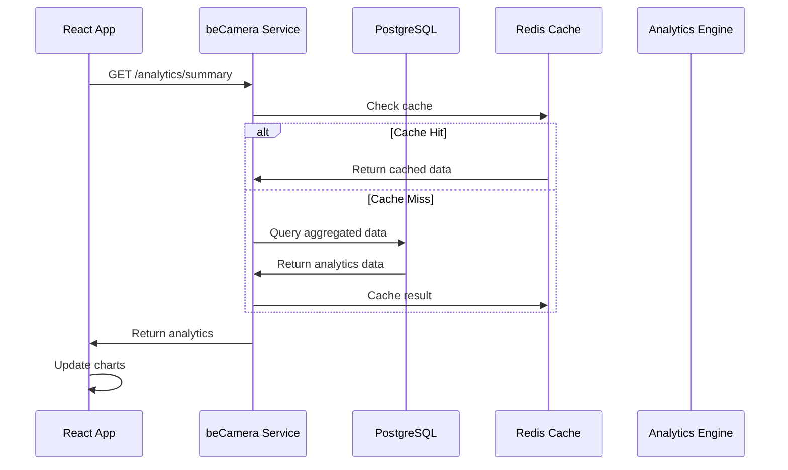

# Technical Design - AI Camera Counting System

## 📊 Tổng quan
Tài liệu này định nghĩa technical design chi tiết cho hệ thống AI Camera Counting, bao gồm system architecture, design patterns, và implementation decisions.

## 🏗️ System Architecture

### High-Level Architecture


### Microservices Architecture


## 🔧 Design Patterns

### 1. Repository Pattern
```typescript
// Frontend Repository Pattern
interface CameraRepository {
  getAll(): Promise<Camera[]>;
  getById(id: number): Promise<Camera>;
  create(camera: CreateCameraRequest): Promise<Camera>;
  update(id: number, camera: UpdateCameraRequest): Promise<Camera>;
  delete(id: number): Promise<void>;
}

class CameraRepositoryImpl implements CameraRepository {
  private apiClient: ApiClient;

  constructor(apiClient: ApiClient) {
    this.apiClient = apiClient;
  }

  async getAll(): Promise<Camera[]> {
    const response = await this.apiClient.get('/cameras');
    return response.data;
  }

  async getById(id: number): Promise<Camera> {
    const response = await this.apiClient.get(`/cameras/${id}`);
    return response.data;
  }

  async create(camera: CreateCameraRequest): Promise<Camera> {
    const response = await this.apiClient.post('/cameras', camera);
    return response.data;
  }

  async update(id: number, camera: UpdateCameraRequest): Promise<Camera> {
    const response = await this.apiClient.put(`/cameras/${id}`, camera);
    return response.data;
  }

  async delete(id: number): Promise<void> {
    await this.apiClient.delete(`/cameras/${id}`);
  }
}
```

### 2. Factory Pattern
```python
# Backend Factory Pattern
from abc import ABC, abstractmethod
from typing import Dict, Any

class CameraProcessor(ABC):
    @abstractmethod
    def process_frame(self, frame: bytes) -> Dict[str, Any]:
        pass

class RTSPCameraProcessor(CameraProcessor):
    def process_frame(self, frame: bytes) -> Dict[str, Any]:
        # Process RTSP frame
        return {"type": "rtsp", "data": frame}

class HTTPCameraProcessor(CameraProcessor):
    def process_frame(self, frame: bytes) -> Dict[str, Any]:
        # Process HTTP frame
        return {"type": "http", "data": frame}

class CameraProcessorFactory:
    @staticmethod
    def create_processor(camera_type: str) -> CameraProcessor:
        if camera_type == "rtsp":
            return RTSPCameraProcessor()
        elif camera_type == "http":
            return HTTPCameraProcessor()
        else:
            raise ValueError(f"Unsupported camera type: {camera_type}")
```

### 3. Observer Pattern
```typescript
// Frontend Observer Pattern
interface CountObserver {
  update(count: CountData): void;
}

class CountSubject {
  private observers: CountObserver[] = [];
  private count: CountData | null = null;

  attach(observer: CountObserver): void {
    this.observers.push(observer);
  }

  detach(observer: CountObserver): void {
    const index = this.observers.indexOf(observer);
    if (index > -1) {
      this.observers.splice(index, 1);
    }
  }

  notify(): void {
    if (this.count) {
      this.observers.forEach(observer => observer.update(this.count!));
    }
  }

  setCount(count: CountData): void {
    this.count = count;
    this.notify();
  }
}

class CountDisplay implements CountObserver {
  update(count: CountData): void {
    // Update UI with new count
    this.updateDisplay(count);
  }

  private updateDisplay(count: CountData): void {
    // Implementation
  }
}
```

### 4. Strategy Pattern
```python
# Backend Strategy Pattern
from abc import ABC, abstractmethod
from typing import List, Dict, Any

class CountStrategy(ABC):
    @abstractmethod
    def count_people(self, frame: bytes) -> Dict[str, Any]:
        pass

class SSDStrategy(CountStrategy):
    def count_people(self, frame: bytes) -> Dict[str, Any]:
        # Use SSD model for counting
        return {
            "count": 5,
            "confidence": 0.92,
            "method": "ssd"
        }

class YOLOStrategy(CountStrategy):
    def count_people(self, frame: bytes) -> Dict[str, Any]:
        # Use YOLO model for counting
        return {
            "count": 5,
            "confidence": 0.95,
            "method": "yolo"
        }

class CountContext:
    def __init__(self, strategy: CountStrategy):
        self.strategy = strategy

    def set_strategy(self, strategy: CountStrategy):
        self.strategy = strategy

    def execute_counting(self, frame: bytes) -> Dict[str, Any]:
        return self.strategy.count_people(frame)
```

## 🗄️ Database Design

### 1. Entity Relationship Diagram


### 2. Indexing Strategy
```sql
-- Performance Indexes
CREATE INDEX idx_users_email ON users(email);
CREATE INDEX idx_users_username ON users(username);
CREATE INDEX idx_users_role ON users(role);
CREATE INDEX idx_users_is_active ON users(is_active);

CREATE INDEX idx_cameras_status ON cameras(status);
CREATE INDEX idx_cameras_created_by ON cameras(created_by);
CREATE INDEX idx_cameras_created_at ON cameras(created_at);

CREATE INDEX idx_count_data_camera_id ON count_data(camera_id);
CREATE INDEX idx_count_data_timestamp ON count_data(timestamp);
CREATE INDEX idx_count_data_camera_timestamp ON count_data(camera_id, timestamp);

CREATE INDEX idx_camera_logs_camera_id ON camera_logs(camera_id);
CREATE INDEX idx_camera_logs_event_type ON camera_logs(event_type);
CREATE INDEX idx_camera_logs_created_at ON camera_logs(created_at);

-- Composite Indexes for Complex Queries
CREATE INDEX idx_count_data_analytics ON count_data(camera_id, timestamp, people_in, people_out);
CREATE INDEX idx_camera_logs_monitoring ON camera_logs(camera_id, event_type, created_at);
```

### 3. Partitioning Strategy
```sql
-- Partition count_data by date for better performance
CREATE TABLE count_data (
    id SERIAL,
    camera_id INTEGER,
    people_in INTEGER,
    people_out INTEGER,
    current_count INTEGER,
    confidence DECIMAL(3,2),
    timestamp TIMESTAMP
) PARTITION BY RANGE (timestamp);

-- Create monthly partitions
CREATE TABLE count_data_2025_01 PARTITION OF count_data
    FOR VALUES FROM ('2025-01-01') TO ('2025-02-01');

CREATE TABLE count_data_2025_02 PARTITION OF count_data
    FOR VALUES FROM ('2025-02-01') TO ('2025-03-01');
```

## 🔄 Data Flow Design

### 1. Real-time Data Flow


### 2. Authentication Flow


### 3. Analytics Data Flow


## 🔒 Security Design

### 1. Authentication & Authorization
```typescript
// JWT Token Structure
interface JWTPayload {
  user_id: number;
  email: string;
  role: 'admin' | 'user' | 'viewer';
  permissions: string[];
  iat: number;
  exp: number;
}

// Role-based Access Control
const permissions = {
  admin: [
    'users:read',
    'users:write',
    'cameras:read',
    'cameras:write',
    'analytics:read',
    'system:admin'
  ],
  user: [
    'cameras:read',
    'analytics:read',
    'profile:read',
    'profile:write'
  ],
  viewer: [
    'cameras:read',
    'analytics:read'
  ]
};
```

### 2. API Security
```python
# Rate Limiting
from fastapi import FastAPI, Depends
from slowapi import Limiter, _rate_limit_exceeded_handler
from slowapi.util import get_remote_address
from slowapi.errors import RateLimitExceeded

limiter = Limiter(key_func=get_remote_address)
app = FastAPI()
app.state.limiter = limiter
app.add_exception_handler(RateLimitExceeded, _rate_limit_exceeded_handler)

@app.post("/auth/login")
@limiter.limit("5/minute")
async def login(request: Request):
    # Login implementation
    pass

@app.get("/cameras")
@limiter.limit("100/minute")
async def get_cameras(request: Request):
    # Get cameras implementation
    pass
```

### 3. Data Encryption
```python
# Data Encryption at Rest
from cryptography.fernet import Fernet
import os

class DataEncryption:
    def __init__(self):
        self.key = os.getenv('ENCRYPTION_KEY')
        self.cipher = Fernet(self.key)

    def encrypt(self, data: str) -> str:
        return self.cipher.encrypt(data.encode()).decode()

    def decrypt(self, encrypted_data: str) -> str:
        return self.cipher.decrypt(encrypted_data.encode()).decode()

# Usage in models
class SensitiveData:
    def __init__(self, encryption: DataEncryption):
        self.encryption = encryption

    def store_sensitive_data(self, data: str):
        encrypted = self.encryption.encrypt(data)
        # Store encrypted data
        return encrypted

    def retrieve_sensitive_data(self, encrypted_data: str):
        decrypted = self.encryption.decrypt(encrypted_data)
        return decrypted
```

## ⚡ Performance Design

### 1. Caching Strategy
```python
# Multi-level Caching
import redis
from functools import wraps

class CacheManager:
    def __init__(self):
        self.redis_client = redis.Redis(host='localhost', port=6379, db=0)
        self.local_cache = {}

    def cache_with_ttl(self, ttl: int = 300):
        def decorator(func):
            @wraps(func)
            def wrapper(*args, **kwargs):
                # Check local cache first
                cache_key = f"{func.__name__}:{hash(str(args) + str(kwargs))}"
                
                if cache_key in self.local_cache:
                    return self.local_cache[cache_key]
                
                # Check Redis cache
                cached_result = self.redis_client.get(cache_key)
                if cached_result:
                    result = cached_result.decode()
                    self.local_cache[cache_key] = result
                    return result
                
                # Execute function and cache result
                result = func(*args, **kwargs)
                self.redis_client.setex(cache_key, ttl, str(result))
                self.local_cache[cache_key] = result
                return result
            return wrapper
        return decorator

# Usage
@cache_with_ttl(ttl=300)
def get_camera_analytics(camera_id: int, date: str):
    # Expensive analytics calculation
    pass
```

### 2. Database Optimization
```sql
-- Query Optimization
-- Use prepared statements
PREPARE get_camera_counts(int, timestamp, timestamp) AS
SELECT 
    camera_id,
    SUM(people_in) as total_in,
    SUM(people_out) as total_out,
    AVG(confidence) as avg_confidence
FROM count_data 
WHERE camera_id = $1 
    AND timestamp BETWEEN $2 AND $3
GROUP BY camera_id;

-- Use materialized views for complex analytics
CREATE MATERIALIZED VIEW daily_camera_summary AS
SELECT 
    camera_id,
    DATE(timestamp) as date,
    SUM(people_in) as total_in,
    SUM(people_out) as total_out,
    AVG(confidence) as avg_confidence,
    MAX(current_count) as peak_count
FROM count_data 
GROUP BY camera_id, DATE(timestamp);

-- Refresh materialized view
REFRESH MATERIALIZED VIEW daily_camera_summary;
```

### 3. Frontend Performance
```typescript
// Code Splitting and Lazy Loading
import React, { lazy, Suspense } from 'react';

const Dashboard = lazy(() => import('./pages/Dashboard'));
const CameraManagement = lazy(() => import('./pages/CameraManagement'));
const Analytics = lazy(() => import('./pages/Analytics'));

// Virtual Scrolling for Large Lists
import { FixedSizeList as List } from 'react-window';

const CameraList = ({ cameras }) => {
  const Row = ({ index, style }) => (
    <div style={style}>
      <CameraCard camera={cameras[index]} />
    </div>
  );

  return (
    <List
      height={600}
      itemCount={cameras.length}
      itemSize={200}
      width="100%"
    >
      {Row}
    </List>
  );
};

// Memoization for Expensive Components
const ExpensiveChart = React.memo(({ data }) => {
  const processedData = useMemo(() => {
    return processChartData(data);
  }, [data]);

  return <Chart data={processedData} />;
});
```

## 🔄 Scalability Design

### 1. Horizontal Scaling
```yaml
# Kubernetes Deployment
apiVersion: apps/v1
kind: Deployment
metadata:
  name: becamera-service
spec:
  replicas: 3
  selector:
    matchLabels:
      app: becamera-service
  template:
    metadata:
      labels:
        app: becamera-service
    spec:
      containers:
      - name: becamera
        image: becamera:latest
        ports:
        - containerPort: 3002
        resources:
          requests:
            memory: "512Mi"
            cpu: "250m"
          limits:
            memory: "1Gi"
            cpu: "500m"
        env:
        - name: DB_HOST
          valueFrom:
            configMapKeyRef:
              name: app-config
              key: db_host
```

### 2. Load Balancing
```nginx
# Nginx Load Balancer Configuration
upstream backend {
    least_conn;
    server beauth-service-1:3001;
    server beauth-service-2:3001;
    server beauth-service-3:3001;
}

upstream camera_backend {
    ip_hash;
    server becamera-service-1:3002;
    server becamera-service-2:3002;
    server becamera-service-3:3002;
}

server {
    listen 80;
    server_name api.aicamera.com;

    location /api/v1/auth/ {
        proxy_pass http://backend;
        proxy_set_header Host $host;
        proxy_set_header X-Real-IP $remote_addr;
    }

    location /api/v1/cameras/ {
        proxy_pass http://camera_backend;
        proxy_set_header Host $host;
        proxy_set_header X-Real-IP $remote_addr;
    }
}
```

### 3. Database Scaling
```sql
-- Read Replicas for Analytics
-- Master database for writes
CREATE PUBLICATION master_pub FOR TABLE count_data, cameras, users;

-- Read replica for analytics queries
CREATE SUBSCRIPTION analytics_sub 
CONNECTION 'host=master_db port=5432 dbname=aicamera user=replica password=secret'
PUBLICATION master_pub;

-- Partitioning for large tables
CREATE TABLE count_data (
    id SERIAL,
    camera_id INTEGER,
    people_in INTEGER,
    people_out INTEGER,
    current_count INTEGER,
    confidence DECIMAL(3,2),
    timestamp TIMESTAMP
) PARTITION BY RANGE (timestamp);

-- Monthly partitions
CREATE TABLE count_data_2025_01 PARTITION OF count_data
    FOR VALUES FROM ('2025-01-01') TO ('2025-02-01');
```

## 📊 Monitoring & Observability

### 1. Application Metrics
```python
# Prometheus Metrics
from prometheus_client import Counter, Histogram, Gauge
import time

# Metrics
REQUEST_COUNT = Counter('http_requests_total', 'Total HTTP requests', ['method', 'endpoint', 'status'])
REQUEST_DURATION = Histogram('http_request_duration_seconds', 'HTTP request duration')
ACTIVE_CAMERAS = Gauge('active_cameras', 'Number of active cameras')
COUNT_ACCURACY = Gauge('count_accuracy', 'Count accuracy percentage')

# Middleware for metrics
@app.middleware("http")
async def metrics_middleware(request: Request, call_next):
    start_time = time.time()
    
    response = await call_next(request)
    
    duration = time.time() - start_time
    REQUEST_DURATION.observe(duration)
    REQUEST_COUNT.labels(
        method=request.method,
        endpoint=request.url.path,
        status=response.status_code
    ).inc()
    
    return response
```

### 2. Distributed Tracing
```python
# OpenTelemetry Tracing
from opentelemetry import trace
from opentelemetry.instrumentation.fastapi import FastAPIInstrumentor
from opentelemetry.sdk.trace import TracerProvider
from opentelemetry.sdk.trace.export import BatchSpanProcessor
from opentelemetry.exporter.jaeger.thrift import JaegerExporter

# Setup tracing
trace.set_tracer_provider(TracerProvider())
tracer = trace.get_tracer(__name__)

jaeger_exporter = JaegerExporter(
    agent_host_name="localhost",
    agent_port=6831,
)
span_processor = BatchSpanProcessor(jaeger_exporter)
trace.get_tracer_provider().add_span_processor(span_processor)

# Instrument FastAPI
FastAPIInstrumentor.instrument_app(app)

# Custom spans
@app.get("/cameras/{camera_id}")
async def get_camera(camera_id: int):
    with tracer.start_as_current_span("get_camera") as span:
        span.set_attribute("camera.id", camera_id)
        
        # Database query
        with tracer.start_as_current_span("db_query"):
            camera = await get_camera_from_db(camera_id)
        
        return camera
```

### 3. Health Checks
```python
# Health Check Endpoints
@app.get("/health")
async def health_check():
    return {
        "status": "healthy",
        "timestamp": datetime.now().isoformat(),
        "version": "1.0.0"
    }

@app.get("/health/detailed")
async def detailed_health_check():
    checks = {
        "database": await check_database_connection(),
        "redis": await check_redis_connection(),
        "ai_model": await check_ai_model_status(),
        "external_services": await check_external_services()
    }
    
    overall_status = "healthy" if all(checks.values()) else "unhealthy"
    
    return {
        "status": overall_status,
        "checks": checks,
        "timestamp": datetime.now().isoformat()
    }
```

---

**Last Updated**: 2025-07-03  
**Version**: 1.0.0  
**Status**: Ready for Implementation 